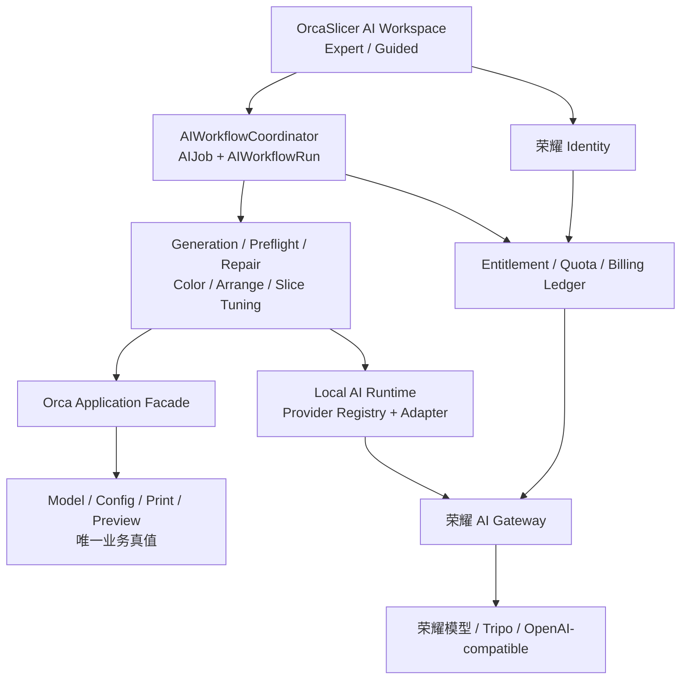

# OrcaSlicer AI 能力状态与实施计划

> 梳理日期：2026-08-08
> 当前开发基线：`master @ a1ef7204fe`
> 官方架构分析基线：`OrcaSlicer main @ a62fb17e03d159d5b562cc6d64163346e454b5de`

## 1. 结论摘要

当前已经形成两条可运行的局部链路：

1. 文生 3D / 图生 3D：本地 sidecar、OpenAI-compatible 预处理、Tripo 生成、状态轮询、产物下载和确认导入已经接通；Windows 构建和 mock 流程有历史验收记录。
2. AI 参数建议：能够从白名单参数构造上下文，接收结构化建议，执行 key/type/range 校验，由用户勾选后写入现有 preset 并重新切片。

但目前没有任何一项可以按“跨平台、真实服务、可恢复、可计费、兼容回归均已完成”的生产标准判定为完成。主要差距集中在：

- 真实文生/图生服务验收、彩色导入保真和三平台打包；
- 统一 `PrintabilityReport`、安全修复、隔离试切和指标比较；
- 持久化工作流、结果版本、任务恢复和统一 AI Workspace；
- Provider registry 与荣耀模型适配；
- 荣耀账号、权益、额度、计费和服务端安全控制。

建议不要按五个大项平均铺开，而是采用“双轨汇合”：

- **核心 AI 轨**：平台基线 → 生成产品化 → 检查/修复 → 自动摆盘/上色 → 参数闭环 → Guided Workflow；
- **商业平台轨**：荣耀身份 → 荣耀 AI 网关 → 权益/额度/计费 → 隐私与运营；
- 两条轨道在公开 Beta 前汇合，本地编辑和切片始终不依赖登录或云服务。

## 2. 状态口径

| 标签 | 含义 | 判定标准 |
|---|---|---|
| A 可运行链路 | 已有纵向实现，可在当前环境演示 | 仍可能缺真实供应商、三平台、恢复或发布验收 |
| B 部分实现 | 有 UI、协议或局部闭环 | 关键步骤、数据契约或验收尚缺 |
| C 原生基础可复用 | OrcaSlicer 已有确定性能力 | 尚未封装为 AI/产品工作流 |
| D 未开始 | 只有需求或目标架构 | 当前源码没有对应实现 |

“A 可运行链路”不等于“生产完成”。生产完成还必须通过兼容、错误/取消、真实服务、跨平台、安全和回归门槛。

## 3. 逐项状态矩阵

### 3.1 模型生成

| 子能力 | 状态 | 当前证据 | 主要缺口 | 下一目标 |
|---|---|---|---|---|
| 文生 3D | A | `ModelGenerationPanel`、`AIModelGenerationClient`、sidecar 文本预处理与 Tripo text task 已接通 | 未见真实付费 smoke 记录；任务仅内存保存；供应商和密钥仍在本机 sidecar | 完成真实服务、幂等提交、恢复、清理和三平台验收 |
| 图生 3D | A | PNG/JPEG、20 MB 限制、上传确认、图像预处理、Tripo image task 已接通 | 真实图生质量与失败补偿未验收；远端取消不保证终止 | 建立真实用例集、远端取消语义和费用幂等 |
| 生成结果预览 | B | 有参考图预览、状态、进度和结果摘要 | 目前主要预览“预处理参考图”，不是可旋转的生成模型 3D 预览；无网格指标 | 接入只读 3D 模型预览、尺寸/面数/格式/颜色/风险摘要 |
| 风格化滤镜 | D | 文档中有需求 | 无风格模板、参数 schema、Provider capability | 先定义跨 Provider 的 `StylePreset`，再映射供应商参数 |
| 效果调优 | D | 文档中有需求 | 无多轮生成、版本、对比、可控细节/比例/复杂度 | 建立 `GenerationVariant`、版本树和并排对比 |
| 可打印性检查 | C | mesh stats、build volume、`Print::validate()` 等原生检查可复用 | 结果分散，未接入生成导入前流程 | 建立只读 `ModelPreflightService` 与稳定问题码 |
| 可打印性保障 | C | admesh/CGAL、落床、缩放、方向等底层能力可复用 | 无风险分级、before/after、确认、复检和端到端测试 | 建立副本修复、差异、Undo 和复检闭环 |
| 彩色模型支持 | B | sidecar 校验自包含 OBJ 顶点色，GUI 校验 `color_encoding`，下载优先级为 OBJ → 3MF → STL | 未证明导入后颜色到耗材映射、3MF 保存/重开和切片保真；UI 的“3MF 优先”说明与实际下载优先级需统一 | 完成彩色 OBJ 导入、耗材映射、3MF round-trip 和降级提示验收 |

### 3.2 智能切片

| 子能力 | 状态 | 当前证据 | 主要缺口 | 下一目标 |
|---|---|---|---|---|
| 自动上色 | C | 原版已有多材料绘制、facet annotation、分色切片和 OBJ 顶点色基础 | 无语义分区、颜色识别、耗材槽位约束和自动确认流程 | 先做“建议分区 + 可编辑预览”，后做一键应用 |
| 自动摆盘 | C | `ArrangeJob`、`OrientJob`、碰撞/构建体积和排布算法成熟 | 无基于质量、支撑、稳定性、时间的候选评分 | 把朝向与排布包装成候选服务，以试切指标选择 |
| 打印性检查与修复 | C | 原生检查、CGAL/admesh 修复和标准 mesh 回写链存在 | 无统一报告和 AI 工作流 | 与模型生成共用 Preflight/Repair 服务，不另建一套 |
| 参数智能调优 | B | 已有白名单参数、最多 8 项建议、严格反序列化和范围校验、用户确认后应用并重切片 | 上下文只有对象数和少量配置；无打印机能力、模型诊断、baseline 指标、plate/object scope、显式 Undo 和候选比较 | 从“单次建议”升级到多个 `SliceCandidate` 的隔离试切与对比 |
| 切片结果优化 | C | `GCodeProcessorResult` 可提供时间、耗材、警告和路径结果 | 无 `TrialSliceJob`、资源预算、评分函数和正式结果隔离 | 建立 baseline + 2~3 个候选的可度量闭环 |

### 3.3 易用性提升

| 子能力 | 状态 | 当前证据 | 主要缺口 | 下一目标 |
|---|---|---|---|---|
| AI 化交互 | B | 3D Generate 页面和 AI Assistant pane 已存在 | 两套交互割裂，助手只支持参数建议 | 统一为 Expert 与 Guided 两种入口，共享同一状态模型 |
| 工作流搭建 | B | 生成流程有 Input → Prepare → Review → Generate → Import 状态 | 未覆盖检查、修复、试切、最终切片；无跨启动恢复 | 区分 `AIJob` 和 `AIWorkflowRun`，实现可暂停/恢复的固定状态机 |
| UX 设计 | B | 生成页有上传告知、付费确认、进度、停止、导入确认 | 3D 预览、错误恢复、全流程信息层级和无障碍尚不完整 | 用任务中心、证据面板和对比视图收敛状态与决策 |
| 模型库与结果管理 | B | 已有本次会话内最多 12 条的缩略图/格式/来源记录 | 不持久化，不能重新打开、比较、复用或追踪来源 | 建立应用数据目录中的元数据索引；正式模型仍以 Orca `Model`/3MF 为真值 |

### 3.4 软件架构设计与解耦

| 子能力 | 状态 | 当前证据 | 主要缺口 | 下一目标 |
|---|---|---|---|---|
| AI 服务边界 | B | loopback sidecar、v1 health/capability、异步客户端和响应大小限制已落地 | `AIServiceManager` 只做发现，不托管 sidecar 生命周期；当前启动仍依赖批处理 | 引入可打包 runtime、启动/关闭/重连、版本迁移和诊断 |
| 多模型/多供应商适配 | B | C++ GUI 不直接依赖 Tripo/OpenAI 协议 | Python sidecar 仍直接调用 OpenAI-compatible 与 Tripo；无 registry、统一鉴权和荣耀 adapter | 定义 `ProviderAdapter`、能力矩阵、错误分类和契约测试 |
| 核心代码解耦 | B | Panel、Client、ServiceManager 和 sidecar 已拆分 | 缺统一 domain service、job store、workflow coordinator；`MainFrame`/`Plater` 仍承担接线 | 新能力通过窄 facade/Job 接入，禁止 Provider 逻辑进入核心 |
| 原版演进兼容 | B | 架构文档已明确最小侵入、3MF/profile 边界 | 缺持续上游合并验证、AI 关闭回归矩阵和稳定补丁边界 | 建立 upstream merge CI、feature-off golden tests 和改动目录约束 |
| 跨平台与兼容性 | B | C++ 代码按 wx/CMake 边界设计，Windows 已构建运行 | sidecar 只有 `.bat` 启动证据；macOS/Linux 打包与运行未验证 | 三平台安装、启动、退出、取消、离线和旧项目回归成为发布门槛 |

### 3.5 账号与计费系统

| 子能力 | 状态 | 当前证据 | 主要缺口 | 下一目标 |
|---|---|---|---|---|
| 荣耀账号接入 | D | 当前源码未发现荣耀账号、OAuth/SSO 实现 | 缺协议、客户端 ID、回调方式、区域、Token 生命周期、注销和账号合并规则 | 先确认荣耀身份平台契约，再实现 `IdentityProvider` mock 与安全存储 |
| 荣耀 AI 模型接入 | D | 当前只有 OpenAI-compatible + Tripo | 缺荣耀 endpoint、模型目录、鉴权、能力、限流和错误码 | 通过服务端 AI Gateway 接入，不把长期模型密钥下发桌面端 |
| 计费与额度 | D | 生成前只有“可能消耗 API credits”的静态确认 | 无额度查询、预占、扣减、幂等、退款/补偿和账单记录 | 建立服务端账本：quote → reserve → consume/release → reconcile |
| 用户权益管理 | D | 无账号等级或套餐判断 | 无 entitlement schema、缓存、离线策略、区域和灰度 | 能力显示与执行都以签名权益快照控制，服务端最终裁决 |
| 隐私与数据安全 | B | 图像上传告知/确认、loopback 限制、HTTPS 且 URL 禁止内嵌凭据、请求大小限制已存在 | 无完整隐私清单、保留/删除策略、OS 安全存储、审计、数据主体请求和安全评审 | 建立数据分类、同意版本、保留策略、脱敏日志和威胁模型 |

## 4. 当前口径差异与需要纠正的判断

1. `Docs/开发进展.xlsx` 将“参数智能调优”标为规划中，但当前源码已经存在受控参数建议、校验、选择、应用和重切片，应标为 **B 部分实现**。
2. 历史 `task_plan.md` 记录过默认关闭的 `enable_ai_features`，但当前 `MainFrame` 会始终创建 3D Generate 页面并立即发现 sidecar。发布策略需要重新明确，不能继续引用旧门控结论。
3. UI 文案写“3MF is preferred”，当前 sidecar 实际按 OBJ → 3MF → STL 下载，以优先保留 OBJ 顶点色。产品文案、格式策略和验收必须统一。
4. 架构文档中的 `AIWorkspacePanel`、`ModelPreflightService`、`ModelRepairWorkflow`、`TrialSliceJob`、`AIJobStore` 等是目标设计，不是当前已实现符号。
5. “按跨平台边界设计”不等于跨平台完成；当前只有 Windows 构建/运行证据。

## 5. 目标架构



### 状态所有权

| 状态 | 权威所有者 | 默认持久化 |
|---|---|---|
| 模型、正式配置、正式切片 | OrcaSlicer `Model` / Config / Print | 现有 3MF/profile 规则 |
| 生成/检查/修复/试切任务 | `AIJobStore` | 应用数据目录，可清理，不写 3MF |
| 端到端流程和审批点 | `AIWorkflowRunStore` | 应用数据目录，可恢复 |
| Provider 凭据 | 服务端或 OS 安全存储 | 不写源码、日志或 3MF |
| 账号、权益、额度、账单 | 荣耀服务端 | 服务端权威，客户端只缓存短期快照 |
| 原始提示和上传资产 | 按隐私策略控制 | 默认短期保留，可删除 |

## 6. 架构决策摘要（Proposed ADR）

### ADR-001：OrcaSlicer 确定性内核保持业务真值

- **决策**：LLM/模型只输出意图、建议、候选和解释；几何修改、配置校验、切片和导入由 OrcaSlicer 执行。
- **收益**：可复现、可撤销、兼容现有 3MF/profile。
- **代价**：需要为原生能力建立 typed facade，初期开发量高于直接让模型操作 UI。

### ADR-002：本地 runtime 与商业云网关分层

- **决策**：本地 runtime 负责桌面协议、任务和 Provider adapter；荣耀 AI Gateway 负责账号鉴权、供应商密钥、路由、限流和计费。
- **收益**：桌面端不持有长期供应商密钥，供应商可替换。
- **代价**：需要维护本地/云端双协议和版本兼容。

### ADR-003：账号、权益和计费由服务端最终裁决

- **决策**：客户端可缓存权益和额度展示，但不能作为扣费真值；付费任务必须带幂等键和服务端 reservation。
- **收益**：避免重复扣费和客户端篡改。
- **代价**：付费 AI 功能依赖网络；必须设计离线降级。

### ADR-004：AI 运行历史默认不进入 3MF

- **决策**：3MF 只保存用户接受后的模型和正式配置；任务 ID、原始回答、账单和凭据留在应用数据或服务端。
- **收益**：保持项目兼容并减少隐私泄露。
- **代价**：跨设备继续任务需要单独的云同步设计。

### ADR-005：Expert 与 Guided 共用同一套能力服务

- **决策**：专家模式逐项调用 Generate/Inspect/Repair/Tune；Guided 模式只编排同一组已验收服务。
- **收益**：避免维护两套业务逻辑，单项能力可以独立测试。
- **代价**：必须先稳定底层服务，不能先做一个万能聊天入口。

## 7. 双轨实施路线图

### F0：共同工程基线（两条轨道的前置）

目标：把“能演示”提升到“可持续开发、可判定完成”。

- 统一状态词典和 Definition of Done；
- 决定 3D Generate 的产品入口策略：构建开关、运行时 capability、权益 gate 各自职责；
- 定义 sidecar/cloud v2 契约：版本、能力、格式、成本提示、隐私级别、错误和幂等；
- 建立本地任务保留/TTL、取消、恢复和清理；
- 将 sidecar 纳入 Windows/macOS/Linux 安装与生命周期；
- 建立 mock contract、真实供应商 smoke、feature-off、旧 3MF/profile 和三平台 CI。

**退出标准**：AI 不可用时本地切片无回归；三平台可安装/启动/退出；真实文生/图生各有可复现 smoke；不泄露凭据。

### 核心 AI 轨

#### A1：模型生成产品化

- 完成真实文生/图生、远端取消和幂等收费提交；
- 加入可旋转 3D 预览与模型指标；
- 完成彩色 OBJ/3MF 导入、耗材映射和 round-trip；
- 定义 `StylePreset`、`GenerationVariant` 和版本对比；
- 将会话模型库升级为可清理、可追踪来源的本地索引。

#### A2：只读 Printability Preflight

- 定义 `PrintabilityIssue/Report`；
- 聚合 mesh、尺寸、build volume、非流形、自交和正式切片前检查；
- 建立坏网格/边界/薄壁/悬垂测试语料；
- 在生成导入前和普通模型上共用同一服务。

#### A3：安全 Repair + 智能摆盘/上色候选

- 修复在模型副本执行，输出 before/after、风险和复检结果；
- 接受时走标准 Undo/dirty/cache invalidation；
- 将 Orient/Arrange 暴露为候选服务，以稳定性、支撑和占板率评分；
- 自动上色先输出可编辑 facet 建议，再映射实际耗材槽位。

#### A4：参数与切片结果闭环

- 构造完整 `SlicingContext`；
- 生成 2~3 个合法 `SliceCandidate`；
- 使用隔离 `TrialSliceJob`，不覆盖正式 plate `Print`；
- 对比时间、耗材、支撑、换料、警告和质量代理；
- 用户接受后正式应用、Undo 并重新切片。

#### A5：低交互 Guided Workflow

- 固定状态机串联 Intake → Generate/Import → Preflight → Repair → Trial Slice → Compare → Apply → Official Slice；
- 只在缺失关键约束、产生费用、中高风险修改和最终输出时询问；
- 支持暂停、恢复、重试、回滚和审计；
- Expert 与 Guided 共享服务和结果库。

### 商业平台轨

#### B1：荣耀身份与安全基础

- 确认 OAuth/OIDC/SSO 协议、客户端类型、回调、区域和注销要求；
- 实现 `IdentityProvider`、短期 access token、refresh 生命周期和 OS 安全存储；
- 保持匿名用户可使用 OrcaSlicer 本地编辑和切片。

#### B2：荣耀 AI Gateway 与 Provider Adapter

- 定义模型目录、能力、版本、错误、限流和健康协议；
- 实现荣耀 adapter 与 mock adapter；
- 将长期供应商密钥、模型路由和审计留在服务端；
- Tripo/OpenAI-compatible 迁移为同一 adapter 契约。

#### B3：权益、额度和计费

- 定义 entitlement、quota、price quote 和 usage 事件 schema；
- 付费任务执行 `quote → reserve → submit → consume/release`；
- request id 作为端到端幂等键；
- 建立超时、重复回调、供应商失败、部分完成和人工对账补偿。

#### B4：隐私、合规与运营

- 数据分类：提示、图片、mesh、G-code、设备、账号和账单；
- 明示上传范围、目的、保留期、删除和模型训练用途；
- 日志脱敏、访问审计、事件追踪和安全告警；
- 完成威胁模型、依赖扫描和发布前隐私/安全评审。

## 8. 依赖与并行关系

```text
F0 ─┬─> A1 ─> A2 ─> A3 ─> A4 ─> A5 ─┐
    └─> B1 ─> B2 ─> B3 ─> B4 ───────┤
                                      └─> Public Beta
```

- A1 与 B1 可以并行；账号接口不应阻塞本地生成/检查能力。
- B2 完成前，可继续用 mock/Tripo 验证 Provider 契约。
- A2 是 A3、A4、A5 的前置，因为修复和调优都需要稳定诊断。
- A4 是 A5 的前置，Guided Workflow 只编排已可独立验收的服务。
- B3 是任何公开付费模型调用的前置，不是本地切片的前置。

## 9. 发布门槛

| 领域 | 最低门槛 |
|---|---|
| 兼容性 | 旧 3MF/profile 可加载；AI 关闭或不可用时默认切片结果不变 |
| 跨平台 | Windows/macOS/Linux 安装、启动、取消、退出、离线均通过 |
| 生成 | 文生/图生真实 smoke；导入、Undo、保存、重开、切片通过 |
| 彩色 | 颜色/耗材映射可解释；OBJ/3MF round-trip；STL 降级有明确提示 |
| 检查/修复 | 固定语料报告稳定；拒绝/取消零修改；接受后可 Undo 并复检 |
| 调优 | 候选试切不改变正式项目；指标可复现；正式应用可回退 |
| 工作流 | 可暂停/恢复；重试不重复付费；每步有输入、产物、版本和审批记录 |
| 账号 | 登录、刷新、退出、过期、撤销和多账号边界通过 |
| 计费 | 幂等、预占、扣减、释放、退款/补偿和对账通过 |
| 安全 | 无长期供应商密钥进入桌面包；日志/3MF 不含 token 和敏感原始数据 |

## 10. 首批建议任务

1. 评审并冻结状态口径、入口/gate 策略和 v2 capability 契约。
2. 补真实 Tripo 文生/图生 smoke，记录费用、任务 ID、产物和失败路径。
3. 完成彩色 OBJ 导入到多耗材映射、保存 3MF、重开和切片验收。
4. 把 sidecar 纳入三平台安装、启动、关闭和崩溃恢复。
5. 定义 `PrintabilityIssue/Report` schema 与首批坏模型语料。
6. 将现有检查聚合成只读 `ModelPreflightService`。
7. 与荣耀侧确认身份、AI Gateway、权益、额度、计费和隐私接口清单。
8. 先实现 `IdentityProvider`、`ProviderAdapter`、`EntitlementClient` 的 mock 契约。
9. 定义付费任务幂等键和 `quote/reserve/consume/release` 状态机。
10. 建立三平台 + feature-off + 旧 3MF/profile 的持续回归矩阵。

## 11. 尚需业务侧确认

- 荣耀账号采用 OAuth/OIDC 还是既有私有协议，桌面客户端允许哪种回调方式；
- 荣耀 AI 模型的能力、输入输出格式、区域、SLA、限流和计价单位；
- 模型、图片和提示是否允许用于模型训练，以及默认保留时间；
- 彩色模型的产品目标是顶点色展示、自动映射耗材，还是完整纹理/材质保真；
- 自动修复允许的最大几何变化和必须人工确认的风险级别；
- 调优目标的默认权重：质量、速度、强度、耗材和成功率；
- 3D Generate 页面是产品固定入口，还是需要构建/运行时 feature gate。

## 12. 证据来源

- `Docs/README.md` 与 `Docs/architecture/*.md`；
- `Docs/开发进展.xlsx`，`Sheet1!B3:F30`；
- `src/slic3r/GUI/ModelGenerationPanel.*`；
- `src/slic3r/GUI/AIModelGenerationClient.*`；
- `src/slic3r/GUI/AIAssistantPanel.*` 与 `AIAssistantConfig.*`；
- `src/slic3r/GUI/AIServiceManager.*`；
- `tools/ai/orca_ai_sidecar.py`、`tripo_client.py`、`openai_preprocessor.py`；
- OrcaSlicer 原生 Arrange/Orient、mesh repair、config、Print 和 G-code result 代码路径；
- 历史 `task_plan.md`、`findings.md`、`progress.md` 中的构建与 mock E2E 记录。
