# AI 目标架构

## 1. 模块级架构



模块级架构用于产品、架构和工作包边界评审。代码级落点见：


## 2. 目标能力

### 2.1 AI 模型生成

支持图生 3D、文生 3D，并将生成结果作为普通 ORCA 模型导入。

```text
用户请求
→ AI 模型生成能力
→ Provider/Sidecar
→ 产物下载与安全校验
→ GeneratedModelImporter
→ ORCA ModelObject
→ Plater 标准导入
→ 编辑、切片、保存和打印
```

关键原则：

- Provider 无关；
- 不在 Plater 内实现远端 API；
- 生成结果必须归一化为 ORCA `ModelObject`；
- 导入后与普通模型遵循相同 Undo、dirty、plate 和 3MF 流程；
- 默认只保存生成后的几何，不保存远端任务历史和凭据。

### 2.2 模型检查与修复

```text
Model / ModelObject
→ ModelPreflightService
→ GeometryIssue / PrintabilityIssue
→ 用户查看证据和建议
→ ModelRepairWorkflow
→ ORCA mesh / CGAL 修复 adapter
→ before/after 比较
→ 用户确认
→ 写回 Model + Undo + cache invalidation
```

检查范围建议包括：

- 非流形、开边、退化面和自交；
- 尺寸、比例、薄壁和细节风险；
- 悬空、摆放、与打印空间关系；
- 可打印性和后续切片警告。

AI 不应直接覆盖模型。修复必须可预览、可接受、可回滚。

### 2.3 智能切片与 AI 调参

```text
Model diagnostics
+ current effective config
+ printer/material capability
+ baseline G-code statistics/warnings
→ SlicingContextBuilder
→ AIConfigProposalService
→ key/type/range/scope validation
→ CandidateConfig[]
→ isolated trial slice
→ GCodeProcessorResult[]
→ time/material/quality comparison
→ user accept
→ standard config apply
→ dirty/Undo
→ official reslice and Preview
```

核心约束：

- Provider 原始输出不能直接写 `DynamicPrintConfig`；
- 每个候选必须标明作用范围：项目、plate、对象、volume 或 layer range；
- 候选试切与正式 plate `Print` 隔离；
- 用户接受前，不改变正式配置和正式切片结果；
- 正式应用必须走 ORCA 原有兼容性、dirty、Undo 和 invalidation；
- 评分不能只依赖 AI 文本判断，应优先使用真实试切结果。

### 2.4 AI 化交互

新增 `AIWorkspacePanel` 作为 ORCA 正式页面或面板，统一承载：

- 图/文模型生成；
- 模型问题列表和 3D 定位；
- 修复前后差异；
- 参数变更解释；
- 候选切片指标比较；
- 进度、取消、重试、历史、接受和回滚。

交互层不成为新的业务真值；它投影 AI workflow 和 ORCA Model/Config/Preview 状态。

## 3. 目标模块

### 用户体验与编排

| 拟新增模块 | 责任 |
|---|---|
| `AIWorkspacePanel` | AI 一体化交互、诊断、比较和决策 |
| `AIWorkflowCoordinator` | 生成、检查、修复、调优状态机 |
| `AIGenerateJob` / `AIAnalyzeJob` | 后台执行、进度、取消和 GUI finalize |
| `TuningComparisonModel` | 基线和候选的可解释比较模型 |

### AI 核心能力

| 拟新增模块 | 责任 |
|---|---|
| `AIModelGenerationService` | 生成请求、任务状态和产物下载 |
| `AIProviderGateway` | Provider/Sidecar 的统一适配边界 |
| `GeneratedModelImporter` | 生成资产校验并转换为 ORCA Model |
| `ModelPreflightService` | 几何和可打印性诊断 |
| `ModelRepairWorkflow` | 修复计划、执行、差异、确认和回滚 |
| `SlicingContextBuilder` | 构造脱敏、结构化调优上下文 |
| `AIConfigProposalService` | 参数候选生成和严格校验 |
| `SliceTuningOrchestrator` | 候选试切、评分、比较和接受 |
| `TrialSliceJob` | 隔离试切和资源控制 |

### 平台服务

| 拟新增模块 | 责任 |
|---|---|
| `AIServiceManager` | 服务生命周期、健康、版本、Provider registry |
| `AIJobStore` | 任务历史、恢复、缓存和清理 |
| AI test matrix | mock、契约、工作流、兼容和 E2E 验证 |

## 4. ORCA 复用边界

| ORCA 能力 | AI 如何复用 |
|---|---|
| `MainFrame` / `Plater` | 页面入口和正式用例接入 |
| `Job/Worker` | 模型生成、分析和试切后台任务 |
| `Model*` | 生成模型和修复结果的唯一场景真值 |
| Mesh / CGAL / Geometry | 模型检查与修复底层适配 |
| `PresetBundle` / Config | 获取当前上下文、验证和应用候选 |
| `Print` / `PrintObject` | 正式切片与隔离试切的计算核心 |
| `GCodeProcessorResult` | 候选评价和 Preview 数据来源 |
| `GLCanvas3D` / Preview | 问题证据、差异和候选结果显示 |
| 3MF / Backup | 保存正式项目状态；按需扩展 AI 元数据 |

## 5. 数据分类与持久化

| 数据 | 默认所有者 | 默认持久化 |
|---|---|---|
| 生成后的 mesh | `ModelVolume` | 3MF |
| 对象诊断报告 | AI workflow/runtime | 不写 3MF，可缓存 |
| 修复后的 mesh | `ModelVolume` | 用户接受后写 3MF |
| AI 原始回答 | AI job store | 不写 3MF |
| 参数候选 | Tuning workflow | 用户接受前不持久化为正式配置 |
| 接受后的参数 | Project/plate/object config | 按 ORCA 现有 3MF/profile 规则 |
| 试切结果 | Trial workflow | 默认临时缓存 |
| 正式切片结果 | Plate G-code result | 按 ORCA 现有规则 |
| Provider 凭据 | 安全配置边界 | 不写项目，不进日志 |
| 远端 job ID | AI job store | 应用数据目录，按保留策略清理 |

## 6. 关键非功能要求

1. Provider 失败不破坏本地编辑和切片；
2. 所有任务支持取消，并能收敛线程与临时文件；
3. Provider 输出经过尺寸、类型、范围和 schema 校验；
4. 凭据和用户模型数据有明确的上传边界和日志脱敏；
5. 试切有并发、CPU、内存、磁盘和候选数量预算；
6. 功能关闭时 ORCA 现有行为完全不变；
7. Windows、macOS、Linux 都能启动、关闭、取消和恢复；
8. 新 3MF/profile 字段必须提供迁移和旧版本测试。

## 7. 建议依赖方向

```text
AI Workspace
→ AI Workflow Coordinator
→ AI domain services / Job
→ ORCA application facade
→ ORCA Model / Config / Print / Preview

AI domain services
→ AI Provider Gateway
→ external Provider / Sidecar
```

禁止反向依赖：

- `libslic3r` 核心不依赖 wx GUI；
- `Model`、`Print` 不依赖具体 AI Provider；
- Provider adapter 不直接修改 ORCA 项目状态；
- Preview 不成为切片或参数业务真值。
