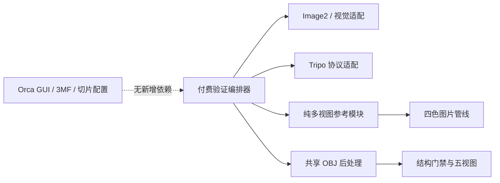

# 阶段 50 多视图模型生成架构复核

## 结论

多视图验证可以继续作为模型生成域能力，但当前只保留在实验编排层，不直接进入 Orca GUI、3MF、打印配置或正式 Sidecar API。两例真实结果均改善了最终视觉分数，证明方向有效；在正式产品化前仍应先抽取 `ModelGenerationGateway`，再以供应商无关的 `reference_views` 契约接入。

## 本阶段依赖方向

- `printable_multiview_reference.py` 只负责提示契约、固定布局、切分、四色处理、报告解析和清单，不再默认导入 OpenAI 兼容客户端。
- `run_paid_multiview_validation.py` 是实验编排边界，负责 Image2、视觉模型、Tripo、付费确认、恢复和人工批准审计。
- `tripo_client.py` 只增加命名视图到 Tripo v3 请求的协议映射；文件 token、URL 和 endpoint 没有进入 C++ GUI。
- 最终 OBJ 继续复用既有供应商无关的转换、顶点色、拓扑、结构门禁和渲染模块。

## 恢复与费用边界

- Image2 和视觉调用在请求前增加计数；缺少落盘结果时拒绝隐式重试。
- 重生成必须同时显式指定重复许可和重生成开关；旧图片、状态和清单归档到 `attempts/image2-attempt-XX/`。
- Tripo 返回任务 ID 后立即写入 `multiview-state.json`，随后才复制输入副本；恢复时只轮询原任务。
- AI 预检为 `review` 时，必须显式记录人工批准理由、图片 SHA-256、AI 分数和警告，才能创建 3D 任务。
- 本阶段实际新增 2 个 Tripo 生成任务和 2 个 OBJ 转换任务，没有启用第三个样本，也没有重复提交。

## 兼容性与隔离检查

- 本阶段没有修改 C++、3MF、打印机配置、材料配置或 Orca 页面状态。
- C++ GUI 中未出现 Tripo endpoint、file token 或多视图供应商字段；原版 Orca 演进面不增加新的合并冲突。
- 实验产物全部位于 `generated_models/model-multiview-validation-phase50/`，不会覆盖模型库历史条目。
- Windows 是当前唯一验收平台；纯 Python 模块没有主动引入 Windows 专属 API，但 macOS/Linux 未列入本阶段验证范围。

## 仍需处理的架构债务

1. 正式 `orca_ai_sidecar.py` 仍直接导入 `tripo_client`，说明现有生产链路尚未形成真正的多供应商 Gateway。
2. 正式接入多视图前，应定义供应商无关的 `reference_views`、能力发现、任务状态和错误分类；Sidecar 只依赖 Gateway，不依赖 Tripo 名称。
3. `run_paid_multiview_validation.py` 是实验工具，不应直接复制为生产协调器；应把状态机、任务仓储和人工批准记录迁入独立服务层。
4. 相机结果出现一个 4 顶点微小组件。自动删除组件属于几何修复策略，不能仅凭本次样本写死阈值；应在更大校准集后单独设计并测试。

## 推进门槛

- 先扩到至少 20 个多视图校准样本，并确认相对单视图的视觉得分、背面一致性或人工可用率有稳定提升。
- 再抽取 Gateway 并接入正式 Sidecar；在此之前不修改 Orca 客户端契约。
- 自动微小组件清理、薄壁和真实打印校准应分别设门禁，不与供应商接入耦合。

## 验证结果

- AI Python 全量回归：169/169 通过。
- `tools/ai` 语法检查：34/34 通过。
- `git diff --check`：通过，仅有仓库既有的 LF/CRLF 提示。
- 本阶段未修改 C++ 或 3MF 契约，因此没有重复构建 Orca；现有正式 GUI 行为不在本阶段变更范围。
