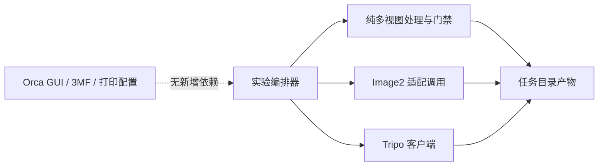

# 阶段 51 多视图校准架构复核

## 结论

本阶段只扩展独立实验编排器、纯 Python 门禁和文档，没有修改 Orca C++、3MF 或打印配置。供应商字段仍未进入 GUI。不过 2/4 的人工接受率说明不能把固定四宫格流程直接搬入正式 Sidecar；正式接入应先完成 `ModelGenerationGateway` 和参考视图策略路由。

## 当前依赖方向

依赖方向符合阶段性边界：纯模块不默认创建供应商客户端，付费调用只存在于显式实验编排器，人工批准和拒绝均带输入哈希落盘。

## 新发现的架构风险

1. 固定四宫格是一种策略，不是领域契约；若直接加入 Sidecar，会把 Image2 的布局和失败模式变成产品 API。
2. 自动视觉复核不能覆盖连通组件异常。结构报告和人工结论必须可以覆盖“自动分数提升”的汇总展示。
3. 样本专属 `generation_guidance` 适合实验，但正式领域应表达为结构化几何不变量，不能长期依赖自由文本。
4. 正式 Sidecar 仍直接导入 Tripo 客户端；在加入第二种视图策略前必须抽取 Gateway，否则策略分支会散落在任务状态机中。

## 保持不变的边界

- Orca 只接收最终 `GeneratedModelArtifact`、质量状态和可导入文件，不理解供应商视图 token。
- 3MF 和打印配置不保存供应商、提示词或远端任务状态。
- 本地切片、模型编辑和历史项目打开不依赖云端能力。
- 实验状态和中间图只写入 `generated_models/` 下对应任务目录。

## 下一阶段入口条件

1. 定义供应商无关的 `ReferenceViewStrategy`、能力快照和结构化几何不变量。
2. 抽取 `ModelGenerationGateway`，使 Sidecar 编排器不直接导入 Tripo API。
3. 将“新增组件 + 人工拒绝覆盖自动结果”纳入汇总契约和测试。
4. 完成 6 个跨类别策略校准样本后再决定 ADR-0002 是否转为 Accepted。

## 验证

- AI Python 全量回归：175/175 通过。
- `tools/ai/*.py`：34 个文件语法检查通过。
- `git diff --check`：通过。
- C++ AI/GUI 边界搜索：无 Tripo endpoint、file token、多视图 endpoint 或实验 guidance 字段。
- 纯 `printable_multiview_reference.py` 不导入供应商客户端；供应商依赖仅存在于实验编排器。正式 `orca_ai_sidecar.py` 仍直接导入 Tripo 客户端，继续列为 Gateway 抽取债务。
