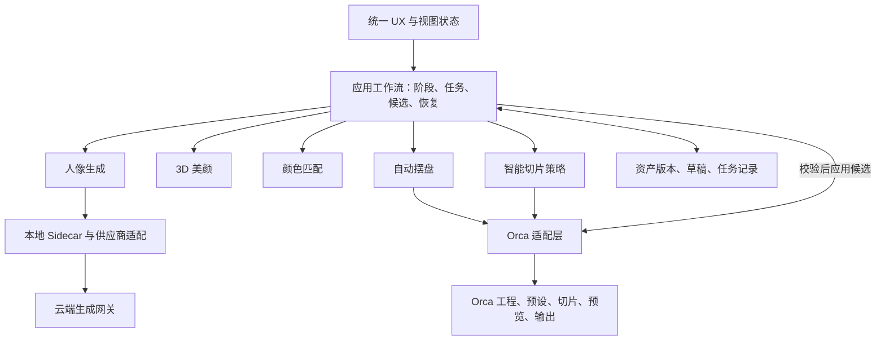
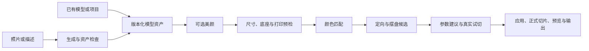

# 工作流优先的模块架构与首发方案

日期：2026-10-04。状态：架构提案，供产品与实现讨论；本文件不代表实现完成，也不替代现有主计划。源码检查基于本机 `codex/team/model-generation` 的 `9b9068e414c9`，未核验另一台 UX 的当前实现。

同日补充：用户提供的 UX 交接报告称真实旅程已经贯通，但五模块仍有计算、编排与控件耦合；其 HEAD 为 `588abecfeab64db33bdde3de35cc6cab98108eb8`，还包含大量未提交/未追踪文件，尚未与本机同步核验。具体实施改按[主计划“五模块独立演进”章节](../plans/2026-09-25-product-convergence-and-lightweight-plan.md)：保护现有旅程，优先拆颜色/美颜计算，再封装生成及摆盘/切片策略。以下工作流层表示职责，可由现有门面和协调器组合承担，不要求首轮另建全局旅程引擎。

建议先交付可完成真实任务的产品基础：**连续的 UX、可恢复的工作流、稳定的数据交接，以及每个关键模块的一套可用实现**。随后分别优化人像生成、颜色匹配、3D 美颜、自动摆盘与智能切片。可后置的是效果上限、复杂策略和非阻塞性能优化；数据正确性、最低可用质量、交互响应与实际打印闭环需要进入首发验收。

范围暂按“人像定制为首发主旅程，兼容已有模型的普通打印”展开。用户若选择通用切片为第一优先级，应调整旅程和验证样本，下面的模块边界仍适用。

## 1 产品目标与判断标准

首发的体验优势可以来自：用户更少选择参数、更少导出再导入、知道当前进度、可以修改和撤销、失败后从已完成的位置继续。生成质量与切片算法暂时使用现有可靠实现，也可能形成产品价值。

“完成 UX 和 AI 工作流，就比 Orca 更好用”应作为待验证的产品假设。先限定为目标任务：让同类用户在相同模型、打印机和耗材条件下，完成从输入到可检查打印任务的全过程。比较任务完成率、主动操作时间、需要理解的参数数量、返工次数与实物结果。AI 等待时间单独计量，不能用更少点击掩盖更长总时长。

Orca 官方已经提供自动摆盘，并支持间距、旋转和材料同盘等选项，因此首版可以复用这一能力，再增加更连贯的流程与解释。[官方自动摆盘说明](https://github.com/OrcaSlicer/OrcaSlicer/wiki/prepare_auto_arrange)

## 2 当前项目已经具备的基础

下表区分源码事实与建议；存在类型和入口不等于整条产品旅程已经验收。

| 当前证据 | 对本方案的意义 | 仍需补齐的边界 |
|---|---|---|
| [集成锁](../../docs/architecture/ai-integration-lock.json)与 [ADR-004](../../docs/architecture/ADR-004-commercial-ai-product-line.md)已选择桌面模块化单体、本地 Sidecar 和商业 Provider Gateway | 总体方向可沿用，无需重选客户端技术栈 | 各业务模块的运行、持久化和 UI 边界仍需逐项落实 |
| [GeneratedModelArtifact](../../src/slic3r/AI/Contracts/GeneratedModelArtifact.hpp)与 [IModelArtifactConsumer](../../src/slic3r/AI/Contracts/IModelArtifactConsumer.hpp)已有生成产物和导入交接 | 生成端已有稳定出口的起点 | 补足跨阶段版本、依赖和能力声明，保留旧消费者 |
| [SmartSlicingCoordinator](../../src/slic3r/AI/SmartSlicing/Application/SmartSlicingCoordinator.hpp)已有候选、取消、应用、撤销和运行记录入口 | 智能切片可作为其他能力拆分的参考 | 全产品的工作流要组合它，避免另造第二套智能切片状态机 |
| [OrcaPlacementCandidateProvider](../../src/slic3r/GUI/AI/Orca/OrcaPlacementCandidateProvider.hpp)在模型副本上调用原生摆盘并返回变换候选 | 已有可封装的基础摆盘实现 | 当前该入口只接受模型仍在当前盘的候选；多盘优化不能据此称为已完成 |
| [BeautyDocument](../../src/slic3r/GUI/AI/Model/BeautyDocument.hpp)区分编辑意图与几何身份；[BeautyPreparationTicket](../../src/slic3r/GUI/AI/ModelGeneration/BeautyPreparationTicket.hpp)有取消和结果归属保护 | 美颜已有数据边界和迟到结果保护基础 | [BeautyWorkbenchControls](../../src/slic3r/GUI/AI/ModelGeneration/BeautyWorkbenchControls.cpp)仍包含草稿文件读写；[BeautyView](../../src/slic3r/GUI/AI/ModelGeneration/ModelGenerationBeautyView.cpp)仍承担部分接受与保存流程 |
| [LocalPrintColorResult](../../src/slic3r/AI/Contracts/LocalPrintColorResult.hpp)区分目标色、物理槽位、配方、可执行性和证据 | 可作为颜色匹配模块的输出基础 | 不把色块数、屏幕色或配方存在等同于硬件执行和实物达标 |
| [本机短状态](../../docs/coordination/current-development.md)记录限定旅程的 GUI 与保存重开证据，以及共享宿主预算、恢复证据等未结项 | 首发准备应承接已有成果 | 本轮未重新执行测试；另一台 UX、完整视觉与实物打印仍不能称为已验收 |

本次优先拆颜色与美颜的纯计算依赖，再收口影响算法替换的保存和任务收尾职责。现有控件与旅程可继续复用；单纯把文件搬到新目录，不能建立模块独立性。

## 3 总体架构

继续采用 C++17、wxWidgets、CMake 和现有 Orca 内核；业务能力按模块组织，本地 AI 依赖通过已有 Sidecar 隔离。只在云端生成、身份和额度管理等确有远程需求的位置使用服务。

图表示职责与主要调用关系。设备、材料和工艺上下文由适配层采集成只读快照，再由应用层传给所需模块；算法不直接读取界面控件。

| 层次 | 负责 | 对外边界 |
|---|---|---|
| UX | 页面、交互、画布呈现、选择与结果比较 | 发出类型明确的操作，订阅工作流快照 |
| 应用工作流 | 判断下一步、组织任务、取消、重试、失效、候选接受与恢复 | 组合各模块，不实现具体算法 |
| 数据与契约 | 资产身份、编辑版本、打印上下文、兼容性与存储接口 | 不携带 wx 控件、Plater 指针或供应商 SDK 对象 |
| 能力模块 | 根据明确输入计算结果、候选和证据 | 返回数据，不直接跳转页面、保存正式工程或修改其他模块 |
| Orca 与供应商适配 | 把稳定接口转换成原生 API、现有算法或远端任务 | 把平台差异与供应商差异留在这一层 |

桌面功能仍随产品统一构建和发布。这里的“独立演进”首先指可以独立修改、测试和切换算法，而不改 UX 及其他能力的业务实现；它不承诺 C++ 二进制热替换。云端策略和本地 Sidecar 可以有独立版本，但需要协议握手、兼容范围和回退版本。

## 4 五个关键模块如何拆分

以下“首版基线”是建议验收范围，并非对当前完成度的声明。

| 模块 | 输入与输出 | 首版基线 | 后续独立优化 | 失败后的可用路径 |
|---|---|---|---|---|
| 人像模型生成 | 照片或描述、造型意图、生成约束 → 模型资产、纹理、来源与质量报告 | 固定一套经过验证的生成链路；规范单位、坐标与文件引用；保存远端任务 ID 和已完成产物 | 身份相似度、多视图一致性、细节、拓扑、成本、供应商切换 | 复用已完成资产或导入已有模型；没有可用模型时明确停在生成阶段 |
| 3D 美颜 | 模型资产、区域、用户修改 → 新外观版本或新几何版本、修改记录 | 已支持输入上的局部编辑、前后比较、撤销、保存和重开；自动识别不可用时保留手动编辑 | 语义识别、边界、五官细节、皮肤外观、几何形变 | 保留原版和已保存修改，可跳过可选美颜 |
| 颜色匹配 | 外观目标、区域、当前材料与工艺约束 → 可执行区域映射、未满足项、偏差与证据 | 对实际装载耗材进行离散匹配、手动修正和明确的降色反馈 | 感知色差、语义保护、材料标定、工艺配方、省换料优化 | 手动映射，或明确选择单色/降色；不能静默把多色目标判为完成 |
| 自动摆盘 | 对象实例、打印方向、床面、禁区、锁定对象、工艺约束 → 盘分配与变换候选 | 封装已有 Orca 摆盘；输出可验证候选；首发承诺多盘时单独完成多盘链路 | 紧凑度、方向选择、多盘分配、支撑/时间/换料综合目标 | 保留已有合法摆放或进入手动调整；非法摆放仍阻止输出 |
| 智能切片 | 已确认模型、颜色方案、摆盘和工艺上下文 → 参数候选、真实试切结果、推荐解释 | 原生预设加有限规则建议、基线与推荐候选比较、显式应用、正式切片 | 候选搜索、支撑与接缝策略、局部参数、质量/时间/耗材多目标优化 | 使用经过当前条件校验的原生预设与正式切片；原生切片报错必须继续处理 |

智能切片模块内部再区分“策略”和“执行”：策略提出受约束的参数或摆放方案；试切与正式 G-code 由 Orca 执行。时间、材料和换料等指标来自真实试切，不能把 AI 文本估算作为验证结果。

自动定向与自动摆盘在内部使用不同操作：定向改变打印姿态和表面质量，摆盘决定盘面位置与实例分配。两者可以由一个打印准备流程组织，但输入、结果与失效条件需要区分。

## 5 三个容易再次耦合的位置

**外观与制造分开。** 生成和美颜维护用户希望获得的形状、纹理与颜色；颜色匹配根据设备、材料和工艺决定实现方式。打印机从四种耗材换成六种耗材时，应重新计算制造方案，保留原始外观和美颜意图。界面中可以在同一工作台即时预览两个结果，不需要用不同页面强迫用户理解内部拆分。

**语义识别作为可选共享能力。** 美颜与配色都可能使用“脸、头发、眼睛”等区域。识别结果应包含几何身份、区域、置信度和来源，双方读取同一份结果；识别器不拥有用户涂色或槽位分配。用户确认的区域与修改有更高优先级，重新识别不得自动覆盖。

**真实制造约束允许联合优化。** 模块独立并不消除物理依赖：方向影响支撑，摆盘影响时间和擦料塔，颜色方案影响换料，某些配方依赖层高、方向和材料。由智能切片应用流程请求候选、在同一上下文中试切比较，避免模块互相调用彼此内部实现。首版采用固定顺序和有限候选，之后再增加联合搜索。

项目现有的 [打印与颜色边界](../domain/printing-color-boundaries.md)应继续保留：物理通道数、目标颜色数和配方组件数是不同概念；屏幕色、计算预测和实物色也分别记录。

## 6 稳定的数据与调用契约

保留现有具体类型，按消费者需要兼容扩展。不要为了统一接口把所有对象塞进一个巨大 JSON，也不要把当前工程模型复制成另一套正式真值。

| 契约 | 至少表达的内容 | 演进规则 |
|---|---|---|
| 资产引用 | asset ID、内容哈希、版本、父版本、格式、单位、坐标系、几何身份、关联文件 | 源资产不可变；新结果产生新版本；扩展当前 GeneratedModelArtifact 或关联 manifest |
| 外观与编辑文档 | 绑定的几何版本、区域、修改、锁定与用户意图 | 承接 BeautyDocument；新算法不能自动重算已接受的修改 |
| 打印上下文 | 打印机、喷嘴、床面、物理材料、配置作用域、工艺指纹 | 从 Orca 生成快照；单独变更制造条件不覆盖艺术目标 |
| 颜色与摆盘结果 | 绑定输入、明确的区域槽位/配方或实例变换、约束、未满足项 | 承接 LocalPrintColorResult 和 placement candidate；结果必须可校验 |
| 工作流任务 | workflow ID、stage、job ID、输入版本、算法/供应商版本、取消状态、结果引用、错误类别 | 主流程由应用层持有；Sidecar 只持有执行任务，按关联 ID 回报 |
| 候选结果 | 基线版本、输出资产或配置补丁、依赖指纹、质量证据、可应用状态 | 候选就绪与正式接受是两个事实；接受前再次检查当前上下文 |

公共任务生命周期可以一致，但请求和结果保持各模块的类型。UI 使用稳定的语义错误，例如“服务暂不可用”“输入不支持”“结果已过期”“保存失败”，不按某供应商的报错字符串推进流程。

建议任务外壳包含：`schema_version`、`job_id`、`capability_id`、`input_refs`、`base_revision`、`algorithm_version`、`parameters_fingerprint`、`budget`。结果包含对应输入身份、`output_refs`、`diagnostics` 和 `quality_evidence`。这些是目标字段，不表示当前已有统一实现。

兼容性分别管理协议版本、数据格式版本和算法版本。兼容新增字段应有默认值；不支持的新能力在调用前说明。历史项目恢复使用已保存的产物与参数，不因升级而自动换成新算法输出。

## 7 “升级模块不影响整体功能”的具体含义

合理目标是：算法升级无需重做页面、不会破坏旧项目、失败后有可用基线，相关下游只重新计算必要结果。无法承诺换了几何或工艺算法后，下游结果完全不受影响。

以下是目标依赖规则。首版先复用现有 WorkspaceRevision 做保守失效，只有缓存正确性得到验证后再细化到表中粒度。

| 发生变化 | 应保留 | 需要失效或重新验证 |
|---|---|---|
| 相机、选中对象、面板展开状态 | 所有制造结果 | 通常只刷新呈现 |
| 外观修改，几何不变 | 源几何、可复用的几何预检和摆放 | 颜色映射；若实际制造分配改变，试切和正式 G-code 失效 |
| 用户调整区域 | 原始模型、外观和未受影响修改 | 依赖该区域的匹配结果；不能覆盖用户锁定内容 |
| 耗材、槽位、喷嘴或工艺变化 | 模型和美颜意图 | 颜色可执行性、配方证明、打印约束与切片；摆放有相关依赖时也重验 |
| 打印姿态、尺寸、底座或几何变化 | 原始资产、可追溯的编辑意图 | 壁厚/悬垂、区域绑定、颜色映射、摆盘、配方与切片按实际依赖重验 |
| 算法升级 | 旧项目的已接受资产、旧参数和历史证据 | 新建任务产生新候选；旧项目只在用户请求时重新计算 |

几何变更尤其需要保护。当前区域引用依赖特定几何下的面序号，重拓扑后不能直接复用旧序号。新算法必须返回经过校验的映射，或把旧区域标为需要重建；用户修改不得静默丢弃。即使面数和拓扑相同，坐标变化也要重新验证相关几何依赖。

每个能力至少保留一套可用基线。新增算法先产生候选，经格式、约束和质量门槛检查后再被接受；可按版本切回基线。某个正在执行的任务固定使用开始时的算法版本，不能中途切换。

## 8 工作流与 UX 如何落地

这是默认旅程，不是强制逐页向导。已有合格结果可以跳过相应计算；回到美颜只使有依赖的下游结果过期。打印设备可以提前选择，用于尺寸和制造风险提示，但不能让生成产物只剩某一套耗材的降色结果。

用户界面可以采用“创作、外观、打印准备、结果”四个阶段；内部保留更细任务。沿用已有 UX 的视觉与交互决定，把它接到共同的应用状态，具体布局无需因为模块拆分而重做。

交互需要一起复现的包括：空态、输入无效、加载、后台处理中、取消中、可编辑、候选比较、输入变化、断网、部分成功、保存失败、历史恢复。只复现正常路径和静态页面无法形成稳定的上线基础。

默认自动完成只读检查与可取消计算。生成费用可以在生成操作处说明；候选用“应用并切片”明确接受。采用就地解释与结果比较，避免每一步增加确认弹窗。普通用户获得明确下一步，专家仍能进入原生参数并撤销自动建议。

## 9 数据所有权与恢复

| 数据 | 唯一负责方 | 恢复方式 |
|---|---|---|
| 原始照片、生成结果、美颜版本 | 资产存储接口 | 不可变原件和版本引用；失败不覆盖原件 |
| 草稿与用户编辑意图 | 编辑应用服务及其存储接口 | 从已成功保存的草稿恢复；保存失败保持未保存状态 |
| 整条产品旅程 | 应用工作流 | 保存阶段、输入版本和任务引用；重启后重建可继续的状态 |
| 远端生成任务 | 网关/Sidecar 执行服务 | 根据已记录 request ID 与 provider task ID 查询和对账 |
| 正式模型、预设、配置、切片状态 | Orca 工程 | 沿用原生 Undo、dirty、backup 与 3MF |
| 邻接、预览、识别和试切中间结果 | 各模块的可丢弃缓存 | 根据输入、算法和配置指纹重新计算 |

首版可沿用已有文件与元数据存储，不要求先换数据库。候选资产先写入并校验，再原子发布其有效引用；中途失败保留原版和诊断。正式应用统一经过 Orca 适配层，在 GUI 线程完成一次可撤销操作；重计算在后台运行。

取消是粘性的。结果回传时同时核对任务实例、输入版本和当前上下文；A→B→A 后旧 A 任务也不能被当成新任务接受。外部生成已经提交时，取消本地等待不必然取消远端费用；恢复先查询，不直接再次提交。供应商缺乏可靠幂等或查询能力时，结果未知的请求进入待核对状态，不能保证“恰好一次”收费。

3MF 继续承担正式打印工程的可移植性。AI 历史可以在外部资产库维护；打开已保存工程、进行普通切片时，不应依赖在线生成服务和本地 AI 缓存。若以后要随工程携带可继续编辑的美颜历史，应另定义可选扩展及跨版本读取行为。[Orca 官方说明](https://www.orcaslicer.com/wiki/general_settings/import_export)也区分模型数据与 3MF 中的打印机、材料及工艺信息。

## 10 实施顺序与现有计划的关系

以下是提议的实施顺序，未改变当前执行队列。继续使用[现有主计划](../plans/2026-09-25-product-convergence-and-lightweight-plan.md)及稳定编号，不建立另一套进度台账。

| 顺序 | 可交付结果 | 完成依据 | 承接关系 |
|---|---|---|---|
| 先收口最小共享边界 | 明确资产/工作区版本、任务生命周期、外观与制造输出、候选接受规则 | 当前实现可以通过这些边界接入；保存和迟到结果不依赖页面控件 | A.1/A.3、B.4/B.5、C.2/C.3、E2 |
| 用现有实现打通一条真实旅程 | 照片或已有模型到美颜、材料映射、摆盘、切片、保存重开与输出 | 新 UX 中真实执行，失败和离线路径可以恢复；目标设备有打印样件 | A.2/A.5、相关 UX 联合验收；实物范围需纳入首发承诺 |
| 冻结首发基线 | 支持范围、默认算法、包与运行版本对应；旧项目兼容 | 集成后的同一候选版本完成首发旅程验证和回退验证 | E2 与现有集成、发布流程 |
| 按模块提升指标 | 保留基线，替换一个能力实现，针对该模块和受影响旅程验证 | 有固定输入、输出质量和性能证据；无强制 UX/格式变更 | 后续 D、B.2/B.3、几何美颜及 F 等按产品决定恢复 |

先完成一条纵向旅程，再推广接口到其他入口。每批迁移使用“稳定门面→委托旧实现→替换内部实现→删除无消费者旧路径”的顺序；契约、UX、算法、历史格式不在同一批同时大改。

两台开发设备可按边界并行：UX 侧负责视图、操作和状态呈现；能力侧负责算法、任务执行与数据持久化；共享适配器与契约由集成范围统一管理。双方交接的是输入/输出示例、状态和错误表、兼容版本、受影响消费者，以及匹配构建产物。另一台的实际实现需在接入时核验，不能由本机文档推断。

## 11 首发门槛与可后置项

| 首发必须建立的能力 | 可以在上线后继续改善的部分 |
|---|---|
| 目标范围内真实生成或导入可用模型，并有基本质量下限 | 更强身份保真、更广风格和更复杂输入 |
| 支持格式上的编辑、撤销、保存和重开可靠 | 更精细语义、更自然五官、更复杂几何美颜 |
| 目标色与实际可打印颜色区别明确，输出映射正确 | 材料标定扩大、连续色域、复杂叠色配方 |
| 合法摆放、制造约束通过、真实切片与预览可用 | 极限装盘率、大规模多盘联合最优 |
| 支持模型规模下 UI 可响应、任务可取消、资源有上限 | 非阻塞耗时继续下降、内存与包体进一步优化 |
| 限定目标机器、材料和代表样件完成实际打印验证 | 扩大硬件兼容和高难度打印覆盖 |

最低可用性能与正确性不能完全延期。先固定支持的模型规模、设备档位和输入格式，在同一候选上测“点击到反馈”“到首次可编辑”“总耗时”“峰值内存”和取消行为，再设置可达的发行预算。本提案不给未经测量的时间承诺。

若首发由产品提供在线生成额度，共享供应商凭据、身份、额度及费用决定应在服务端管理；客户端只持有产品会话信息。现有本地 `model_provider_gateway.py` 的存在不能证明生产云端网关已部署。此项与 UX/算法拆分可并行，但属于在线业务实际可交付的组成部分。

当前代码状态仍记录共享宿主预算超限、部分失败恢复缺乏证据，以及跨机 UX 与完整打印未验。它们应按各自范围收口，不用等待所有效果实验完成，也不能被一次本机 GUI 成功代替。

## 12 如何证明模块已经解耦

1. 替换生成供应商时，UX、美颜与切片消费者无需改业务代码；适配层输出同一资产契约。
2. 同一外观换一套耗材时，只更新制造方案与有依赖的下游结果，不重新付费生成人像。
3. 美颜算法失败或关闭时，原模型可继续打印；已保存的修改不会消失。
4. 摆盘优化器不可用时，已有合法摆放或原生策略仍能完成切片；不绕过碰撞和设备约束。
5. 智能建议服务离线时，普通 Orca 导入、编辑、保存、切片和输出继续可用。
6. 保存中断、取消、输入切换和迟到结果不会串模型、覆盖原件或把未保存结果标为成功。
7. 新版本能打开旧项目并按原参数处理；算法升级不会隐式改变已经接受的内容。

验证按影响范围选择：纯算法使用固定样本和性质约束；共享契约覆盖消费者与旧数据；工作流覆盖恢复和失效；集成版本覆盖真实 UX 旅程。摆盘/切片改变时比较真实 G-code 指标；涉及外观与制造效果时检查样件。编译、GUI 成功、视觉效果和实物打印分别记录。

独立优化指标也分别维护：生成看可用率与相似度，美颜看编辑保留与人工返工，配色看区域差错和实物偏差，摆盘看约束合格率与盘数，智能切片看成功率、时间、材料及样件质量。共用相同输入和设备快照，才能区分收益来自哪个模块。

## 13 本提案的架构决策记录

下列均为本次提议；与已接受 ADR 一致的部分承接其理由，新增契约仍需按实际消费者落实。

| 决策 | 采用理由 | 代价与约束 |
|---|---|---|
| 继续桌面模块化单体与单一本地 Sidecar | 复用 Orca 与既有构建，减少安装、端口和跨进程状态成本 | 本地模块通常仍随整包发布；用代码边界和定向回归保证独立性 |
| 应用层管理流程，模块输出数据或候选 | UX 与算法解耦，统一取消、失效与恢复语义 | 应用层只组合模块，不能成长为包含全部算法的巨型协调器 |
| 不可变资产与唯一正式 Orca 工程 | 保留原件、支持版本比较和可靠撤销 | 增加存储占用；先按引用管理缓存，后续再做安全清理 |
| 外观目标与制造方案分别存储 | 换材料和优化配色时保留创作结果 | 必须显式表达两种预览与未满足的打印目标 |
| 首发采用基线算法，增强策略作为可切换实现 | 先交付真实闭环，按数据提升模块 | 基线也要过最低质量和可靠性门槛；降级不能伪装成成功 |

本轮仅完成源码与文档范围的架构分析及提案。未修改业务代码、运行应用或重新执行发布门禁；当前测试与 GUI 结论均来自引用的既有状态记录。
