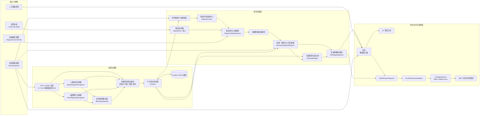
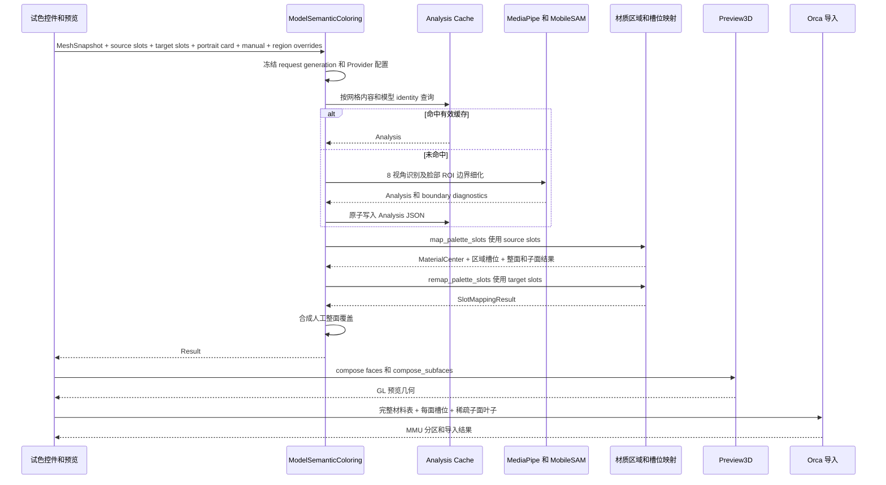
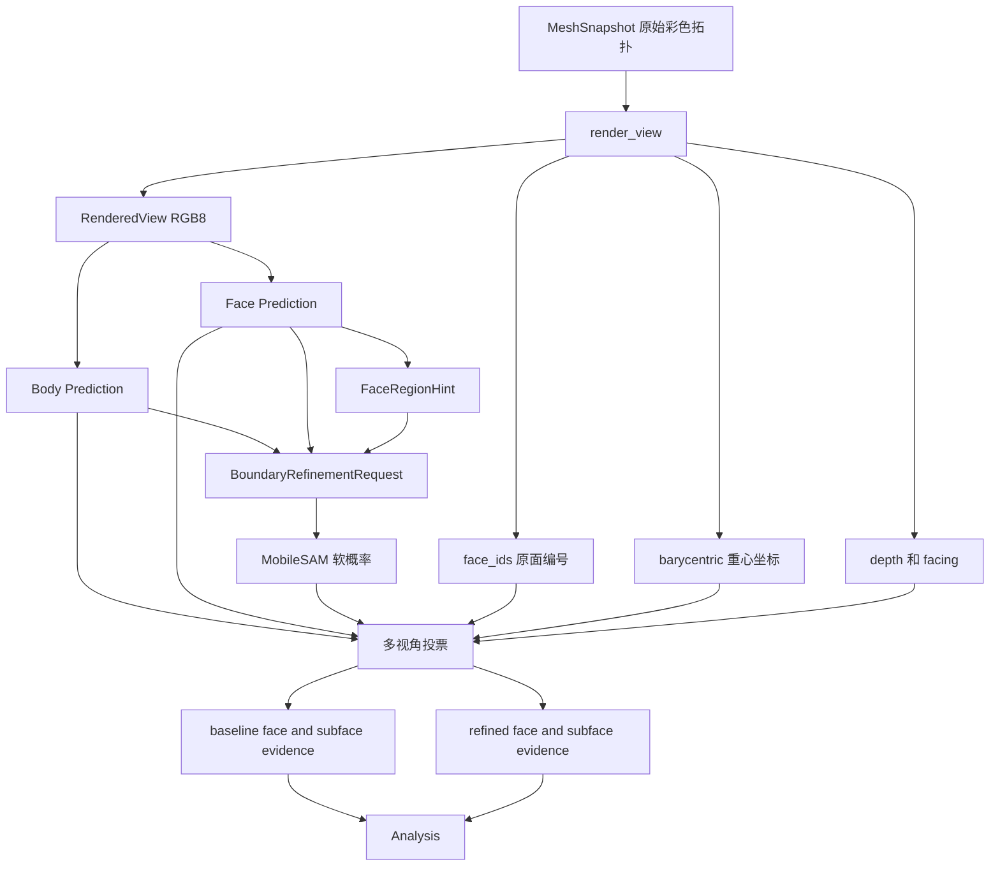
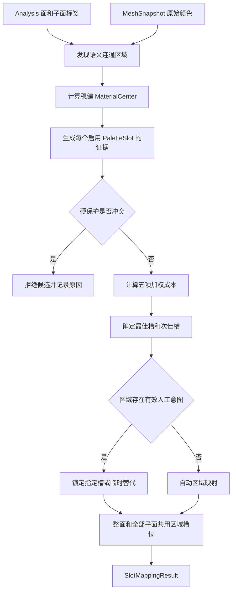
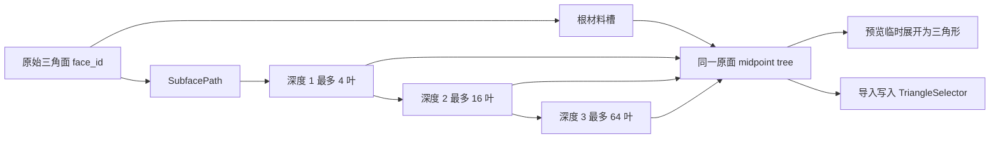
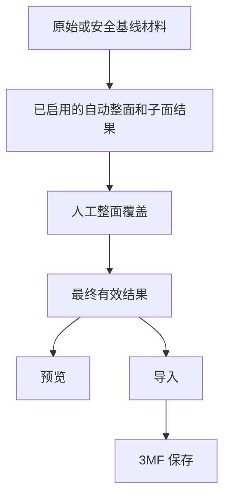
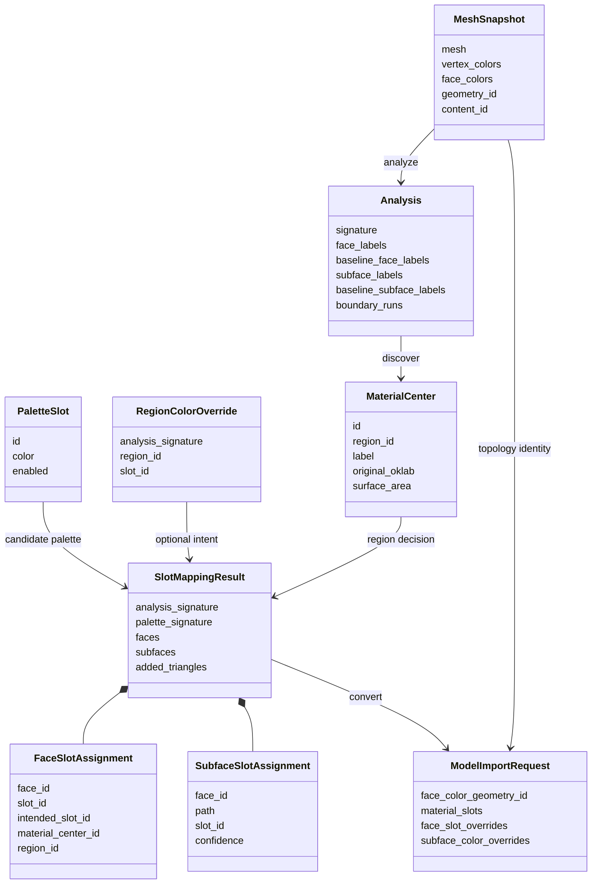
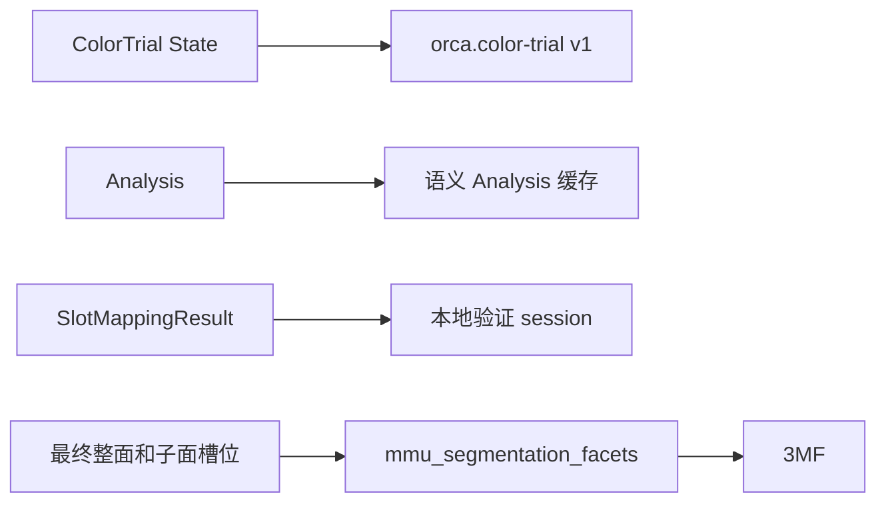

# 当前模型上色模块架构与数据说明

> 文档基线：`codex/exp/mobile-sam-local-validation` 当前工作树  
> 语义证据版本：`orca.semantic-coloring/v23-region-consistency-joint-boundary`  
> 材质映射版本：`orca.semantic-material-mapping/v6`  
> 本文描述当前源码已经存在的实现，不包含尚未落地的训练模型和后续计划。

## 1. 模块边界

当前上色链路分为三层：

1. **识别证据层**：把原始彩色网格渲染成多视角 RGB、深度、原面 ID 和重心坐标；MediaPipe 输出人体与五官语义，MobileSAM 可选地细化局部边界。
2. **配色决策层**：把像素证据回投到原始面及子面，借助视角、几何和邻接证据发现可信材质区域；区域选槽主要按原色与语义兼容性，从 1～6 个耗材槽中选择颜色。
3. **预览与打印落地层**：叠加人工整面覆盖，构造预览几何；导入时把同一整面/子面材料树写入 Orca 的 MMU 分区并随 3MF 保存。

识别模型只回答“这里是什么区域、边界大致在哪里”，不选择耗材。耗材映射也不修改识别证据，因此换耗材无需重新运行视觉模型。

## 2. 总体架构图



### 2.1 关键依赖方向

- `MediaPipeRegionRecognizers` 和 `NativeMobileSamBoundaryRefiner` 依赖模型运行时，但业务层只依赖统一接口及统一标签。
- `SemanticColoring` 负责渲染、回投、分析、候选评分、整面/子面基础映射和缓存格式。
- `SemanticMaterialRegions` 是配色业务后处理，综合语义、原色、面积、邻接、法向和局部连通性；它不是识别模型。
- `SemanticPaletteMapping` 负责稳定区域、槽位 ID、区域覆盖、推荐诊断以及槽位增减后的重映射。
- `ModelSemanticColoring` 是后台任务协调器，负责取消、缓存、Provider 创建、映射、人工覆盖和结果交付。
- `ModelPreview3D` 与 `OrcaWorkspaceAdapter` 分别消费同一合成结果用于显示和打印分区。

## 3. 一次自动配色的数据流



### 3.1 source slots 与 target slots

这两个集合的槽位 ID 相同，但用途不同：

- **source slots**：参与区域原色与候选耗材的竞争，决定区域绑定哪个稳定槽位 ID。
- **target slots**：表示当前实际耗材颜色。绑定完成后按槽位 ID 替换颜色，不重新跑识别或重新做最近色竞争。
- 槽位被临时停用时，系统记录 `intended_slot_id`，选一个仍启用的临时替代槽；恢复后可以回到原槽。

## 4. 识别与边界数据流



当前固定渲染 8 个水平视角，每隔 45 度一张 512 像素图；检测到脸部后会从同一原网格重新光栅化局部 ROI。ROI 不是把低分辨率截图放大，因此仍能获得准确的原面编号、深度和重心坐标。

MobileSAM 的输出保留为 ROI 内软概率。只有满足人物、部位、侧别、可靠种子、连通性和多视角条件的结果才进入回投；失败、拒绝或冲突会保留基线证据。

## 5. 区域颜色选择逻辑

### 5.1 生产映射实际使用的区域候选评分

`PalettePolicy::decide()` 调用统一评分函数取得原色和语义分量，但传入的多视角、几何、邻接支持目前均为 `1.0`，因此这三项对区域候选的排序不产生差异。生产选槽实际使用下面的成本，越低越好：

```text
区域成本 = (0.35 × 原色成本 + 0.30 × 语义不兼容成本) / 0.65
         - 兼容的人像色卡角色加分
         + 高饱和超出原色的惩罚
```

角色加分上限为 `0.10`；硬保护可以直接拒绝明显冲突的候选。多视角、深度/原面回投、法向、面积和邻接主要在上游证据融合、材质中心发现及边界后处理发挥作用，并非当前区域选槽的独立动态权重。

源码同时提供一个可审计的通用 `score_palette_candidate()` 函数，支持五项成本：

```text
通用评分 = 0.35 × 原色距离成本
       + 0.30 × 语义不兼容成本
       + 0.15 × 多视角不一致成本
       + 0.10 × 几何不支持成本
       + 0.10 × 邻接不连续成本
       - 人像角色加分
```

上述五项公式是函数的能力边界，不能解读为当前生产区域映射已经动态使用全部五项。虹膜、皮肤、嘴唇、眼白等保护区域还会在明显违背原色或侵入相邻五官时拒绝候选。

### 5.2 决策流程



图中“整面和全部子面共用区域槽位”表示同一区域 ID 的绑定一致；子面也可能有独立于根面的区域 ID 和标签。`SemanticMaterialRegions` 参与整面映射后处理，包括可靠肤色空洞、阴影碎片、耳发接缝、眼部保护、白衣与独立灰色材质、发际线以及衣服/皮肤边界。已发现的可靠原色材质区域最终会重新断言统一选槽，避免局部修补规则悄悄改变推荐结果；未归入该区域的低置信位置仍可受后处理影响。

## 6. 整面、子面与锯齿边界



- `SubfacePath` 每级使用 2 bit：`0/1/2` 为三个角子面，`3` 为中心子面。
- 当前支持深度 `1..3`。深度 3 只用于有连续边界证据的局部，不对整个模型细分。
- 一个分裂节点增加 3 个三角形。默认预算是最多新增 20 万个三角形且不超过原面数 20%，候选最低置信度 0.70。
- 预算失败是事务性的：保留已验证的安全整面或基线子面树，不提交半棵无效树。
- 预览中的平滑法线或 MSAA 只改变显示；真实打印边界由子面材料树决定。

## 7. 合成优先级与一致性



实际优先级为：

1. 人工整面覆盖。
2. 已启用的自动整面和子面结果。
3. 原始颜色或安全基线。

人工覆盖一个原始面时，该面所有自动子面叶子都被抑制。`ModelPreview3D::import_face_color_overrides()` 与 `import_subface_color_overrides()` 使用和屏幕预览相同的 `compose()` / `compose_subfaces()`，防止“预览正确、导入不同”。

## 8. 核心数据结构

### 8.1 网格与渲染证据

| 结构 | 关键字段 | 数据含义与生命周期 |
|---|---|---|
| `MeshSnapshot` | `mesh`, `vertex_colors`, `face_colors`, `geometry_id`, `content_id` | 后台任务使用的不可变原网格快照。`geometry_id` 标识拓扑，`content_id` 同时绑定原始颜色内容。 |
| `RGBImage` | `width`, `height`, `pixels` | 顶左原点、紧密排列的 RGB8 图像，是所有识别接口的统一输入。 |
| `RenderedView` | `image`, `face_ids`, `barycentric`, `depth`, `facing`, `surface_samples` | CPU z-buffer 输出。每个像素可追溯到原始面和面内位置；`surface_samples` 补充密集网格的漏采样面。 |
| `ViewRegion` | `left`, `top`, `width`, `height` | 归一化相机区域；脸部局部图会重新光栅化整个源网格。 |

### 8.2 统一模型接口

| 结构/接口 | 关键字段或返回值 | 说明 |
|---|---|---|
| `Label` | `Hair`, `FaceSkin`, `BodySkin`, `Clothes`, `Lips`, `MouthInterior`, `EyeSclera`, `Iris`, `Eyebrow` 等 | 业务层统一语义；不暴露 MediaPipe 类别编号和 478 点索引。 |
| `Prediction` | `labels`, `confidence`, `person_detected`, `face_detected`, `regions` | 与输入图同尺寸的粗语义及面部 ROI 提示。 |
| `IBodyRegionRecognizer` | `identity()`, `predict()` | 人体大区域识别端口。实现可独立替换。 |
| `IFaceRegionRecognizer` | `identity()`, `predict()` | 面部五官识别端口。landmark 到掩膜的转换留在适配器内部。 |
| `FaceRegionHint` | `person_id`, `part`, `side`, `box`, `support_polygon` | 面部适配器给业务层的解剖位置提示，不包含模型专用点号。 |
| `BoundaryTarget` | 人物、部位、侧别、ROI、前景/背景、提示点 | 描述一次局部边界任务。不同人物、左右部位分别处理。 |
| `IBoundaryRefiner` | `identity()`, `refine()` | 局部边界模型端口；当前原生 MobileSAM 实现返回软掩膜。 |
| `BoundaryRefinement` | `foreground_probability`, `confidence`, `rejected`, `model_score`, 耗时 | ROI 内软概率及运行诊断。ROI 外为 NaN；拒绝与运行错误分开。 |
| `BoundaryRunDiagnostic` | 人物/部位/侧别、状态、原因、耗时、变化像素 | 用于定位是模型、自动提示、ROI、回投还是策略回退造成失败。 |

### 8.3 识别分析

| 结构 | 关键字段 | 说明 |
|---|---|---|
| `SubfaceLabelEvidence` | `face_id`, `path`, `label`, `confidence`, `samples` | 某原始面内一个 midpoint 叶子的语义证据。 |
| `Analysis` | Provider identities、`signature`、当前/基线面标签、当前/基线子面标签、视角计数、边界诊断 | 与耗材无关的识别结果。基线字段是边界细化失败或越界时的安全回退层。 |
| `SubfaceBudget` | `maximum_added_triangles`, `maximum_added_ratio`, `minimum_confidence` | 限制边界细分的规模和最低可信度。 |

### 8.4 材质中心、槽位和区域覆盖

| 结构 | 关键字段 | 说明 |
|---|---|---|
| `PaletteSlot` | `id`, `color`, `enabled` | 稳定耗材身份。ID 独立于数组顺序和 RGB，因此支持重排及同 RGB 不同槽。 |
| `MaterialCenter` | `id`, `label`, `original_rgb/oklab`, 面数/面积、`region_id`, 分位数、离散度、主色比例、梯度 | 从不可变原色和语义区域发现的稳健材质代表；不随当前耗材数量改变。 |
| `RegionColorOverride` | `analysis_signature`, `material_center_id`, `region_id`, `slot_id`, `target_color`, `semantic_role`, `locked` | 用户对一个稳定区域的颜色意图。签名不一致时成为过期意图，不会套到另一个模型。 |
| `RegionPaletteDecision` | 最佳/次佳成本、分差、歧义、候选列表 | 某个区域所有候选耗材的可审计决策。 |
| `RegionColorRecommendation` | 区域原色、面积、推荐槽、完整候选和拒绝原因 | 面向 UI/诊断的只读推荐接口。 |
| `ResolvedRegionColor` | 预期槽、实际槽、实际颜色、状态 | 表示自动、锁定、临时替代、歧义、过期、槽缺失或无可行候选。 |

### 8.5 最终映射结果

| 结构 | 关键字段 | 说明 |
|---|---|---|
| `FaceSlotAssignment` | `face_id`, `slot_id`, `intended_slot_id`, `intended_color`, `material_center_id`, `region_id` | 每个原始面最终绑定的稳定槽及原始意图。 |
| `SubfaceSlotAssignment` | 上述字段加 `SubfacePath` 和 `confidence` | 子面叶子的槽位绑定。 |
| `SlotMappingResult` | `faces`, `subfaces`, 面/子面槽位、材质中心、签名、区域覆盖、解析状态、统计 | 配色决策层的完整输出，也是预览、推荐、恢复和导入的共同依据。 |
| `ModelSemanticColoring::Result` | GL 几何、自动/人工颜色、`Analysis`, `SlotMappingResult`, 诊断和耗时 | 后台任务向 GUI 一次性交付的结果；GUI 只采用当前 generation 的结果。 |

### 8.6 导入数据合同

| 结构 | 关键字段 | 说明 |
|---|---|---|
| `ModelPaletteSlot` | `slot_id`, `color`, `project_slot` | 稳定槽位到 Orca 项目耗材序号的完整表，包含仅被子面使用的材料。 |
| `ModelFaceSlotOverride` | `face_id`, `slot_id` | 必须精确覆盖每个源面一次的根材料。 |
| `ModelSubfaceColorOverride` | `face_id`, `depth`, `path`, `color`, `slot_id` | 不改变源拓扑的稀疏 midpoint 叶子。 |
| `ModelImportRequest` | artifact、颜色模式、整面/子面覆盖、几何 ID、完整槽表 | 预览到 Orca 工作区的事务合同。显式材料导入绕过重新聚类。 |
| `TriangleSelector::MidpointSubfaceState` | depth、path、MMU state | 最终写入 `mmu_segmentation_facets` 的打印材料树节点。 |

## 9. 数据关系图



## 10. 缓存、失效和取消

### 10.1 Analysis 缓存

缓存键绑定：

- 网格几何身份；
- 原始颜色内容身份；
- 语义流水线版本；
- Body Provider identity；
- Face Provider identity；
- Boundary Provider identity。

因此，更换模型、权重、预处理、原始纹理或拓扑会重新识别；仅改变耗材颜色或启用槽位不会重新识别。

### 10.2 材质发现缓存

材质中心发现独立于候选耗材。增减 1～6 色时复用原色区域中心，再对候选槽重新评分；不会从已经减色的输出反推原色。

### 10.3 任务代际

`ModelSemanticColoring` 为请求分配 `generation`，后台任务持有不可变快照和取消令牌。切换模型、配置或请求后会取消旧任务；GUI 只采纳当前请求结果，避免过期识别写入新模型。

## 11. 持久化边界



- `orca.color-trial/v1` 保存试色色卡、mapping colors、锁定、1～6 色数量、开关、稳定槽位 ID、启用状态和休眠槽位，并绑定 geometry SHA256 与面数。
- `Analysis` 单独缓存，保存模型身份、当前/基线面与子面证据及边界诊断，不包含当前耗材颜色。
- `SlotMappingResult` 可由 `orca.semantic-material-mapping/v6` 编解码，并继续读取 v2-v5；当前本地验证入口用它恢复完整映射和区域意图。
- 标准 3MF 的打印事实是最终 MMU 整面和 midpoint 子面材料树。3MF 不需要在切片时重新运行 MediaPipe 或 MobileSAM。

## 12. 失败与回退规则

| 失败位置 | 当前回退行为 |
|---|---|
| MediaPipe 资源缺失或识别失败 | 语义自动层不提交，保留原有配色/人工结果。 |
| MobileSAM 缺失、损坏、拒绝、取消或超时 | 保留 MediaPipe 基线，不清空整模型。 |
| 无可靠人物或动物样本 | `person_detected == false`，不生成语义自动覆盖。 |
| 区域覆盖签名过期 | 标为 `StaleIntent`，不应用到当前分析。 |
| 预期槽位停用 | 使用临时有效槽，保留预期槽 ID，恢复后可还原。 |
| 子面证据不足或超预算 | 保留安全整面或基线子面树。 |
| 导入拓扑不一致 | 事务失败，不做最近面猜测或重建映射。 |
| 导入槽表不完整 | 事务失败，避免仅由子面使用的材料丢失。 |

## 13. 当前源码入口

| 职责 | 文件 |
|---|---|
| 统一标签、识别接口、Analysis、渲染、评分、子面和缓存合同 | `src/slic3r/AI/ModelGeneration/SemanticColoring/SemanticColoring.hpp/.cpp` |
| MediaPipe 工厂和模型适配器 | `MediaPipeRegionRecognizers.hpp/.cpp` |
| MobileSAM 原生边界实现 | `NativeMobileSamBoundaryRefiner.hpp/.cpp` |
| 自动提示、软掩膜接受和连续轮廓 | `SemanticBoundaryRefinement.hpp/.cpp` |
| 区域一致性与几何后处理 | `SemanticMaterialRegions.cpp` |
| 稳定槽位、区域覆盖、推荐与映射持久化 | `SemanticPaletteMapping.hpp/.cpp` |
| 后台调度、缓存、取消、映射与预览几何 | `src/slic3r/GUI/AI/ModelGeneration/ModelSemanticColoring.hpp/.cpp` |
| 预览合成和导出同源结果 | `ModelPreviewSemantics.cpp`, `ModelPreview3D.hpp` |
| 1～6 色控件状态持久化 | `src/slic3r/GUI/AI/Model/ColorTrialState.hpp` |
| 导入数据合同 | `src/slic3r/AI/Contracts/IModelArtifactConsumer.hpp` |
| MMU 整面和子面材料树写入 | `src/slic3r/GUI/AI/Orca/ModelColorUpdate.hpp` |
| 工作区导入和 3MF 模型落地 | `src/slic3r/GUI/AI/Orca/OrcaWorkspaceAdapter.cpp` |

## 14. 当前实现的关键限制

- 语义模型和边界模型提供证据，不保证有限耗材一定存在与原色兼容的颜色。
- 区域材质中心和局部规则仍依赖阈值；耳发、眼部和眉毛的极窄边界可能受 512 像素采样及原始三角面密度限制。
- 深度 3 子面可改善实际打印边界，但会增加材料树和显示几何规模，必须受预算控制。
- `ColorTrial State` 保存试色控件与槽位状态；完整区域映射目前由本地验证 session 单独保存。最终 3MF 保存的是打印分区结果，而不是完整可重新推理的语义会话。
- 屏幕抗锯齿、平滑法线和真实打印材料边界属于不同问题，验收时需要分别观察。
