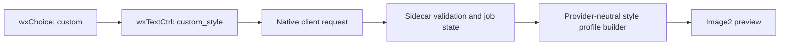

# 自定义图片风格与用户旅程复验设计

## 目标

在 3D 生成页面现有五种预设风格后增加“自定义”。用户选中后原位展开文字框，输入希望使用的视觉风格；该文字同时用于文生图和图生图预览，并能随未完成任务恢复。完成实现后，以正式 Windows Orca 从输入到图片确认、3D 入口和页面往返完整复验。

## 方案比较

### 弹窗输入

实现简单，但打断用户从输入到预览的连续视线，也不利于检查和修改，拒绝。

### 把自定义文字拼进风格 ID

改动少，但会混淆稳定枚举和自由文本，破坏能力发现、状态恢复与多供应商适配，拒绝。

### 内联输入 + 独立请求字段（采用）

`style=custom` 表示策略，自由文本放在 `custom_style`；输入框只在选择“自定义”时展开。预设和自由文本边界清楚，Sidecar 可独立校验，未来 Gateway 可把它映射到不同供应商。

## 交互

1. 风格下拉末尾增加“自定义”。
2. 选择后紧邻下方显示“自定义风格描述”多行输入框和示例提示。
3. 输入框变化立即刷新按钮可用状态和“预览已过期”判断，不需要点击其他控件触发。
4. 自定义文字为空时“生成图片预览”禁用；若通过键盘等路径触发，显示就近中文提示。
5. 切回预设风格隐藏输入框但保留草稿；再次选择恢复。
6. 恢复未完成的自定义任务时，自动选择“自定义”、还原文字并展开输入框。

## 契约与数据流

- `style` 新增稳定值 `custom`。
- `custom_style` 为独立 UTF-8 字段，必填、去除首尾空白、最大 1000 字节。
- 非 `custom` 风格不接受非空 `custom_style`，避免陈旧 UI 状态污染预设任务。
- 自定义描述只作为外观方向；主体、构图、四色、连接和可打印性硬约束优先。
- 状态文件和公开任务状态保存该字段；不写入 3MF、打印配置或 Orca 核心模型。

## 验收

- 五个预设风格请求和恢复行为不变。
- 自定义空值、超长值、预设风格携带自定义值均被安全拒绝。
- 自定义文字实际进入文生图、图生图提示构造。
- 正式 Orca 中选择“自定义”立即展开，切换即时隐藏/恢复，输入后按钮状态立即更新。
- 真实图片预览流程成功后，确认按钮和 3D 生成入口符合现有付费确认边界；复验不必实际创建新的付费 3D 任务。
