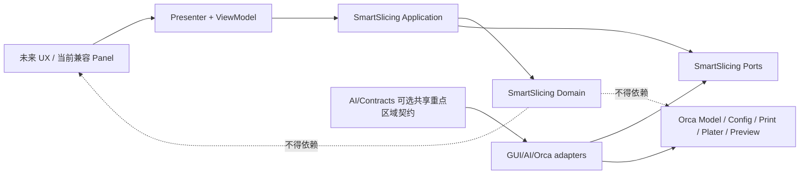
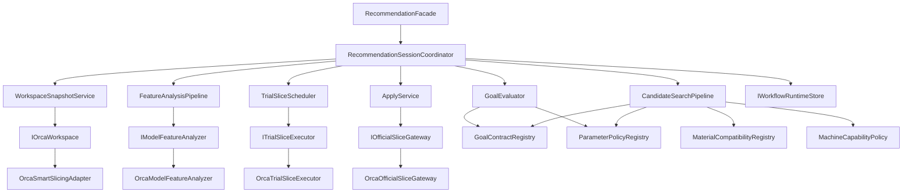
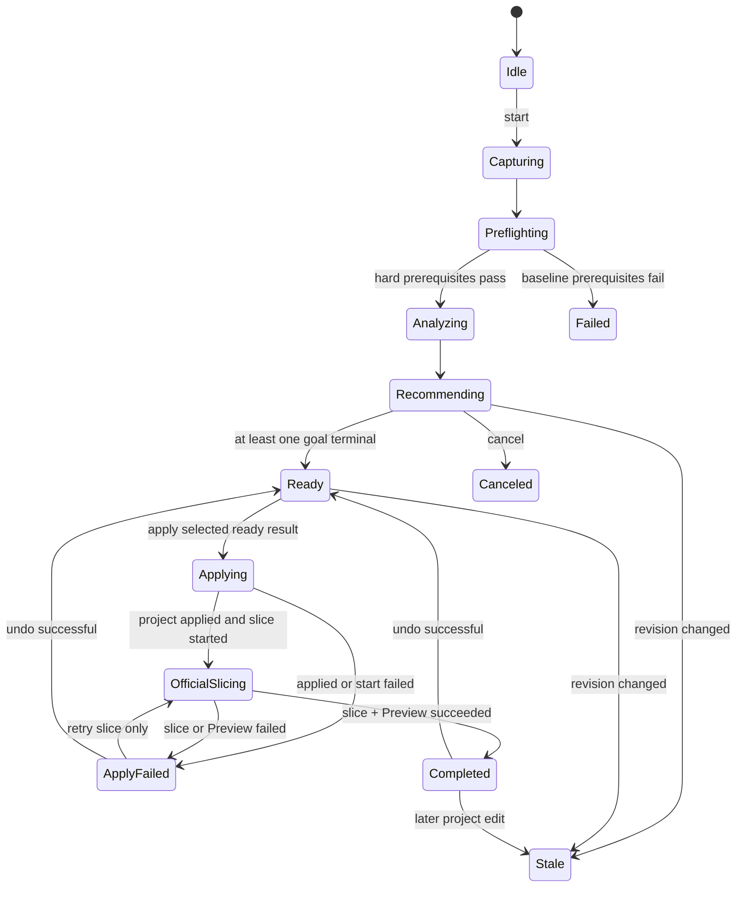

# AI 智能切片软件详细设计

- 日期：2026-09-28
- 状态：详细设计基线，可用于分阶段开发任务拆分与验收
- 上游需求：[AI 智能切片需求与方案基线](2026-09-28-ai-smart-slicing-requirements-and-solution.md)
- 架构约束：[ADR-002：智能切片采用 Plater 工作台与事务式候选架构](../../Docs/architecture/ADR-002-smart-slicing-transactional-workbench.md)
- 适用范围：Windows 内部开发版、WonderMaker 4/6 独立喷头、0.4 mm、PLA/PETG/TPU 同材料家族
- 非范围：公共发布、云端模型分析、跨工程优化、单喷头智能推荐、未经验证的混合材料自动推荐

## 1. 文档目标

本文把已经冻结的产品需求转换为可实现、可测试、可分阶段交付的软件设计。后续任务应能仅凭本文和上游需求确定：

- 模块边界、依赖方向和受控集成点；
- 稳定请求/响应对象、状态机、错误码和线程规则；
- 工作区快照、人工意图、设备/材料能力和模型特征的数据契约；
- 三目标候选生成、隔离试切、硬门槛、比较和解释规则；
- 应用、正式切片、失败重试、撤销和工程持久化语义；
- 每个开发阶段的输入、改动范围、自动测试、主窗口检查、退出条件和禁止宣称事项。

本文是实现设计，不代表对应能力已经完成。现有代码、自动测试、实际主窗口和实物打印证据仍分别验收。

## 2. 已冻结设计结论

以下结论不在后续普通开发任务中重复讨论：

1. 保留现有事务工作流、Orca 适配层、隔离试切、正式切片和 Undo 基础，重建智能决策内核。
2. 原生基线单独存在；`balanced`、`speed`、`quality` 各自最多发布一张不可静默变化的结果卡。
3. 推荐前的模型分析、候选生成和试切全部在本机完成，不上传网格、3MF 或工程内容。
4. 用户明确建立的对象锁定、局部涂绘、修改器、层高范围和对象级覆盖是硬约束；普通全局工艺参数可优化。
5. 在线速度方案以 Orca 预计时间至少节省 10% 为出卡门槛；实物验收另行要求实际时间至少缩短 10%。
6. 应用成功而正式切片失败时保留已应用工程状态，允许只重试正式切片或一次 Undo，不自动回滚。
7. V1 不新增尺寸关键特征标记控件；没有明确元数据或固定测试声明时只报告通用尺寸风险。
8. 先交付 4 喷头内部候选；6 喷头保持禁用，直到正式 Profile 和样机证据齐全。第一版最终设备验收仍包含 4/6 喷头。

## 3. 现有实现基线与迁移差距

现有实现不是废弃原型，以下能力直接保留：

| 现有能力 | 当前入口 | V2 处理 |
|---|---|---|
| 工作流状态与工作区失效 | `SmartSlicingCoordinator`、`WorkspaceRevision` | 保留事务与 revision 守卫，重构为会话级状态加三目标子状态。 |
| 只读工作区快照 | `IOrcaWorkspace`、`OrcaSmartSlicingAdapter` | 扩展快照内容，不允许捕获过程修改正式工程。 |
| 隔离试切 | `ITrialSliceExecutor`、`OrcaTrialSliceExecutor` | 保留 Model/Config/Print 副本和 G-code 指标，增加会话输入、策略版本和硬超时。 |
| 正式应用和切片 | `IOfficialSliceGateway`、`OrcaOfficialSliceGateway` | 保留 prepare/commit/Undo，增加“已应用后仅重试切片”操作。 |
| 一次 Undo 事务 | `Plater::TakeSnapshot` | 保留；所有对象变换和配置补丁必须在同一快照内应用。 |
| ViewModel 单向投影 | `SmartSlicingPresenter`、`SmartSlicingViewModel` | 演进为稳定目标卡结果；当前 Panel 作为兼容/开发视图，不作为最终 UX。 |
| 运行态日志 | `IWorkflowRuntimeStore` | 继续只存有限元数据；不恢复候选几何、配置副本或试切缓存。 |
| 定向 C++ 测试 | `tests/slic3rutils/test_smart_slicing_*.cpp` | 保留全部回归，按阶段增加契约、策略、取消、应用和适配器测试。 |

必须消除的差距：

- `CandidateGoal` 仍以 `Stability/Quality/Speed/MaterialSaving` 表示，缺少稳定的 `balanced/speed/quality` 外部标识。
- 当前一次工作流只支持一个目标，且比较集合上限为三项，原生基线占用其中一项。
- 当前候选仅包含原生 XY 自动摆放和裙边稳定性建议。
- 当前质量比较主要使用支撑体积，不能代表外观、尺寸和强度。
- 当前参数校验只有 9 个板级 Process 键、最多 4 项变化，不支持策略注册表和对象级合法优化。
- 当前 `WorkspaceContext` 不包含几何特征、人工意图、重点区域、设备能力和策略版本。
- 当前 Panel 自己创建工作线程；Coordinator 在 UI 和工作线程间缺少明确的单写者模型。
- 当前总资源预算默认 30 分钟，不符合 10 分钟硬超时。
- 当前正式切片失败后可以 Undo，但没有“不重复应用、只重试正式切片”的接口。

## 4. 设计原则

### 4.1 唯一真值

- 正式 `Model`、项目配置、原生切片结果和 Preview 仍由 Orca 持有。
- 智能切片只持有绑定 `WorkspaceRevision` 的不可变快照、候选和试切证据。
- 用户点击应用前，正式工程零变化；应用后只存在一个原生 Undo 快照。

### 4.2 依赖方向



- `Domain` 和 `Application` 不 include wx、`Plater` 或 Provider SDK。
- 只有 `GUI/AI/Orca` 可以读取正式 Orca 工作区、创建 Orca 副本或应用正式变更。
- 最终 UX 只调用 Application 门面，不调用候选生成器、参数策略或 Orca 适配器。
- 智能切片不依赖模型生成模块内部的 `BeautyGuidance`、历史 JSON 或 GUI 类型。

### 4.3 缺失证据不是零风险

所有指标使用显式可用性：`available`、`unavailable`、`not_applicable`。缺失的质量、尺寸、强度、多色或设备证据不能按 0 分、0 成本或自动通过处理。

### 4.4 兼容演进

第一阶段不大规模重命名现有文件。通过新 DTO、服务和适配器逐步替换内部实现，旧 `SmartSlicingCoordinator` 方法在迁移期间可以委托到新门面；契约测试通过后再删除兼容路径。

## 5. 目标架构

### 5.1 组件



### 5.2 代码归属

建议新增或演进以下文件。文件名可以在实现时小幅调整，但职责和依赖方向不得改变。

| 目录 | 主要职责 |
|---|---|
| `src/slic3r/AI/SmartSlicing/Domain/RecommendationTypes.*` | 稳定目标、用途、状态、动作、错误码和值可用性。 |
| `.../Domain/ModelFeatureSnapshot.*` | 纯 DTO：几何、重点区域、多色复杂度和人工意图。 |
| `.../Domain/MachineCapabilitySnapshot.*` | 4/6 喷头能力、Profile 完整性和启用状态。 |
| `.../Domain/ParameterPolicy.*` | 参数类型、所有权、范围来源、风险等级和冲突规则。 |
| `.../Domain/GoalContract.*` | 三目标硬门槛、比较顺序、资源边界和解释码。 |
| `.../Domain/RiskAssessment.*` | 外观、尺寸、强度、可靠性和重点区域风险。 |
| `.../Domain/CandidateEvaluation.*` | 硬门槛、Pareto 淘汰和目标内选择。 |
| `.../Application/RecommendationSessionCoordinator.*` | 会话状态、命令串行化、渐进事件、过期结果丢弃。 |
| `.../Application/CandidateSearchPipeline.*` | 有界候选生成、快速通道和试切预算。 |
| `.../Application/TrialSliceScheduler.*` | 串行试切、取消、超时和结果关联。 |
| `.../Application/ApplyService.*` | 应用、只重试切片、Preview、Undo 和应用后 revision。 |
| `.../Ports/IModelFeatureAnalyzer.hpp` | 从只读模型副本产生特征 DTO。 |
| `.../Ports/IProtectedRegionSource.hpp` | 读取生成链路语义区域或当前运行态用户标记。 |
| `src/slic3r/GUI/AI/Orca/OrcaModelFeatureAnalyzer.*` | 使用 Orca/libslic3r 几何计算实现特征分析。 |
| `.../Orca/OrcaSmartSlicingAdapter.*` | 捕获当前板快照、能力、人工意图和 revision。 |
| `.../SmartSlicing/SmartSlicingViewModel.*` | 与具体控件无关的三卡投影和动作可用性。 |
| `resources/data/ai_smart_slicing/wondermaker_compatibility.json` | 独立、版本化的设备、材料和工艺兼容注册表；不得放入厂商 Profile 扫描目录，也不得按显示名称猜测。 |

若模型生成链路需要把脸部语义跨模块交给智能切片，应在 `src/slic3r/AI/Contracts` 新增最小、不可变、与 geometry hash 绑定的共享 DTO，并更新集成锁/架构映射。不得让智能切片 include `GUI/AI/Model/BeautyGuidance.hpp`。

现有 `IParameterAdvisor` 在 V1 不进入推荐关键路径。第一版使用本地 Profile、策略注册表和确定性候选生成器；若保留该接口，只能作为产生结构化草案的可选输入，输出仍需完整策略校验和隔离试切，且不得因此引入网格上传或 Provider 依赖。

## 6. 稳定应用接口

### 6.1 标识和版本

- 外部稳定目标标识固定为字符串：`balanced`、`speed`、`quality`。
- 中文显示文案不进入 Domain；由 UX/本地化层维护。
- 请求和结果包含 `contract_version`，V1 为 `1`。
- 内部枚举必须通过一个映射函数转换稳定标识；未知标识返回 `unsupported_goal_id`，不能回退到其他目标。

### 6.2 请求

```cpp
enum class UsagePurpose { Decoration, General, Functional };

struct RecommendationRequest {
    uint32_t contract_version {1};
    UsagePurpose purpose {UsagePurpose::General};
    std::vector<std::string> requested_goal_ids {
        "balanced", "speed", "quality"
    };
};
```

UX 不传入网格、Profile 绝对值或候选参数。Application 在主线程捕获工作区快照并绑定 revision，避免 UX 伪造设备事实或绕过策略。

### 6.3 结果

```cpp
enum class GoalResultStatus {
    Analyzing,
    Ready,
    Unavailable,
    Failed,
    Stale,
    Applied
};

enum class EvidenceAvailability {
    Available,
    Unavailable,
    NotApplicable
};

template<class T> struct EvidenceValue {
    EvidenceAvailability availability;
    std::optional<T> value;
    std::string source_code;
};

struct GoalResult {
    std::string goal_id;
    CandidateId candidate_id;
    WorkspaceRevision workspace_revision;
    GoalResultStatus status;
    ParameterSummary parameters;
    TrialMetrics metrics;
    RiskSummary risks;
    std::vector<ChangeExplanation> changes;
    std::vector<std::string> benefit_codes;
    std::vector<std::string> tradeoff_codes;
    std::vector<std::string> diagnostic_codes;
    bool confirmation_required {false};
    std::string confirmation_token;
    ActionSet allowed_actions;
};
```

结果必须满足：

- `ready` 只在参数策略、设备/材料边界、原生校验、隔离试切和目标硬门槛全部通过后发布。
- 一旦某目标发布 `ready`，该 `candidate_id`、参数、指标、收益、代价和风险不可静默替换。重新分析必须创建新的 workflow/candidate 身份。
- 没有有意义候选时使用 `unavailable`，并给出稳定原因码；不发布退化参数凑卡。
- 单个目标失败不自动把其他已完成目标改为失败。

### 6.4 门面命令

```cpp
class IRecommendationFacade {
public:
    virtual WorkflowId start(const RecommendationRequest&) = 0;
    virtual void cancel(WorkflowId) = 0;
    virtual RecommendationSnapshot snapshot() const = 0;
    virtual bool select(WorkflowId, const CandidateId&) = 0;
    virtual ApplyResult apply(WorkflowId, const CandidateId&,
                              const std::vector<std::string>& confirmation_tokens) = 0;
    virtual RetrySliceResult retry_official_slice(WorkflowId) = 0;
    virtual UndoResult undo_last_apply(WorkflowId) = 0;
};
```

最终 UX 只能通过此门面或等价 Application 接口操作。`retry_official_slice` 不得再次应用对象变换或配置补丁。

## 7. 工作区快照与 revision

### 7.1 捕获边界

快照仅包含当前打印板：

- 当前板内的对象、实例、模型体和不可变几何副本引用；
- 打印机、工艺、材料、床型、0.4 mm 喷嘴和物理槽位映射；
- 当前板级、对象级、体级、层高范围和修改器配置；
- 支撑涂绘、接缝涂绘、MMU 涂色、模糊表面等注释的身份和时间戳；
- 板锁定、对象/实例锁定、打印空间、排除区、擦料塔区域；
- 层级换头序列、冲刷、擦料塔和颜色映射；
- 可选重点区域，且必须绑定对象、体和几何 fingerprint。

捕获动作在 GUI 主线程完成。后台线程只能使用深拷贝或纯 DTO，不能访问活动 `Plater`、PresetBundle 或 wx 对象。

### 7.2 revision 组成

`WorkspaceRevision` 至少覆盖：

- 当前板对象/实例身份、变换、可打印状态和网格时间戳；
- 对象、体、板和有效全局配置；
- 层高范围、变量层高、修改器和所有人工涂绘时间戳；
- 打印机/工艺/材料 Profile 身份与有效配置；
- 物理槽位、颜色映射、层级工具序列和板锁定状态；
- 重点区域 geometry fingerprint 和当前运行态标记版本；
- 设备/材料兼容注册表版本、参数策略版本。

任何影响候选正确性的变化都使结果 stale。仅窗口大小、相机、展开状态和本地化文案变化不得使候选失效。

### 7.3 人工意图分层

`IntentConstraintSnapshot` 明确记录：

| 来源 | V1 处理 |
|---|---|
| 板、对象或实例位置/朝向锁定 | 硬约束；不得移动或旋转。 |
| 手绘支撑、支撑阻挡/强制区域 | 硬约束；候选不得删除或迁移。 |
| 手绘接缝 | 硬约束；候选不得用全局接缝策略覆盖。 |
| 修改器、对象级配置、层高范围、手工变量层高 | 硬约束；未覆盖区域仍可优化。 |
| 当前普通全局 Process 参数 | 推荐基线；在注册表允许范围内可修改。 |
| 喷嘴、空间、偏移、运动极限、流量/PA 等事实或校准值 | 不可修改。 |

若硬约束使某目标无法达到门槛，该目标返回 `unavailable/intent_constraint_conflict`。

## 8. 模型特征与重点区域

### 8.1 特征 DTO

每个对象至少提供：

- 包围盒、体积、表面积、底面积候选、高宽比、重心和床面稳定性；
- 网格闭合性、退化面、薄壁/小孔/小字候选；
- 分级悬垂面积、桥接跨度和方向、曲率分布、朝向敏感面；
- 可见性近似、支撑接触风险、接缝可见风险；
- 材料/颜色分区数量、跨层工具序列复杂度和换头密度；
- `known/unknown` 标记和分析版本。

特征计算在当前板的模型副本上执行，不修复、简化或重写正式网格。算法必须有取消检查点和内存上限。

### 8.2 重点区域

```cpp
enum class ProtectedRegionKind {
    Face,
    Eye,
    Nose,
    Mouth,
    FrontContour,
    UserMarkedSurface
};

struct ProtectedRegionSnapshot {
    uint64_t object_id;
    uint64_t volume_id;
    std::string geometry_fingerprint;
    ProtectedRegionKind kind;
    RegionSource source; // GeneratedSemantic or UserMarked
    std::vector<FacetRange> facet_ranges;
    double confidence;
};
```

- 生成链路语义区域只有在 geometry fingerprint、面数和对象绑定均一致时才能复用。
- 普通导入模型无法可靠识别时不运行伪人脸识别；由简单表面标记入口产生 `UserMarkedSurface`。
- 用户标记属于当前智能切片运行态，不修改支撑/接缝原生涂绘，也不在 V1 新增 3MF 格式字段。工程或几何变化后失效；重启后不承诺恢复。
- 重点区域面列表不写普通日志；日志只记录区域类型、面数、面积和绑定结果。

### 8.3 跨功能契约

若现有生成历史只能提供 `BeautyGuidance`，实现顺序为：

1. 在模型生成边界内把需要的语义转换为中立 `ProtectedRegionManifest`；
2. manifest 包含 schema、geometry fingerprint、对象/体绑定、面范围、语义类型和来源版本；
3. 通过 `AI/Contracts` 或 Orca 导入适配器传递；
4. 智能切片只消费中立 manifest，不读取美颜工作台文件。

该步骤属于共享契约改动，必须运行集成边界检查并检查模型生成消费者。

## 9. 设备与材料能力

### 9.1 设备能力模型

`MachineCapabilitySnapshot` 至少包含：

- 稳定机器/Profile 标识和 Profile fingerprint；
- 喷头数量、独立寻址能力、喷嘴直径和物理编号；
- 每喷头偏移、可达区域、碰撞/净空限制；
- 换头 G-code 能力、预热/待机/回抽行为和换头时间模型；
- 擦料塔/预充能力、冲刷矩阵和空间限制；
- `Disabled/PendingValidation/Enabled` 支持状态及原因码。

V1 入口硬门槛：机器属于明确放行的 WonderMaker Profile、所有活动喷嘴为 0.4 mm、设备能力记录完整且状态为 `Enabled`。

4 喷头 Profile 完整后先设为 `Enabled`。6 喷头初始固定为 `PendingValidation`；任何字段缺失、Profile 哈希不匹配或专项验证未完成时都不得通过入口门槛。

### 9.2 材料兼容注册表

兼容注册表使用稳定 Profile 身份和继承链，不根据显示名称做 `contains("PLA")` 一类判断。每项至少记录：

- 规范化家族：`PLA`、`PETG`、`TPU`；
- Profile 身份/继承来源和 fingerprint；
- 是否为 Basic/95A 等已放行普通材料；
- 是否为 CF、Metal、Marble、Silk、专用支撑等受限变体；
- 允许的机器、喷嘴、温度/流量边界来源和验证状态。

当前板实际使用的全部槽位必须归一到同一已放行家族。不同颜色允许；跨家族或未放行变体返回 `unsupported_material_combination`，保留 Orca 原生模式。

TPU 即使属于已放行的同一材料家族，V1 速度方案也只能通过层高、朝向、支撑和路径取得收益，不主动提高最大体积流量或设备速度；该限制只有 WonderMaker 样机校准和 Profile 更新后才能调整。

## 10. 参数策略注册表

### 10.1 策略项

```cpp
struct ParameterPolicyEntry {
    std::string key;
    ConfigValueKind value_kind;
    std::set<ConfigScope> scopes;
    PresetOwner owner;
    ParameterRiskClass risk_class;
    BoundSource bound_source;
    std::vector<std::string> allowed_enum_values;
    std::vector<GoalId> allowed_goals;
    IntentConflictRule intent_rule;
    std::string explanation_code;
};
```

风险层：

1. `StrategyControlled`：层高、墙、顶底层、填充、工艺速度/加速度、支撑、裙边、接缝、路径和换头顺序。
2. `CalibratedRange`：线宽、支撑间距、冷却、回抽、冲刷量和擦料塔，只能在有效 Profile/兼容注册表给出的范围选择。
3. `ImmutableFact`：喷嘴、打印空间、喷头偏移、机器极限、材料温度范围、最大体积流量、流量系数和 Pressure Advance，候选补丁一律拒绝。

### 10.2 校验顺序

每个补丁集按以下顺序校验：

1. key 存在且策略版本匹配；
2. type、scope、owner、target 和重复键合法；
3. `expected_value` 与捕获快照一致；
4. 不触碰人工意图和不可变事实；
5. 新值位于有效机器、工艺和材料 Profile 交集内；
6. 目标允许该参数变化，且候选变化预算未超限；
7. 应用到配置副本后通过 Orca 原生配置校验；
8. 正式应用前在最新 revision 上重复 1-7。

不再以固定 `MAX_CHANGES = 4` 表达安全性。实现阶段改为“注册表允许键数 + 序列化大小 + 每作用域预算”的有界 PatchSet；初值和上限必须由专项单测覆盖，不能通过移除限制解决失败。

## 11. 候选生成

### 11.1 总体流程

```text
当前板快照
  -> 人工意图和设备/材料硬门槛
  -> 几何/重点区域特征
  -> 每对象有限朝向集合
  -> 板级组合 beam
  -> 三目标参数策略模板
  -> 静态风险和资源预筛
  -> 参数策略/原生配置校验
  -> 隔离试切
  -> 目标硬门槛/Pareto/目标内比较
  -> 每目标一个不可变结果
```

### 11.2 有界搜索

第一版采用确定性小规模搜索，不训练新模型，不做无界参数组合：

- 每个未锁定对象从当前朝向、稳定平面、低支撑方向和重点面保护方向中去重选取最多 4 个朝向。
- 多对象板级组合使用 beam search，初始 beam width 为 8；锁定对象原样保留。
- 每个目标生成最多 6 个静态草案，最多选 3 个进入真实试切。
- 原生基线只试切一次；总试切上限初值为 10（基线 1 + 三目标各最多 3）。
- 所有数量是可测试的内部预算，不是用户可调参数；性能校准可以下调，提升必须同时证明 10 分钟硬超时仍成立。

### 11.3 快速通道和渐进返回

- 基线成功后，每个目标优先产生一个高置信、低搜索成本草案。
- 试切仍串行。调度器按预计试切成本选择下一个草案；成本相同时按 `balanced`、`speed`、`quality` 稳定排序，避免运行间漂移。
- 某目标首个通过全部硬门槛且有意义的候选发布为 `ready` 后，V1 停止该目标的后台替换，保证卡片不静默变化。
- 第一张 `ready` 卡目标为 2 分钟；不能通过发布未试切占位值满足该指标。
- 到 10 分钟硬超时时取消当前及剩余工作，已完成且 revision 匹配的卡片保留，其他目标转 `unavailable/recommendation_timeout`。

### 11.4 三目标契约

所有目标先经过共同硬门槛：

- 不新增 Orca 原生校验错误、材料不兼容、物理槽位错误、颜色映射退化或已知碰撞；
- 不突破设备/材料事实、校准范围或人工意图硬约束；
- 已知外观风险代理不得比原生基线更差；无法评价关键外观风险时不得把候选描述为外观改善；
- 已知结构强度代理不得低于原生基线的 95%，后续仍由同材料、同方向、同批次实物试样验收；
- 尺寸、重点区域或多色证据缺失时保持 unknown，相关目标收益不得由其他分量代替；
- 任何候选都不能以预计切片成功代替实物质量、多色或碰撞验收。

`balanced`：

- 先执行安全、人工意图、颜色、槽位和资源硬门槛；
- 默认时间不超过基线 115%，总材料不超过 110%；关键表面显著改善时可放宽到 125%/115%，必须带解释码；
- 对非支配候选使用质量 45%、可靠性 25%、时间 20%、材料/多色废料 10% 的冻结初始权重；
- 没有可解释收益时返回 unavailable。

`speed`：

- Orca 预计时间相对基线至少降低 10%；
- 不新增原生错误，不突破质量、强度、成功率、重点区域和材料硬门槛；
- 未知用途至少 2 道墙和 15% 填充；只有明确装饰用途才允许 10-12%；
- 有小字、五官、陡斜面、薄壁或关键曲面时禁用 0.28 mm；
- 不提高最大体积流量、温度或机器极限。

`quality`：

- 同时评价外观、尺寸和结构，不用层高或支撑量单独代表质量；
- 默认时间不超过基线 200%，总材料不超过 120%；
- 重点表面支撑接触、脸部接缝和粗层纹为高惩罚；
- 没有明确尺寸关键特征时，尺寸分量标为 unavailable，不据此宣称改善；
- 超出资源上限的草案只保留诊断，不发布默认卡片。

### 11.5 初始搜索中心

下表用于候选搜索和策略测试，不是三份写死 Profile。所有值必须从当前 WonderMaker 有效 Profile 派生，并再次受设备、材料、人工意图和原生校验约束。

| 项目 | balanced | speed | quality |
|---|---|---|---|
| 基础工艺 | 0.20 mm Standard | 0.24 mm Draft | 0.12 mm Fine |
| 层高候选 | 0.16-0.20 mm | 0.24 mm；低细节且无风险特征时可到 0.28 mm | 0.12 mm；大模型或预算受限时 0.16 mm |
| 墙数 | 默认 3 | 最少 2 | 默认 3 |
| 普通填充 | 默认 15% | 未知用途 15%；明确非承力装饰件 10-12% | 默认 15%；结构模型可到 20% |
| 顶面有效厚度 | 不低于 0.8 mm | 不低于 0.8 mm | 不低于 1.0 mm |
| 底面有效厚度 | 不低于 0.6 mm | 不低于 0.6 mm | 不低于 0.8 mm |
| 支撑接口层 | 2-3 | 最少 2 | 3-4 |
| 朝向 | 平衡稳定、支撑、时间和重点表面 | 减少层数、支撑和换头，但服从全部硬门槛 | 保护关键曲面、脸部和已声明尺寸特征 |
| 接缝 | 避开正面和脸部 | 必须避开脸部，普通区域可放宽 | 隐藏到背面或低可见区域 |

策略注册表应引用 Profile 中已经存在的 0.12、0.16、0.20、0.24 和 0.28 mm 工艺基线。某个 Profile 不提供对应工艺或超出材料校准范围时，该值不进入搜索空间。

## 12. 隔离试切与评价

### 12.1 隔离保证

每次试切创建或复用会话级只读输入的独立副本：

- `Model` 副本；
- `DynamicPrintConfig` 副本；
- 独立 `Print`；
- 独立临时 G-code；
- 独立取消和 deadline 状态。

试切不得调用正式 `Plater` dirty/invalidation、正式 Preview 或原生 Undo。临时 G-code 在指标提取后清理。

### 12.2 指标

`TrialMetrics` 至少包括：

- 预计时间；
- 模型、支撑、冲刷和擦料塔材料体积，以及可计算时的总材料；
- 换头次数、逐层工具序列和换头时间估计；
- 物理槽位兼容性、颜色映射退化和擦料塔状态；
- 原生校验错误、警告和稳定代码；
- 实际生效于试切副本的参数摘要和对象变换摘要。

### 12.3 风险评价

风险对象按分量记录 `Known/Unknown/NotApplicable`、原始证据、归一化值和相对基线变化：

| 分量 | 主要证据 |
|---|---|
| 外观 | 可见面层纹、支撑接触、接缝、顶面覆盖、悬垂、桥接和薄壁。 |
| 尺寸 | 明确关键孔/配合面/尺寸特征；没有声明时仅保留通用代理风险。 |
| 强度 | 墙厚、顶底有效厚度、填充、薄弱方向和层间受力代理。 |
| 可靠性 | 原生错误/警告、附着、重心、支撑充分性、碰撞和流量边界。 |
| 重点区域 | 脸部/用户标记区域的支撑、接缝和层纹面积及严重度。 |

正式选择顺序固定为：硬门槛 -> 缺失证据处理 -> Pareto 淘汰 -> 目标内比较 -> 稳定 ID 决胜。不得用总分绕过硬门槛。

### 12.4 风险确认

当所有可行方案都无法避免脸部支撑或接缝风险时：

- 只保留风险最小且其他硬门槛通过的候选；
- 结果包含区域类型、面积/严重度和 `confirmation_required=true`；
- `confirmation_token` 绑定 workflow、candidate、revision 和风险集合；
- 应用接口缺少匹配 token 时返回 `risk_confirmation_required`；
- 工作区或候选变化后旧 token 失效。

## 13. 状态机

### 13.1 会话状态



`Ready` 表示会话可以展示一个或多个目标终态，并不要求三张卡都完成。剩余目标可以继续分析；会话 ViewModel 同时展示逐目标状态。

### 13.2 目标状态

```text
analyzing -> ready
analyzing -> unavailable
analyzing -> failed
任一未应用状态 -> stale
ready -> applied
```

- `unavailable`：输入受限、没有有意义候选或硬超时，属于预期产品结果。
- `failed`：分析器、试切器或内部契约错误，属于技术失败。
- `stale`：revision 不再匹配，任何应用动作都被 Application 层拒绝。
- `applied`：只标记实际被应用的目标；其他 ready 卡在应用后转 stale 或禁用。

### 13.3 晚到结果

每个后台任务携带 `workflow_id + attempt_id + workspace_revision + candidate_id`。任一字段不匹配当前活动任务时只清理资源，不更新状态、不发布 ViewModel、不写正式工程。

## 14. 线程、取消和资源预算

### 14.1 单写者模型

- GUI 主线程：捕获 Orca 快照、接收用户命令、应用正式工程、驱动 Preview/Undo、渲染 ViewModel。
- 会话协调线程：唯一修改推荐会话状态，接收命令队列和 worker 结果。
- 特征分析 worker：只读模型副本，按对象并行或串行均可，但必须有取消点。
- 试切 worker：并发固定为 1，避免多个 `Print` 和临时 G-code 对内存、磁盘及取消造成不可控竞争。
- Presenter 回调统一派发到 GUI 主线程。

不允许 UI timer 和 worker 同时直接调用可变 Coordinator。现有 Panel 的后台线程调用方式应迁移为命令队列；兼容期至少用互斥和单写者断言保护。

### 14.2 取消

取消来源：用户取消、关闭/切换模式、工作区 revision 变化、10 分钟 deadline、程序关闭。

取消步骤：

1. 标记会话 cancellation token；
2. 停止生成新草案；
3. 调用活动 `Print::cancel()`；
4. 等待 worker 清理临时对象和文件；
5. 丢弃晚到结果；
6. 用户取消进入 `Canceled`，工作区变化进入 `Stale`，deadline 保留已完成卡片并把未完成目标设为 unavailable。

### 14.3 预算

- 总硬超时：10 分钟，从用户启动推荐到所有目标终态或取消。
- 第一张可应用卡设计预算：2 分钟。
- 试切并发：1。
- 初始总试切上限：10。
- 当前内存和临时磁盘上限可沿用 2 GiB/512 MiB 作为实现初值，但必须在冻结性能机上验证并写入性能规范；不能把估算内存当作真实峰值证明。
- 每个阶段记录：快照、分析、生成、每次试切、评价和发布耗时。

## 15. 应用、正式切片、重试和 Undo

### 15.1 应用前检查

1. candidate 为 ready 且属于当前 workflow；
2. 风险确认 token 完整；
3. 当前 revision 等于 candidate base revision；
4. 当前人工意图、设备/材料注册表和策略版本未变化；
5. 参数补丁和对象变换重新校验；
6. 当前没有活动模型工具或其他正式工程事务。

### 15.2 原子应用

在一个 `Plater::TakeSnapshot("Apply Smart Slicing Candidate")` 中：

- 应用各对象/实例朝向和允许的摆放变化；
- 应用板级/对象级原生配置补丁；
- 更新受影响对象、切片失效和工程 dirty 状态；
- 记录应用后的 revision、Undo snapshot 身份和 candidate_id。

应用过程中异常时立即使用该事务回滚，并返回 `candidate_apply_rolled_back`。这种情况与“应用成功后正式切片失败”不同。

### 15.3 正式切片失败

应用成功后，正式切片未启动、切片失败或 Preview 导航失败时：

- 状态进入 `ApplyFailed`；
- 保留已应用模型/配置和应用后 revision；
- 提供 `retry_official_slice`，只调用原生正式切片，不再次应用 candidate；
- 提供一次 AI Undo，但仅在当前 Undo 顶仍是本次快照且应用后 revision 未被后续编辑替换时可用；
- 后续已有工程编辑时禁用 AI Undo，提示使用 Orca 原生 Undo 历史；
- Preview 成功前禁止“去打印”。

### 15.4 持久化

- 未应用候选、分析特征、试切缓存、用途和用户临时重点区域不写 3MF。
- runtime journal 只写 workflow id、revision、目标状态、候选 id、策略版本、时间和诊断码；程序重启后把匹配记录恢复为“上次任务中断”，不自动恢复可应用候选。
- 应用后的朝向和原生配置按 Orca 现有 3MF/Profile 语义保存。
- V1 不新增 3MF schema；若未来需要持久化重点区域，必须单独进行格式迁移设计。

## 16. ViewModel 与未来 UX 契约

### 16.1 固定结构

ViewModel 至少提供：

- 当前模式：AI 智能切片/Orca 原生；
- 用途：装饰/通用/功能，默认通用；
- 单独的原生基线摘要；
- 固定顺序的 balanced/speed/quality 三个目标槽位；
- 每个槽位的状态、参数摘要、预计指标、相对基线差、收益、代价、风险和动作；
- 会话取消、重新分析、应用、只重试切片、撤销和切换原生模式动作；
- 稳定错误码和本地化参数，不提供拼接好的内部英文诊断作为用户文案。

### 16.2 动作规则

| 状态 | 允许动作 |
|---|---|
| analyzing | 取消、切换原生模式。 |
| ready | 查看详情、选择、满足确认后应用并切片、取消剩余分析。 |
| unavailable | 查看原因、切换原生模式、输入变化后重新分析。 |
| failed | 查看技术错误、重新分析；不得应用。 |
| stale | 重新分析、切换原生模式。 |
| applied/official slicing | 查看状态；正式切片完成前不得去打印。 |
| apply failed | 只重试正式切片、在守卫允许时撤销、查看错误。 |

当前 `SmartSlicingPanel` 可用于开发验证，但不得成为 Domain 依赖。最终 UX 接入只替换 View，不复制规则。

## 17. 错误码、日志与隐私

### 17.1 错误分类

| 类别 | 示例 |
|---|---|
| 输入/能力不可用 | `unsupported_machine_profile`、`nozzle_diameter_not_supported`、`unsupported_material_combination`。 |
| 人工意图冲突 | `intent_constraint_conflict`、`protected_region_binding_invalid`。 |
| 分析/候选 | `feature_analysis_failed`、`no_meaningful_candidate`、`recommendation_timeout`。 |
| 试切 | `baseline_trial_failed`、`candidate_trial_failed`、`trial_result_mismatch`。 |
| 版本 | `workspace_changed`、`policy_version_changed`、`candidate_stale`。 |
| 应用 | `risk_confirmation_required`、`candidate_apply_rolled_back`、`official_slice_not_started`。 |
| 正式切片 | `official_slice_failed`、`preview_navigation_failed`、`slice_retry_not_allowed`。 |
| Undo | `apply_undo_unavailable`、`apply_undo_failed`。 |

稳定错误码在 Domain/Application 定义；本地化文本在 UX 层。原生长错误文本可进入受限诊断详情，但不能作为逻辑判断条件。

### 17.2 日志

每次会话记录：

- workflow/candidate/goal id、revision fingerprint 的截断哈希；
- 设备/Profile/策略/兼容注册表版本；
- 对象数、面数区间、颜色数和特征统计，不记录完整几何；
- 候选数量、淘汰原因、试切指标和阶段耗时；
- 取消、过期、应用、正式切片、重试和 Undo 结果；
- 不记录完整模型路径、网格、用户备注、Provider 凭据或完整 3MF 内容。

## 18. 分阶段开发计划

每阶段只在其输入和前置阶段通过后开始。阶段验收不自动代表后续阶段或完整 V1 通过。

### 阶段 D0：稳定契约与兼容骨架

目标：引入 `balanced/speed/quality`、用途、结果状态、EvidenceValue、动作和错误码；保留旧流程可编译。

主要范围：Domain DTO、目标映射、ViewModel 契约测试、Coordinator 兼容适配。

验收：

- 三个稳定 goal_id 往返映射；未知 ID 被拒绝。
- 三目标槽位固定且基线不占名额。
- `analyzing/ready/unavailable/failed/stale/applied` 可独立投影。
- 现有智能切片测试继续通过；不要求真实 GUI。

不得宣称：已经生成三类真实候选。

### 阶段 D1：工作区、人工意图、设备和材料快照

目标：扩展只读快照、revision、能力和兼容注册表，先启用合格 4 喷头 Profile。

主要范围：`OrcaSmartSlicingAdapter`、Workspace DTO、策略/兼容资源、Printability 检查。

验收：

- 捕获前后正式工程、dirty 和切片有效性不变。
- 任一锁定、涂绘、修改器、对象覆盖、层高范围变化都使 revision 改变。
- 普通全局参数被标为可优化基线，人工意图被标为硬约束。
- 同家族颜色通过；跨家族、CF/专用支撑等未放行材料拒绝。
- 6 喷头保持 `PendingValidation`，不能被配置缺省值误启用。

不得宣称：6 喷头支持或质量优化已完成。

### 阶段 D2：会话状态机、线程和渐进结果

目标：建立单写者 Coordinator、命令队列、三目标子状态、取消和硬超时。

主要范围：RecommendationSessionCoordinator、scheduler、runtime journal、Presenter。

验收：

- 三个目标独立完成，单目标失败不覆盖其他结果。
- 取消、revision 变化和 late result 均不会发布过期卡片。
- 10 分钟 deadline 使用可注入时钟做确定性测试。
- ready 卡发布后内容不静默变化。
- runtime journal 不包含模型、参数副本或重点区域面表。

不得宣称：2 分钟性能已在真实模型上通过。

### 阶段 D3：模型特征与重点区域

目标：实现可取消的本地几何分析、生成语义区域绑定和用户临时标记入口契约。

主要范围：IModelFeatureAnalyzer、OrcaModelFeatureAnalyzer、ProtectedRegion DTO/adapter、合成网格测试。

验收：

- 固定合成模型的薄壁、悬垂、桥接、底面积和高宽比结果可重复。
- geometry fingerprint 或面数不匹配时拒绝语义区域。
- 没有可靠区域时明确 unknown，不伪称识别人脸。
- 用户标记不修改原生支撑/接缝涂绘，工程变化后失效。
- 分析取消和内存上限有测试。

不得宣称：脸部保护打印效果已经通过。

### 阶段 D4：参数策略和有界候选生成

目标：用策略注册表替换少量白名单，实现朝向、支撑、层高、墙/顶底、填充、速度、附着、接缝和多色顺序草案。

主要范围：ParameterPolicy、GoalContract、CandidateSearchPipeline、对象/板配置 patch adapter。

验收：

- 不可变事实和越界校准值始终拒绝。
- 人工意图硬约束在所有生成器中保持。
- 候选由当前有效 Profile 派生，不发明不受支持绝对值。
- 同一输入和策略版本产生相同 candidate id、顺序和补丁。
- 搜索预算、去重和停止条件有测试。

不得宣称：候选是全局最优或已通过试切。

### 阶段 D5：隔离试切、风险评价和三目标卡

目标：完成 baseline + 三目标的真实隔离试切、硬门槛、Pareto 和渐进发布。

主要范围：TrialSliceScheduler、OrcaTrialSliceExecutor、RiskAssessment、CandidateEvaluation、ViewModel。

验收：

- 基线只试切一次，最多 10 次试切，试切并发为 1。
- speed 未达到预计 10% 时返回 unavailable。
- balanced/quality 的时间、材料和重点区域边界生效。
- 缺失尺寸/多色指标不按零处理。
- trial 期间正式工程零变化；临时 G-code 清理。
- 三目标契约测试不依赖最终 UX。

不得宣称：实际打印节省 10%、外观或强度已经通过。

### 阶段 D6：应用、失败重试和 Undo 闭环

目标：完成风险确认、一次事务应用、正式切片、Preview、只重试切片和 Undo。

主要范围：ApplyService、IOfficialSliceGateway 演进、FeatureHost、相关测试。

验收：

- stale、缺确认 token、参数 expected value 不匹配时应用前拒绝。
- 对象变换和配置变化由一次 Orca Undo 完整恢复。
- 应用异常自动回滚且不留下部分修改。
- 应用成功、切片失败时保留工程；重试不重复应用。
- 后续工程编辑后 AI Undo 不改动新历史。
- 只有切片和 Preview 成功才启用去打印。

不得宣称：最终 UX 或实物打印通过。

### 阶段 D7：目标 UX 接入与真实主窗口验收

目标：未来 UX 通过稳定接口接入两个模式、用途选择、基线和三目标卡。

主要范围：最终 UX View、Presenter 绑定、主窗口入口；不复制 Domain 规则。

验收：

- 实际启动源版本匹配的完整 Windows 程序。
- 检查成功、取消、超时、unavailable、stale、风险确认、应用失败重试和 Undo 可见状态。
- 模型导入不自动改预设或切片；AI 关闭/不可用时普通 Orca 流程不变。
- 窄窗口、滚动、长文案和三卡渐进到达无重叠。
- 保存足够的截图、日志和运行二进制身份。

不得宣称：代码测试等于实物打印验收。

### 阶段 D8：4 喷头性能和实物校准

目标：冻结普通模型范围、性能机、固定模型清单和量测规程，完成 4 喷头内部验收。

主要范围：资产 manifest、性能规范、18-24 次代表性打印中的 4 喷头部分、阈值校准。

验收：

- 第一张可应用卡不超过 2 分钟，总硬超时 10 分钟。
- 预计时间误差、材料误差、尺寸、外观、强度和多色指标按需求基线分别记录。
- speed 实际时间至少降低 10% 才通过实物收益验收。
- 所有资产许可证、原始/规范化哈希和转换步骤可追溯。

不得宣称：6 喷头已支持或少量样本代表广泛最优。

### 阶段 D9：6 喷头启用和第一版设备验收关闭

目标：接收真实六喷头数据，补齐 Profile、能力、碰撞、换头、冲刷和保存恢复，完成 4/6 专项回归。

验收：

- 六个实体喷嘴编号、偏移、可达区、碰撞限制和换头行为来自正式 Profile。
- 六槽材料/颜色映射、擦料塔、冲刷和故障路径通过自动、主窗口和实物专项验收。
- 4 喷头既有行为无回归。
- 缺任一前置证据时 6 喷头仍保持禁用。

只有 D9 通过后，第一版设备范围验收项才可关闭。

## 19. 验证矩阵

| 风险面 | 自动测试 | 实际程序/实物 |
|---|---|---|
| DTO、状态、目标映射 | `slic3rutils_tests` 的 SmartSlicing 契约测试 | 不需要 GUI。 |
| 几何特征 | 合成/冻结网格单测，必要时 `libslic3r_tests` | 固定模型叠加可视检查。 |
| 参数策略 | 类型、范围、scope、owner、expected value、人工意图冲突测试 | 参数详情旧值/新值检查。 |
| 试切和指标 | `slic3rutils_tests` 适配器测试；真实 Print 行为放 `fff_print_tests` | 当前板试切，核对正式工程零变化。 |
| 并发/取消 | 注入时钟、阻塞 executor、late result 和随机顺序测试 | 取消、切工程、改模型、关闭面板。 |
| 应用/Undo | gateway、revision、snapshot identity 回归 | 主窗口应用、失败、重试、撤销、Preview。 |
| 多色/多喷头 | 槽位、映射、序列、冲刷和碰撞 fixture | 4/6 色主窗口与实物专项。 |
| 兼容性 | AI 关闭、旧 3MF/Profile、原生导入/切片回归 | 普通 Orca 用户流程。 |
| 性能 | 固定输入计时器和资源预算测试 | 冻结 Windows 机器和模型集。 |
| 实物质量 | 不能由单元测试替代 | 18-24 次代表性打印与量测。 |

### 19.1 第一版量化验收线

以下门槛按自动化、真实主窗口和实物打印分别记录，任何一类不能替代另一类：

| 类别 | 通过条件 |
|---|---|
| 正式工程隔离 | 点击应用前，正式模型、配置、dirty/工程修订和正式切片结果不因推荐流程变化。 |
| 撤销 | 一次 Orca Undo 完整恢复一次 AI 应用引入的对象变换和配置变化。 |
| 速度在线门槛 | 同一基线下 Orca 预计时间至少缩短 10%，且界面始终标为预计值。 |
| 速度实物门槛 | 同模型、设备、材料和基线下，实际打印时间至少缩短 10%。 |
| 时间估计 | 预计时间相对实际打印时间的绝对误差不超过 15%。 |
| 材料估计 | 预计总材料相对实际总材料的绝对误差不超过 10%；总材料包含模型、支撑、冲刷和擦料塔。 |
| 尺寸精度 | 对已声明关键特征，绝对误差不超过 `max(0.2 mm, 标称尺寸的 0.5%)`；无声明模型不适用且不得宣称改善。 |
| 外观质量 | 按冻结缺陷类型、拍摄条件和评分方法，所有最终推荐方案的表面缺陷不得劣于原生基线。 |
| 结构强度 | 同材料、同方向、同批次标准试样的强度指标不低于原生基线的 95%。 |
| 多色/多喷头 | 颜色映射退化、错误喷头使用和已知碰撞均为 0。 |
| 性能 | 冻结 Windows 测试机和普通模型范围内，第一张可应用卡不超过 2 分钟，总推荐硬超时 10 分钟。 |

日常相关命令按实际阶段选择：

```powershell
./dev.ps1 Check
./dev.ps1 CppTest -TestSuite slic3rutils_tests -TestLabel SmartSlicing
python scripts/verify_ai_integration.py --json
./dev.ps1 Build
./dev.ps1 -NoLaunch
./dev.ps1
```

- 纯 Domain/文档阶段不启动 Orca。
- 改动共享契约、架构边界或 `GUI/AI/Orca` 集成点时运行 `verify_ai_integration.py --json` 并报告全部发现。
- 修改真实界面、应用、Undo、导入或切片行为时必须启动对应新二进制走查受影响流程。
- 不要求日常阶段自动打包、推送、PR、远程 CI 或实物打印；仅在阶段验收需要时执行。

## 20. 后续任务单模板

每个实现任务应从上述阶段中切出一个可独立判断的行为，并记录：

```text
阶段/任务：D<n> / <行为名称>
可见结果：用户或测试能够观察到什么
固定输入：模型/Profile/用途/revision/策略版本
允许修改：明确目录或文件
禁止修改：共享契约、Plater、Profile 等未授权范围
实现要点：对应本文章节和不变量
自动测试：测试名、suite、命令
实际检查：是否需要启动 Orca，检查哪个状态/交互
退出条件：所有必须通过的断言
证据：日志、结果文件、截图或实物记录路径
遗留限制：明确 NOT_RUN/待校准项和不得宣称内容
```

任务拆分原则：

- 一次任务只解决一个可观察结果，不同时重写状态机、策略、UX 和 Profile。
- 修改 shared contract、`Plater`、Profile 或正式应用路径时单列任务和回归范围。
- 构建期间不改源码；复用当前 checkout 的 `.tmp/dev/build`，不与其他 worktree 共用。
- 失败后保留原始日志并诊断；不通过放宽硬门槛、伪造指标或删除测试取得通过。

## 21. 主要风险和回退

| 风险 | 控制 | 回退 |
|---|---|---|
| 几何分析超过 2 分钟预算 | 有界特征、按对象取消点、缓存同 revision 结果 | 返回部分目标 unavailable，保留原生模式。 |
| 候选组合爆炸 | 朝向上限、beam、每目标草案/试切预算 | 降低搜索宽度，不降低安全门槛。 |
| 试切内存/磁盘过高 | 并发 1、会话输入、deadline、临时文件守卫 | 取消剩余目标并报告资源原因。 |
| 人工意图被覆盖 | 显式 IntentConstraint、生成和应用双重校验 | 候选 unavailable，不自动删除用户设置。 |
| 脸部语义错绑 | geometry fingerprint、面数和对象绑定 | 拒绝语义，要求用户标记或不宣称保护。 |
| 速度估计与实物偏差 | 在线只称预计；固定打印校准 | 调整阈值/时间模型，不改写历史证据。 |
| 六喷头资料不完整 | Profile completeness 和启用状态硬门槛 | 保持 6 喷头禁用，继续交付 4 喷头候选。 |
| 应用后切片失败 | 保留应用后 revision、只重试切片、一次 Undo | 用户 Undo 或切换原生模式。 |
| 上游 Orca 合并冲突 | 限制 `MainFrame/Plater` 改动，逻辑留在 FeatureHost/adapter | 保留旧入口兼容层，分阶段迁移。 |

## 22. 第一版完成定义

以下全部成立后，才能称 AI 智能切片第一版完成：

1. D0-D9 的阶段退出条件全部有对应版本和证据；
2. 原生基线与三个目标契约稳定，未应用时正式工程零变化；
3. 三目标卡来自真实隔离试切，缺失指标不伪装为通过；
4. 一次 Undo 恢复一次应用，正式切片失败可重试且不重复应用；
5. AI 关闭、失败、取消、超时和 stale 时普通 Orca 行为保持；
6. 4/6 喷头正式 Profile、自动测试、真实主窗口和实物专项均通过；
7. 性能、时间、材料、尺寸、外观、强度和多色门槛按冻结规程分别记录；
8. 没有用切片成功代替实物质量，也没有把预计收益写成实际收益。

## 23. 需求追踪

| 需求主题 | 设计章节 | 主要验收阶段 |
|---|---|---|
| 三目标与稳定标识 | 6、11 | D0、D5 |
| 人工意图硬约束 | 7、10 | D1、D4、D6 |
| 本地处理和隐私 | 4、17 | D1-D7 |
| 渐进结果和超时 | 11、13、14 | D2、D5、D8 |
| 脸部保护与确认 | 8、12 | D3、D5-D7 |
| 同材料家族 | 9 | D1、D5、D8-D9 |
| 参数自主权和安全 | 10 | D4-D6 |
| 隔离试切 | 12 | D5 |
| 应用、重试、Undo | 15 | D6-D7 |
| 最终 UX 对接 | 6、16 | D0、D7 |
| 4/6 喷头阶段交付 | 9、18 | D1、D8-D9 |
| 性能和实物验收 | 14、18、19 | D8-D9 |

## 24. 现有代码入口

- `src/slic3r/AI/SmartSlicing/Application/SmartSlicingCoordinator.*`
- `src/slic3r/AI/SmartSlicing/Domain/WorkspaceContext.hpp`
- `src/slic3r/AI/SmartSlicing/Domain/CandidateComparison.*`
- `src/slic3r/AI/SmartSlicing/Domain/ParameterProposalValidator.*`
- `src/slic3r/AI/SmartSlicing/Ports/IOrcaWorkspace.hpp`
- `src/slic3r/AI/SmartSlicing/Ports/ITrialSliceExecutor.hpp`
- `src/slic3r/AI/SmartSlicing/Ports/IOfficialSliceGateway.hpp`
- `src/slic3r/GUI/AI/Orca/OrcaSmartSlicingAdapter.*`
- `src/slic3r/GUI/AI/Orca/OrcaTrialSliceExecutor.*`
- `src/slic3r/GUI/AI/Orca/OrcaOfficialSliceGateway.hpp`
- `src/slic3r/GUI/AI/SmartSlicing/SmartSlicingFeatureHost.*`
- `src/slic3r/GUI/AI/SmartSlicing/SmartSlicingViewModel.*`
- `tests/slic3rutils/test_smart_slicing_*.cpp`

## 25. 实施决策记录

### 2026-09-28 / D1-001：对象和实例锁定的缺失来源

当前 Orca 数据模型只有 `PartPlate::is_locked()`，没有可核验的 `ModelObject` 或 `ModelInstance` 位置/朝向锁定 API。V1 快照将对象和实例锁定记录为 `Unknown`，来源码为 `unavailable_in_orca_model`；不得根据当前变换、`printable` 或排列状态推断为已锁定或未锁定。后续若 Orca 增加正式锁定字段，只替换 Adapter 数据源，不改变 Domain 类型和硬约束规则。

### 2026-09-28 / D1-002：四喷头 Profile 能力证据不足

当前 WonderMaker ZR Ultra 和 ZR Ultra S 0.4 mm Profile 能提供稳定 `setting_id`、直接继承来源、文件 SHA-256 和四个 0.4 mm 喷嘴事实，但不能提供逐喷头独立寻址、偏移、可达区、碰撞/净空、完整换头 G-code、预热/待机/回抽行为、换头时间模型、校准冲刷矩阵、擦料塔空间约束和专项验证完成证据。机器能力 DTO 使用 `EvidenceValue<T>` 保存实际值及来源；上述字段全部为 `Unavailable`，两个实际四喷头 Profile 保持 `PendingValidation`。不得用配置项存在、零值、通用默认值或合成测试数据启用生产入口。六喷头仍固定 `PendingValidation`。

### 2026-09-28 / D1-003：材料速度权限与不可变事实

PLA Basic 和 PETG Basic 只允许在现有机器、工艺和材料 Profile 边界内提高 Process 速度；TPU 95A 不主动提高 Process 速度。对 PLA、PETG、TPU 均不得修改材料温度范围、最大体积流量或机器运动极限。材料能力契约分别表达 `may_increase_process_speed` 和三类不可变事实权限，禁止用一个“速度可优化”布尔值同时授权修改校准上限。

### 2026-09-28 / D3-001：纯网格特征的可用性和保守候选语义

`ModelFeatureSnapshot` v1 使用深拷贝顶点/三角形纯 DTO 输入，每一项特征显式记录 `Known/Unknown/Unavailable` 和稳定原因码。包围盒、非退化表面积、退化面数量和拓扑闭合性可由有效输入直接得出；实体体积、重心、床面接触、分级悬垂和桥接候选只有在各闭合分量定向一致且体积可靠时才可为 `Known`。取消、非法输入或内存预算超限属于整个分析任务失败，不返回含部分 `Known` 字段的快照。

V1 桥接分析只把“高于最低床面、近水平向下且跨度超过策略阈值”的三角面记录为低置信候选，输出候选位置、平面方向、跨度、投影面积和置信边界，不宣称已证明存在无支撑桥接。V1 薄壁分析只把对象整体轴对齐包围盒中的窄尺度记录为低置信候选，输出位置、轴向和尺度上界，不宣称精确局部壁厚；未检出候选时保持 `Unknown`，不能解释为模型没有桥接或薄壁。小孔、小字、曲率、朝向敏感面、视点可见性、支撑/接缝风险、材料/颜色分区和跨层工具时序字段保留在同一版本 DTO 中；缺少截面、视点、材料映射或试切证据时稳定为 `Unknown/Unavailable`，由后续阶段兼容填充。

所有阈值集中在版本化 `ModelFeatureAnalysisPolicy`，不散落于算法。`model-feature-policy/v1` 默认使用 `1e-10 mm²` 退化面面积阈值、`1e-5 mm` 接触平面容差、`0.98` 向下法向余弦阈值、相对向下轴 `0-30°/30-55°/55-75°` 的 severe/moderate/mild 悬垂分级、`1.0 mm` 桥接候选最小三角面跨度和 `0.8 mm` 轴对齐整体薄壁候选尺度上界；修改任一语义阈值必须更新 policy 版本。输入内存、拓扑工作集和候选增长使用确定性保守计账。每个顶点、三角面、边组、闭合分量和特征遍历都检查取消，排序前后也检查取消。该计账是任务预算守卫，不替代 D8 冻结机器上的真实峰值测量。

### 2026-09-28 / D3-002：重点区域清单、原子绑定与运行态用户标记

`orcaslicer.protected-region.v1` 的一份 `ProtectedRegionManifest` 只表示一个区域；多个语义区域通过 manifest 列表传递。同一区域的 facet range 使用半开区间 `[begin, end)`，必须非空、已排序、互不重叠且全部位于声明的 facet count 内；不同区域之间允许面重叠，以支持 Face 包含 Eye/Nose/Mouth 等语义嵌套。接收端对整个列表执行原子绑定：schema、source version、kind/source 配对、object、volume、geometry fingerprint、facet count、confidence 或任一 range 不合法时，整批返回 `Rejected`，不返回部分区域，日志摘要也不得残留此前已校验区域；没有 manifest 时返回 `Unknown`。

来源分层固定为 `GeneratedSemantic` 与 `UserMarked`。生成语义不得声明 `UserMarkedSurface`，用户标记只能声明 `UserMarkedSurface`。共享 Contract 不依赖 SmartSlicing 的 `WorkspaceRevision`，使用私有存储和只读 getter 保持逻辑不可变及正常值语义；revision 校验只存在于 SmartSlicing 绑定/registry 层。V1 不依赖模型生成内部 `BeautyGuidance` 或 GUI 类型，生成工作台若提供数据必须在自身边界转换为中立 manifest。

运行态用户标记 registry 按 `(object_id, volume_id)` 保存一份可替换 manifest，只存在于内存，不写 3MF 或 runtime journal。workspace revision、geometry fingerprint 或 facet count 任一变化时，该标记立即删除并返回 `Unknown/stale`。registry 不读取或修改原生支撑、接缝、MMU/多色涂绘。日志 DTO 只允许绑定状态、诊断码、region kind/source、汇总面数和可选总面积；不得包含 facet ranges、geometry fingerprint 或对象/体绑定信息。

### 2026-09-28 / D3-003：Orca 模型副本与 BeautyGuidance 单向边界转换

Orca 模型捕获分为 GUI owner 阶段和纯 DTO worker 阶段。owner 只读取当前板上的 `MODEL_PART` 体，按可选 object/volume/instance 目标筛选，并以 `instance matrix * volume matrix` 把顶点深拷贝到世界坐标；三角拓扑、object/volume identity 和原生未变换网格的 `SurfaceSelectionPersistence::geometry_fingerprint` 同时保留。原生 fingerprint 不因实例放置变化而改变，变换后顶点用于实际 bbox、体积和几何风险分析。同一 object/volume 的多个实例各自产生一份带 `instance_id` 的包装输入和输出，不相互覆盖。活动 `Model`、`Plater`、mesh 指针和 wx 对象不得越过捕获调用；worker 只能调用 `LocalModelFeatureAnalyzer`。捕获和批量分析均执行整请求累计内存预算，任一取消、非法输入或超限都丢弃整批部分结果。

模型生成边界使用显式 `BeautyGuidanceBindingEvidence` 单向转换到共享 `ProtectedRegionManifest`。证据必须声明完成状态、来源版本、object/volume、原生 geometry fingerprint、facet count、有限 `[0,1]` 的绑定证据置信度，以及 guidance facet 到原生 facet 的完整一一映射；映射必须等长、界内、唯一并覆盖全部原生 facet。该 confidence 表示宿主对绑定证据的置信，不是丢失后重建的逐面模型概率。任何完成状态、长度、身份、fingerprint、面数、置信度或映射错误都整批拒绝且不产生 manifest。

V1 语义映射固定为：`face -> Face`，`re/le/iris -> Eye`，`nose -> Nose`，`imouth/llip/ulip -> Mouth`，`lr/rr -> FrontContour`。`neck/rb/lb/hair/cloth` 是已知但不输出保护区的语义；未被任何 facet 引用的未知 name 不影响转换，实际被引用的未知 name 整批拒绝。相同 kind 的多个标签合并，映射后的原生 facet 排序后压缩为稳定半开 ranges，manifest 输出顺序固定为 Face、Eye、Nose、Mouth、FrontContour。合法但没有可输出保护语义时返回 `Unknown`。生产转换器位于模型生成边界，只依赖 `BeautyGuidance` 和中立 Contract；SmartSlicing 不 include `BeautyGuidance` 或 GUI 类型，D3-T2 binder 仅在接收端和测试中验证输出。

### 2026-09-29 / D4-001：参数策略版本、有界 PatchSet 与原生配置边界

参数策略冻结为 `smart-slicing-parameter-policy/v1`，补丁预算冻结为 `parameter-patch-budget/v1`。V1 注册 26 个可变策略项，PatchSet 上限为注册表可变项总数、4096 序列化字节，以及 Plate 16、Object 8、Material 4、Workspace 4 的分作用域上限；边界值和超一边界均由专项测试覆盖。验证固定按“策略版本/键、结构和类型、expected snapshot、人工意图/不可变事实、有效 Profile 交集、目标和预算、Orca 配置副本原生校验”七阶段 fail-fast，正式应用必须以最新 revision 调用同一严格入口重验。无显式 `ParameterValidationContext` 的旧 Domain 重载仅保留测试/编译兼容；无显式 `IntentConstraintSnapshot` 的生产 Orca adapter 对非空补丁固定拒绝，生产调用方不得绕过。

`StrategyControlled` 的普通全局 Process 参数可在策略、目标、变化量及当前有效 Profile 边界内优化；对象级人工覆盖、层高范围、放置锁、支撑/接缝/MMU 涂绘继续作为硬约束。`ProcessProfile` 必须有 Process 证据，机器/工艺/材料交集和 `CalibratedProfileIntersection` 必须同时有 Machine、Process、Material 三类有效且版本化的证据，缺失或空交集一律 fail closed，不用注册表绝对范围补造 Profile 能力。喷嘴、打印空间、喷头偏移、机器运动极限、喷嘴/热床温度、材料温度上下界、最大体积流量、流量系数和 Pressure Advance 均为不可变事实。

Orca `ConfigOptionDef::min/max` 只参与阶段 7 的原生类型/范围复核，不是 Process、Machine 或 Material Profile 边界证据。严格 adapter 只接受调用方从当前有效 Profile 快照显式提供的只读 `ParameterBoundEvidence`；候选自身不得携带或声明可信边界。当前 FeatureHost 和 TrialSlice 未接入真实 Profile 边界捕获时传空证据，因此 `ProcessProfile`、机器/工艺/材料交集和校准参数全部 fail closed，只有 `PolicyRange` 参数可继续进入原生副本校验。

当前 `ConfigValue` 是标量 DTO，而 Orca 的材料冷却、回抽、温度范围、最大体积流量、流量系数、Pressure Advance 和部分机器字段是按喷头/材料槽保存的向量配置。D4-T1 不以单个标量覆盖整个向量；生产 adapter 只用 Orca 严格反序列化后的序列化值做只读 expected snapshot 比对，多槽向量不会被误当成单槽匹配，并在原生回调中对所有向量写入显式拒绝。后续只有在补丁协议增加明确的槽位身份、逐元素 expected value 和对应 Profile 证据后，才能启用这些 `CalibratedRange` 项的原生应用。`object_orientation_strategy` 和 `tool_change_sequence` 是候选搜索/放置策略键，不是 Orca `DynamicPrintConfig` 原生键；必须由后续专用 adapter 转换，不能直接交给配置反序列化器。上述边界不影响不可变向量事实的注册和按冻结顺序拒绝。

### 2026-09-29 / D4-002：正式三目标契约与确定性有界候选搜索

正式候选目标固定使用 D0 `RecommendationGoal::{Balanced, Speed, Quality}`。`ParameterProposal`、`ParameterValidationContext` 和 `ParameterPolicyEntry::allowed_goals` 已迁移到该类型；legacy `CandidateGoal::{Stability, Quality, Speed, MaterialSaving}` 只保留在旧 `SliceCandidate`、比较器和运行时兼容 API，不得再用 `Stability` 代替 balanced，也不得把 `MaterialSaving` 作为第四张正式目标卡。`smart-slicing-goal-contract/v1` 固定第 11.4 节共同硬门槛、强度 95% 下限、时间/材料倍率、用途墙数/填充下限、证据要求、解释码和 balanced 初始 45/25/20/10 权重；第 11.4 节未冻结 speed/quality 权重，因此二者在 D5 前保持未设置且不得参与选择。speed 的 `maximum_material_ratio=1.0` 是保守的“不得增加总材料”建议边界，D5 仍须用真实试切指标重新执行共同硬门槛和收益判断。balanced 使用关键表面资源放宽时必须带 `balanced_critical_surface_resource_relaxation`。

`candidate-search-budget/v1` 固定每对象最多 4 个朝向、板级 beam width 8、每目标最多 6 个静态草案、每目标最多 3 个 trial-selected draft、baseline 1 个 trial slot 和总计最多 10 个 slot。当前朝向始终保留；板锁或匹配的对象/实例锁只保留当前 transform。其余朝向必须携带 Known 的来源和版本，重点面保护朝向还要求已接受的重点区域绑定。对象、实例、朝向、Profile 参数和值先规范化排序和去重；板级 beam、补丁和草案再以稳定 ID 决胜。candidate id 绑定 workspace revision、参数策略、GoalContract、搜索预算、用途、规范化 transform 和 patch；该 ID 用于本地确定性身份和排序，不作为安全校验摘要。

搜索输入只接受宿主捕获的当前值、有限 Profile 选项、各选项 source/version、有效边界、人工意图、模型特征/重点区域可用性和注入的 native validator。目标模板中的 0.12/0.16/0.20/0.24/0.28 mm 仅是选取偏好，输入 Profile 没有有效同值选项时不得生成该层高补丁，也不得用未生效的偏好层高计算顶/底层数后退回 common 草案。顶/底有效厚度按补丁后的实际层高和层数计算，balanced/speed 分别至少 0.8/0.6 mm，quality 至少 1.0/0.8 mm；不足且没有有效 Profile 修正选项时该模板 fail closed。候选输出不携带或声明可信 Profile 证据。Unknown 用途按 General 的至少 2 墙/15% 填充处理；General/Unknown/Functional 的 speed 草案应用后必须仍满足 2 墙/15%，Decoration 必须至少 2 墙/10%，基线不足且没有有效 Profile 修正选项时该目标 fail closed。TPU 或无提速权限时不生成速度参数补丁；小字、五官/重点面、陡斜面、薄壁、关键曲面为 Known 风险或风险证据 Unknown 时都不进入 0.28 mm 激进层高。Unknown 只保留诊断，不产生“已改善”解释。

支撑接口层门槛只在版本化当前值证明 `enable_support=true` 时生效：balanced/speed 至少 2 层，quality 至少 3 层；支撑明确关闭时不得为满足该门槛而修改接口层。参数输入非空但缺少可靠支撑启用状态时返回 `support_enablement_unknown`，不能任意假设开启或关闭；参数输入整体为空时，balanced/quality 仍可仅生成证据完整且非 no-op 的 orientation-only Draft，不附带参数收益声明，speed 继续因用途下限证据缺失而 fail closed。

`CandidateSearchPipeline` 是纯 C++ 领域搜索：输出唯一无补丁 baseline descriptor，以及 balanced/speed/quality 各自独立的 accepted drafts、最多 3 个 selected-for-trial drafts 和被 D4-T1 validator 拒绝的稳定诊断摘要。静态组合先按稳定 rank 全部通过 D4-T1/native 校验，再截取最多 6 个 accepted drafts，避免前一模板的拒绝占满预算。参数无变化但存在证据完整、未锁定且不同于当前 transform 的放置时允许 orientation-only Draft；全 current placement 加空 PatchSet 是 no-op，不生成。无效 workspace revision 和内容冲突的重复 object/instance identity 稳定拒绝，不从输入顺序选择其中一项。相同 scope/owner/target/key 的参数记录只有规范化后完全一致才去重；当前值、option 的 value/valid/source/version，或同一 BoundEvidenceSource 的范围/valid/version 冲突时整个搜索以 `candidate_parameter_evidence_conflict` fail closed。option、枚举集合和边界证据先排序、精确去重，结果不得依赖输入顺序。所有输出状态固定为 `Draft`；本阶段不调用 `ITrialSliceExecutor`、不生成 `Ready`、不做 D5 风险评价/Pareto 或真实收益判断。D4-T3 的生产捕获和会话接线按 D4-003 完成；当前设备/Profile 证据仍会保守阻断不可生产的草案，不得据此宣称已完成真实试切、Ready 评价或设备验收。

### 2026-09-29 / D4-003：Orca 生产捕获证据、单值 Profile 选项与 Draft 会话接线

Orca 生产捕获固定在 GUI owner 阶段完成，只读取当前板、`Model`、`PresetBundle` 和 plate effective config，随后只向纯搜索传递值 DTO。当前板上的每个对象/实例使用原生稳定 ID 和当前实例矩阵；板锁使全部对象只保留当前矩阵。当前 Orca 没有版本化的稳定平面、低支撑或重点面保护朝向提供器，因此生产适配器只提供 `Current`。通用 DTO 构造器只有在非当前朝向同时具备 `Known`、非空 source/version、有限合法矩阵，并且重点面朝向具有 `Accepted` 绑定时才接收；不得用策略枚举名或当前几何推断补造证据。模型特征和重点区域没有已绑定生产输入时保持空/`Unknown`。

当前 edited Process preset 只有在未 dirty、`setting_id` 非空且 preset 文件 SHA-256 可得时才可作为证据源。plate effective config 是 current value 来源，active Process preset 是 option 来源；普通全局或板级 Process override 使两者数值不同时仍是可优化基线，必须分别保留 effective current 与 preset option，不能误判为人工意图冲突。只有同一策略键缺失一侧证据、标量/向量类型冲突，或按策略值类型无法解析时才整次 fail closed。V1 只捕获注册表中 Plate/Process 的原生标量布尔、整数、浮点/百分比和枚举/字符串，向量配置、Project 策略伪键以及非 Process owner 不进入该标量协议。active preset 的单一值只作为唯一 Profile option，不从其他显示名称相似的 preset 推断兼容选项，也不从 `ConfigOptionDef::min/max` 构造 Process bound；没有独立版本化来源的 Profile bounds 保持空，对应参数变化由 D4-T1/T2 自然拒绝。对象级人工配置覆盖仍作为 `IntentConstraintSnapshot` 硬约束进入 validator，不因普通 Process override 可优化而放宽。机器为 `PendingValidation/Disabled`、材料集合为空/不兼容、Profile dirty 或身份/哈希缺失时，不产生可调度搜索输入。当前 WonderMaker 四喷头能力仍为 `PendingValidation`，所以该生产入口会保守阻断草案，不因完成接线而自动启用设备。

native validator 捕获一份 immutable effective config；每次候选回调都让严格 `OrcaParameterProposalAdapter` 从该基线新建 `DynamicPrintConfig` 工作副本，避免候选之间累积写入或顺序依赖，也不触发正式工程 dirty/invalidation。纯 `CandidateSearchSessionPlanner` 只接受 baseline 和 balanced/speed/quality 各自首个 `Draft` selected identity，要求候选 ID 唯一，并生成绑定 workflow、attempt、workspace revision、goal 和 candidate 的 start/task identity；任一正式目标缺少合法 Draft 时不启动会话，不合成占位候选。每次新的用户候选尝试在 capture 前先用内部 `SupersedeRecommendationSessionCommand` 失效旧 `Recommending/Ready` identity；即使新 capture 或 planner 失败，旧候选也不能继续可用。通用外部 Cancel 白名单仍只有 User、ModeChanged 和 Shutdown，不能伪造 Superseded；有效的新 Start 也必须取消旧 token 并以全新 token 启动。FeatureHost 将 start command 交给 D2 `RecommendationSessionCoordinator` 后只发布 `Analyzing`，不提交 task result、不进入 `Ready`、不调用 trial slice。独立 revision timer、面板隐藏和宿主销毁分别沿用 D2 的 stale、mode-change/shutdown cancel 与晚到结果丢弃规则；timer/show 通过可明确 Unbind 的稳定事件桥接器接入，析构时先 Stop/Unbind，再释放捕获宿主状态，排队事件不得访问失效 `Impl`。旧 Panel 和 Coordinator 仅保留编译兼容，新生产候选入口不再调用 `candidate_proposals()` 或用 legacy `CandidateGoal::Stability` 生成方案。

### 2026-09-29 / D5-001：版本化试切指标、风险语义与硬门槛顺序

`TrialMetrics` 固定使用 `orcaslicer.smart-slicing.trial-metrics/v1` 和 `trial-metrics-policy/v1`，完整记录预计时间、模型/支撑/冲刷/擦料塔/总材料、换头次数和时间、逐层工具序列、物理槽位/材料兼容、颜色映射、擦料塔状态、原生错误/警告，以及实际生效参数和对象变换摘要。schema、version 或 policy version 不匹配时整份指标拒绝，不接受仅非空的未知版本。每个指标使用 `Known/Unknown/NotApplicable`；`Known` 必须有值，其他状态不得携带值。所有 Known/NotApplicable 指标必须至少有一个非空 evidence code，不能只修改 availability 声称已知或不适用；Unknown 可不带 evidence，但仍按后续 missing 规则处理。只有材料分量被明确标为 `NotApplicable` 时才可在总材料推导中按零计，`Unknown` 永远阻止推导。四个材料分量全部为 Known/N/A 时，Known 总材料必须与分量和一致，容差固定为 `max(1e-6 mm³, 分量和 * 1e-9)`；容差外整份指标以 `total_material_volume_mismatch` 拒绝。诊断、参数摘要、对象摘要、风险证据和按 layer identity 的记录在规范化时稳定排序；逐层工具 ID 是实际时序，不得排序或去重。对象变换矩阵必须全部有限，`object_id` 和 `instance_id` 必须非零，同一 `(object_id, instance_id)` 只能有一条摘要。

`RiskAssessment` 固定使用 `orcaslicer.smart-slicing.risk-assessment/v1` 和 `risk-assessment-policy/v1`，未知 schema/version/policy version 整份拒绝；分别保存 appearance、dimensional、strength、reliability、protected-region 五类风险。Known 和 NotApplicable 风险都必须至少有一项非空 evidence code 与非空 raw value；Known 还必须有 `[0,1]` 归一化值，数值越大表示风险越高。不能只修改 availability 把无来源证据变成 Known/N/A。相对基线变化、硬门槛可接受性和强度保留比是独立字段，不得由总分反推。强度硬门槛只使用候选相对同一基线的 `retained_strength_ratio >= 0.95`。estimated time、total material、appearance、strength 和 reliability 对 baseline/candidate 都必须为 Known；仅明确没有已声明尺寸特征的 dimensional、没有重点区域的 protected-region、单材料的 multicolor/physical slot 可以使用 `NotApplicable`，且不得据此宣称改善。其他 Unknown/N/A 都不能按零或已通过处理。

`candidate-evaluation-policy/v1` 固定按“共同硬门槛 -> 目标硬门槛 -> 缺失证据”三段执行，任一前段有拒绝即不进入后段，段内拒绝码按枚举顺序稳定输出，输入容器顺序不得改变结果。共同门槛包括契约版本、候选原生错误、物理槽位/材料兼容、颜色映射退化、人工意图、强度 95%、用途墙/填充下限、已知外观变差、可靠性不可接受和重点区域不可接受；原生 warning 只保留证据，不直接拒绝。单材料物理槽位可以是 `NotApplicable`，材料兼容必须为 Known true，缺失时 fail closed。墙数/填充/人工意图/关键表面改善证据的 availability/value 结构必须一致，所有 Known/N/A 同样要求至少一个非空 evidence code，填充值还必须有限；结构、来源或有限性错误使用 `invalid_candidate_evaluation_evidence` 在共同门槛拒绝。critical-surface 为 Unknown 时可不带 evidence，只表示不启用放宽。

speed 要求预计时间至少减少 10%、总材料不增加且可靠性风险不变差；balanced 使用 115%/110%，只有明确关键表面显著改善并输出 `balanced_critical_surface_resource_relaxation` 时放宽到 125%/115%；quality 使用 200%/120%。边界相等通过。所有时间/材料比值的 baseline 和 candidate 都必须为 Known、有限且严格大于 `1e-9`，任一端为零或小于等于该下限的近零值都使用对应 missing-evidence code 保守拒绝，不能把伪零候选解释成 100% 改善。时间、材料、必需风险或多色证据缺失时在第三段以稳定 missing-evidence code 拒绝；任何 score、权重或后续 Pareto 都不能覆盖这些结果。D5-T1 不执行 Pareto、最终目标选择或真实试切。

### 2026-09-29 / D5-002：稳定 Pareto、目标内比较与不可变渐进发布

`candidate-selection-policy/v1` 的一次选择输入显式绑定同一 `workflow_id + attempt_id + workspace_revision + baseline_candidate_id + goal_task_candidate_id`，以及 strategy、`smart-slicing-goal-contract/v1`、`candidate-evaluation-policy/v1` 和 selection policy 版本。`goal_task_candidate_id` 是 D2/D4 预定的目标选择任务 identity，不等于最终胜出 candidate。候选身份、目标或任一绑定不一致时整次返回 `invalid_selection_input`，不得跨尝试拼接结果。每个候选同时携带完整 D5-T1 评价输入与已完成结果；选择器必须用本次选择输入的 baseline/goal 重新执行同一纯评价，附带结果和重验结果都为 `Passed` 且拒绝码为空时才可进入选择。这样指标/风险不能与另一候选的 Passed 结果错配；其他 hard-gate、goal-gate、missing-evidence 或结构无效候选只进入稳定 excluded 列表，score 不得恢复它们。

Pareto 的固定维度为 appearance、dimensional、strength、reliability、protected-region、预计时间和总材料，风险值和资源值均按越小越好比较；总材料已经包含可得的支撑、冲刷和擦料塔消耗，因此作为 balanced 的“材料/多色废料”分量。选择 epsilon 固定为 `1e-9`，统一用于 Pareto 严格改善、balanced score/tie、speed/quality 字典序相等和目标收益，epsilon 内差异视为相等。一个候选必须在全部可比维度不差且至少一维超过 epsilon 严格更好才支配另一个候选。Unknown 永不转成数值；dimensional/protected-region 只有与同一 baseline 的 availability 完全一致时才进入同一选择集，双方均 `NotApplicable` 时该维度跳过且不产生收益，Known 与 N/A 不互相排序或宣称改善。这样避免把 N/A 当零，也保证 Pareto 和后续排序满足稳定全序前提。

balanced 只使用第 11.4 节冻结的 45% quality、25% reliability、20% time、10% material/multicolor-waste。quality 分量取可比的 appearance、dimensional、strength 归一化风险改善的等权算术平均；N/A 分量不加入分母。其余分量分别使用 reliability 风险改善、`1 - time_ratio` 和 `1 - total_material_ratio`，不增加额外权重。只有总值大于 selection epsilon 且能输出至少一个超过 epsilon 的实际正收益解释码时才发布 Ready；否则发布 `Unavailable/no_explainable_benefit`。

speed/quality 不补造权重。speed 的稳定字典序为：预计时间、reliability 风险、protected-region 风险、总材料、appearance 风险、dimensional 风险、strength 风险、retained-strength ratio（越高越好）、candidate ID。quality 的稳定字典序为：appearance 风险、dimensional 风险、strength 风险、protected-region 风险、reliability 风险、预计时间、总材料、retained-strength ratio（越高越好）、candidate ID。输入先做 Pareto，再执行目标内字典序；每个维度都以进入该维度的候选最优值为锚，只保留距最优值不超过 selection epsilon 的候选再比较下一维，避免三条近邻数值组成 epsilon 链时产生非传递排序；retained-strength 使用同样规则但取最大值。全部数值维度筛选后，最终按 candidate ID 升序决胜。balanced 同样先排除自身 score 不大于 epsilon 的候选，再取最高 score，并在距最高分不超过 epsilon 的候选中按 candidate ID 决胜；低于收益门槛的候选不能凭 ID 赢得 tie，也不能使另一个有效候选降级为 Unavailable。quality 还要求 appearance、dimensional、strength 至少一项相对 baseline 改善超过 selection epsilon，并输出对应的 `appearance_risk_reduced`、`dimensional_risk_reduced` 或 `strength_risk_reduced`；可保留其他分量 tradeoff，但三项都无明确改善时发布 `Unavailable/no_explainable_quality_benefit`。没有明确尺寸特征时 dimensional 必须双方 N/A 且不输出尺寸改善说明。

选择结果发布一个只读证据快照：精确 selection policy、解释码、时间/材料相对 baseline 比值、五类风险和 retained-strength ratio，并保留 Available/Unavailable/NotApplicable，不用缺失值填零。Available 必须有有限值和合法 source；Unavailable/N/A 不得携带值，N/A 必须有原因；Ready 的时间、材料、appearance、strength、retained-strength 和 reliability 必须 Available，dimensional/protected-region 只能 Available 或有原因的 N/A，解释码必须合法且非空。

纯 `CandidateSelectionTaskMapper` 将选择结果映射回预定 `RecommendationTaskIdentity`。mapper 的 expected context 必须由当前 `StartRecommendationSessionCommand`/session plan 提供 task identity、baseline candidate ID 和 strategy version，不能由 worker 返回的 selection binding 自证；mapper 严格校验 workflow/attempt/revision/goal/task candidate、expected baseline、expected strategy 及完整 policy binding，任一不一致均拒绝映射。Ready 的 `selected_candidate_id` 还必须存在于 Pareto 集。`RecommendationTaskResult.identity.candidate_id` 和 `GoalResult.candidate_id` 始终保留目标选择 task identity，只用于 D2 晚到结果匹配；真正可供 D6 应用的候选单独保存在 `selected_candidate_id`，ViewModel 的可见 candidate 投影该字段并另留 task identity。Ready 必须同时携带非空 selected ID 和通过上述校验的证据；Unavailable/Failed 禁止携带 selected ID 或证据。非法诊断码、空/错误版本/非有限/availability 结构错误的证据均整条丢弃，不得发布 Ready 或写 journal。

`RecommendationSessionCoordinator` 沿用 D2 的完整 identity 校验和 first-terminal-wins：balanced、speed、quality 可按任意完成顺序独立发布 Ready/Unavailable；首个目标终态、真实 selected candidate 及其证据不可被重复、晚到或错 revision/attempt/task-candidate 的结果覆盖。ViewModel 只投影已发布的 Ready/Applied/Stale 证据，不从候选列表重算，也不显示 analyzing/failed/unavailable 携带的占位证据。D5-T2 不接线真实试切，不验证并发 1、最多 10 次、临时 G-code 清理或正式工程零变化；这些仍属于 D5-T3。

### 2026-09-29 / D5-003：隔离试切调度、Orca 证据提取与生产线程边界

`TrialSliceScheduler` 固定按一个 session 执行一次 baseline，实际选择的目标候选数必须与 `total_trial_slots` 声明一致；总试切数不得超过 10，每目标不得超过 3，并发固定为 1。调度顺序先按候选 `estimated_trial_cost`，再按 balanced、speed、quality，最后按稳定 candidate ID；所有任务完整携带 workflow、attempt、workspace revision、goal、task candidate、baseline 和 strategy identity。`estimated_trial_cost` 是 `candidate-trial-cost/v1` 的确定性试切调度成本代理，公式冻结为 `parameter_template_index * 1000 + beam_cost`；`beam_cost` 是每个对象的目标朝向 rank 与输入 `static_cost` 之和。数值越小越先试切，只决定同一 session 内的执行顺序，不是 Orca 预计打印时间，也不得作为收益、质量、风险或用户解释证据。cost policy version 同时写入 search result/session plan 并进入候选 canonical identity，scheduler 要求二者与 V1 常量一致；公式、stride、朝向 rank 或 beam cost 组成变化必须升级该版本，禁止保持 V1 静默改变跨目标顺序。baseline 成功后才允许目标评价；每个目标第一次发布 Ready 后立即冻结，不再试切该目标剩余候选，三个目标仍可按完成先后独立渐进发布。PendingValidation/Disabled 不得调用 executor。共享 cancellation token 与硬 deadline 贯穿 scheduler 和 executor；executor 返回后必须再次检查 deadline，跨过 deadline 才返回的结果不得发布 Ready。执行器纯技术失败且该目标没有任何成功评价时发布 `Failed/trial_slice_execution_failed`，不能伪装成 `Unavailable/no_eligible_candidate`；identity、schema、选择绑定或结果契约错误同样 fail closed。

`OrcaTrialSliceExecutor` 的 versioned 入口只消费 GUI owner 线程预先捕获并深拷贝的 `OrcaTrialSliceInput`。该快照缺失时返回 `versioned_trial_session_input_unavailable`，绝不从 worker 回调 legacy `InputProvider` 读取 Plater、wx 或当前工程；legacy 入口仍独立使用 provider。FeatureHost 在 recommendation worker 存活期间不得因旧 Panel cancel/render 清理 versioned 快照，worker join 后才释放，因而旧兼容流程不能造成 worker 回退到 GUI 数据源。每次试切继续创建独立 `Model`、`DynamicPrintConfig`、`Print` 和临时 G-code；RAII 同时清理请求路径与 Orca 实际导出路径。task deadline 与本地资源 deadline 取更早者，取消和超时轮询会驱动活动 `Print::cancel()`。

真实指标来源固定为 Orca `PrintEstimatedStatistics` 与 `GCodeProcessorResult`：时间、模型/支撑/冲刷/擦料塔材料、四分量总材料、换头次数/时间、原生 warning/error、实际参数和对象变换均从本次隔离试切提取。逐层工具顺序只使用 extrusion `moves` 的 `layer_id + extruder_id`，保留层内连续实际时序；没有 extrusion moves 时固定返回 `Unknown/orca_gcode_extrusion_moves_unavailable`。`layer_filaments` 是归并/排序后的集合，只可辅助判断实际使用过的工具，绝不填入 `layer_tool_sequences` 或声称层内顺序。Profile bounds 必须由 D4 捕获显式传入，缺失或越界拒绝，不从 `ConfigDef` 补造。placement Active lock 直接拒绝；锁证据缺失或 Unknown 时 `manual_intent_preserved` 保持 Unknown。D1 的材料兼容、物理槽位和颜色映射证据只有在 `evidence_revision == task.workspace_revision` 时采用，旧 revision 不得复用。

FeatureHost 在 owner 线程完成候选、模型、配置、意图、Profile bounds 和 D1 证据捕获，再启动唯一 scheduler worker。worker 只执行隔离试切并向 mutex queue 写入 `RecommendationTaskResult`，不得直接调用 Coordinator、写 ViewModel 或访问 wx/Plater；timer 在 owner 线程依次检查共享 deadline、检查 workspace revision、drain queue 并调用 Coordinator。worker 顶层必须有 catch-all；异常路径只写入无分配的 `RecommendationWorkerState` 原子失败位并以 release 顺序清除 running，不在 worker 构造诊断、调用 Coordinator 或访问 wx。owner 在 drain 后 join，消费失败位，再由 `settle_recommendation_worker_exception` 校验当前 workflow/attempt/revision/strategy/task identities，只把仍为 Analyzing 的 baseline/goal 收敛为 `Failed/trial_worker_exception`；已 Ready/Unavailable/Failed 的首个终态保持不变，旧 session 或已取消 session 不发布。随后释放 versioned session input，保证异常路径同样清理快照。一次 `session_started_at` 同时写入 `StartRecommendationSessionCommand.requested_at` 并用于计算 scheduler 的 `session_started_at + 10 min`，Coordinator 保留调用方显式时间，不再形成两条不同硬 deadline。隐藏、revision 变化、用户取消、Supersede、析构和 worker 创建失败都必须取消活动试切并按身份收敛；析构先停止并解绑事件，再取消、join 和清队列，不使用捕获裸 `this` 的异步 `CallAfter` 发布 worker 结果。

D5-T3 当前只完成生产会话、隔离执行、渐进发布内核和 owner/worker 线程接线。五类生产风险尚无冻结的 Orca 计算算法，executor 合法返回全 Unknown `RiskAssessment`，因此即使机器能力未来变为 Enabled，也会按 D5-T1 缺证据门槛保守 Unavailable，不能宣称完整三张 Ready 卡。`RecommendationSessionCoordinator` 结果尚未接入 presenter/legacy `WorkflowSnapshot`，主窗口三张卡可见与交互仍属于 D7；本阶段不得把内部结果发布等同于用户可见验收。当前机器能力仍为 PendingValidation，真实主窗口生产试切保持 NOT_RUN，正式应用/Undo 保持 D6 范围。

### 2026-09-29 / D6-001：版本化应用命令、风险确认与纯应用前守卫

D6 应用前协议固定为 `orcaslicer.smart-slicing.apply-command/v1`、`orcaslicer.smart-slicing.risk-confirmation-token/v1` 和 `orcaslicer.smart-slicing.atomic-apply-plan/v1`。owner 必须从当前 `RecommendationSessionSnapshot`、当前 `WorkspaceContext`、当前候选和当前参数重验上下文捕获 `ReadyApplyBinding`；只有 goal enum 合法、session 为当前 `Ready`、对应 goal 仍为 `Ready`、selected candidate 自身状态也为 `Ready`、task candidate 与 selected candidate 均匹配、发布证据契约合法，且机器/材料 registry version 均非空时才可捕获。Draft、Stale 或非法 enum 不得进入 token 签发。binding 完整保存 workflow、attempt、base revision、goal、goal task candidate、selected candidate、strategy、selection policy、parameter policy、风险证据摘要、required confirmations、人工意图 revision、机器/材料注册表及各自完整能力证据摘要，以及实际应用 payload 摘要。

`required_confirmations` 必须由 owner-side 的版本化风险策略根据已发布风险证据生成，UI 只能提交自己已确认的风险集合；服务要求提交集合与 owner 集合完全相同，不能接收一个 UI 布尔值或让 worker 自行声明“已确认”。集合中的每一项都必须是 V1 已知风险 enum，重复或未知枚举值稳定拒绝，禁止把 `unknown` 编入 token。`RiskConfirmationToken` 的构造函数不对 UI/worker 开放，只能由 `ApplyService` 在当前 expected context 与 binding 仍一致时签发。token identity 绑定上述完整 binding，确认集合按无序集合规范化后编码。当前 D5 五类生产风险算法尚未冻结，因此 D6-T1 不宣称已经能从真实 protected-region 接触、接缝或其他生产证据自动派生 required confirmations；D6 后续生产接线前必须提供并版本化该 mapper/policy，缺失时不得用空集合默认放行。

风险、candidate payload、机器能力、材料兼容和 token identity 的规范输入统一使用长度前缀字符串、显式 variant 类型、`max_digits10` 浮点表示和 `std::locale::classic()`；仅对语义无序的 confirmation/reason/policy allow-list 排序，喷头、冲刷矩阵、材料槽和继承链等有序身份保持原顺序。摘要当前使用 FNV-1a 64 位，只用于同一进程内版本绑定、确定性身份和变更检测，不是密码学签名、安全认证或跨信任边界防伪；真正的授权边界仍是 owner 提供的当前 expected context、私有 token 构造和 apply 时逐字段重验。

一次合法 schema 且 `command_id` 符合现有稳定 code grammar（1 至 128 个 ASCII 小写字母、数字、下划线、连字符或点）的命令在首次进入 `ApplyService` 时即被消费，包括之后因缺 token、旧 attempt、证据变化或参数重验失败而拒绝的情况；空、超长、换行、非 ASCII 或其他字符在进入长期 nonce set 前拒绝。同一合法命令不能重放。token 不设全局消费位，错误 token 只消耗该命令，不使另一枚仍与当前 context 匹配的合法 token 失效。所有 identity、revision、策略、风险摘要、required confirmations、intent、机器、材料、活动模型工具/正式事务、摆放和参数校验都在生成 plan 前完成。摆放矩阵必须 finite、object/instance identity 唯一、3x3 行列式绝对值大于 `1e-12`，且仿射底行为 `[0,0,0,1]`；板/对象/实例活动锁继续硬拒绝。参数补丁以当前值、当前 intent、当前 goal、有效边界和原生副本 validator 调用 D4 `revalidate_for_apply`，`expected_value`、scope、owner 或 native validation 任一失败都只返回稳定诊断，不生成 plan。

`ApplyService` 不持有也不调用 `IOfficialSliceGateway`，因此所有 D6-T1 拒绝在 gateway 和正式工程 mutation 之前。`IOfficialSliceGateway::commit_plan` 只增加默认返回 `versioned_apply_plan_not_supported` 的前向兼容入口，旧实现无需修改；D6-T1 不调用该入口。`AtomicApplyPlan` 只是一次性纯值计划，不等于已应用。Plater 单事务、异常回滚、正式切片、Preview、retry、Undo、FeatureHost/Panel 接线和真实主窗口验收仍属于 D6-T2/T3，当前不得宣称正式工程已修改或 Undo 闭环完成。

### 2026-09-29 / D6-002：owner 发布风险确认策略与不可替换证据绑定

风险确认策略冻结为 `risk-confirmation-policy/v1`，contract schema/version 冻结为 `orcaslicer.smart-slicing.owner-risk-confirmation/v1`。V1 只定义两个可确认事实：`ProtectedRegionSupportContact` 表示不可避免的保护区支撑接触，`ProtectedRegionSeam` 表示不可避免的保护区接缝。每项来源事实都必须携带明确的 `Known`、布尔值、稳定 evidence code 和 source version；`true` 派生对应确认项，`false` 是显式无风险证据。只有两项都完整且为 Known 时才允许得到空确认集合；Unknown、Unavailable、缺项、非法枚举、重复、冲突、缺布尔值或缺来源细节一律拒绝，不能把不确定性映射成“无需确认”。未知 policy version 同样 fail closed。

`RiskConfirmationMapper` 是 owner 发布边界，输入完整 publication identity、已发布 `RecommendationEvidence` 和两项来源事实，输出私有构造且只读持有的 `OwnerRiskConfirmationContract`。contract 随对应 `GoalResult` 以 `shared_ptr<const ...>` 冻结，不再作为独立 `ApplyExpectedContext` 参数由 UI/caller 注入。它绑定 workflow、attempt、workspace revision、goal、goal task candidate、selected candidate、RecommendationEvidence digest、policy version、规范化 source evidence digest 和 mapper 派生的 required set。事实输入顺序不影响摘要或输出；source/version 或事实值变化会改变 source digest。当前摘要仍是长度前缀规范编码后的 FNV-1a 64 位，只用于版本绑定和变更检测，不是安全签名。

`ApplyService` 只从当前 session 的已发布 goal 读取 contract，并逐字段核对 publication identity、schema/version/policy、RecommendationEvidence digest 和非空 source digest；缺 contract、跨 workflow/attempt/revision/goal/task/selected candidate 复用、发布后 evidence 变化或 source contract 变化均在 token/plan 前拒绝。`ReadyApplyBinding` 和 token identity 同时绑定 confirmation policy version、source evidence digest 与规范化 required set。UI 只能提交确认集合，提交空集、子集、重复项、未知项或额外项都不能满足非空 owner required set；完整 Known false 的 owner 发布可合法签发空集合 token。

当前生产试切仍没有冻结的 protected-region 支撑接触/接缝检测算法，所以生产路径不得调用 mapper 补造 Known false，也不得发布默认安全 contract；缺 contract 时应用保持 fail closed。D6-T2 只完成纯 Domain/Application policy、mapper、发布证据冻结与应用前验证，不修改 `GUI/Redesign`、MainFrame/Plater，不调用正式 gateway，也不实现正式切片、Preview、retry、Undo、D7 风险卡片或真实模型风险检测。

owner 发布通路由 `RecommendationTaskResult::risk_confirmation_contract` 进入单写者 `RecommendationSessionCoordinator`。该字段只允许 Ready 目标结果携带，baseline、Unavailable 或 Failed 携带 contract 时整条 task result 丢弃；Ready 可以暂不携带 contract 并正常发布，以兼容当前生产风险算法尚未实现的阶段，但对应 `GoalResult` 保持无 contract，后续 Apply 必须 fail closed。Coordinator 在写入 `GoalResult` 前调用 Domain 的统一 `validate_owner_risk_confirmation_contract`，验证 schema、contract version、policy version、完整 publication identity 与当前 task/session/selected candidate 一致、RecommendationEvidence digest、一项非空 source digest，以及 required set 只含 V1 合法且不重复的 enum；任一失败都不发布 Ready，也不保留 evidence、selected candidate 或 contract 的部分结果。

`OwnerRiskConfirmationContract::from_untrusted_data` 只用于重建版本化输入和验证损坏/未来版本，不代表可信或已发布；重建对象必须经过上述 validator 才能进入 Coordinator snapshot 或 Apply binding。正常 owner 仍应使用 mapper 从完整来源事实创建只读 contract。取消、Supersede 和 workspace stale 会删除 snapshot 中已冻结的 contract，新 attempt 全量重建 snapshot，不继承旧 publication。当前 FeatureHost/TrialSlice 因没有真实 Known 来源事实继续提交无 contract 的 Ready/Unavailable 结果，不得伪造 Known false。

### 2026-09-29 / D3-004：运行态用户重点区域宿主桥接

`OrcaSmartSlicingAdapter` 现持有内存态 `InMemoryUserMarkedRegionRegistry`，在 GUI owner thread 按当前 object/volume 重新捕获 workspace revision、原生 mesh geometry fingerprint 和 facet count 后提供标记、清除与查询 API。registry 只保存 `UserMarkedSurface` manifest 于运行态内存；目标、几何、facet ranges 或 revision 不匹配时 fail closed，stale/unknown 不转换为 Accepted。

候选搜索捕获仅查询当前板的 model-part volumes，将仍匹配的用户 manifest 汇总为对象 protected-region DTO；不改原生支撑、接缝、MMU/多色 painting，也不写 3MF 或 runtime journal。自动化复用 registry 的 mark/query、revision/geometry/facet stale、invalid range/clear 覆盖，并增加 Orca adapter 无当前 Plater geometry 时的拒绝和候选不误报边界；真实可视化选面入口、主窗口交互和实物效果仍为 `NOT_RUN`。

### 2026-09-29 / D7-004：推荐会话早退时清理旧目标投影

推荐会话 supersede、候选捕获缺失、静态候选规划拒绝和 trial input 捕获异常均在 owner thread 清理会话资源后立即调用 D7-T3 bridge，发布当前 `RecommendationSessionSnapshot`。这样旧三目标的 Ready/Unavailable/Failed 结果不会残留到下一次会话；未 supersede 的 legacy context 缺失路径不伪造新推荐状态。该修复只影响 ViewModel 投影和诊断刷新，不改变 worker、风险确认、Apply/Undo 或普通 Orca 状态。自动化通过 bridge 发布空推荐快照验证旧目标回落到 Analyzing；真实主窗口早退路径仍需 D7 GUI 验收。

### 2026-09-29 / D7-003：推荐会话结果的 owner-thread ViewModel 投影

`RecommendationSessionCoordinator` 仍是推荐会话的唯一写者；worker 只将 `RecommendationTaskResult` 放入线程安全队列。D7-T3 在 `SmartSlicingPresenter` 增加 owner-thread `publish_recommendation_snapshot` bridge，由 `SmartSlicingFeatureHost` 在启动、结果 drain、取消和 workspace stale 处理后调用。bridge 复制现有 `SmartSlicingCoordinator::WorkflowSnapshot`，仅替换 `recommendation` 字段，因此工程状态、正式切片、Apply/Undo 和旧动作状态保持原值，三目标结果才会投影到现有 ViewModel。

所有 bridge 调用均在 owner timer/GUI 回调中执行并经过 owner-thread gate；worker 不访问 wx、Presenter 或 ViewModel。模式/用途选择先保留在 Presenter，再覆盖桥接生成的 ViewModel。自动化测试覆盖 analyzing/ready/unavailable/stale/failed 目标状态、旧模式/用途保留及 Presenter owner dispatch；本任务不放宽风险确认或 Apply fail-closed 规则，也不代表真实主窗口验收完成。

### 2026-09-29 / D7-002：模式/用途选择只改变 UX 捕获上下文

D7-T2 在 Panel 增加 AI 智能切片/Orca 原生模式和装饰/通用/功能用途选择。模式选择只通过稳定 callback 更新 Presenter 的展示状态；选择 Orca 原生时取消当前推荐会话并隐藏 AI 面板，保持普通 Orca 工作流，不自动改预设、工程或切片。用途选择通过 Presenter callback 写入 `OrcaSmartSlicingAdapter::set_usage_purpose`，只影响下一次 `capture_candidate_search_input()` 的 `UsagePurpose`，不修改当前工程。Adapter 默认 General，Decoration/Functional 正常传递，Unknown 或非法枚举 fail closed 回退 General。

Panel 仅负责选择控件与显示，Candidate/风险/Apply 规则继续由既有 Domain/Application/Coordinator 提供；本阶段不改变 `GUI/Redesign`、Plater、Profile 或 MainFrame。自动化测试覆盖默认 General、Decoration/Functional 选择和 Unknown 回退；真实主窗口模式隐藏和下一次捕获链路仍需独立 GUI 验收。

### 2026-09-29 / D7-001：稳定目标 UX 的 ViewModel/Presenter/Panel 第一阶段

D7-T1 只在 SmartSlicing GUI 展示边界接入稳定 ViewModel，不修改 Domain、Apply、Profile、Plater、MainFrame 或 `GUI/Redesign`。ViewModel 默认模式为 AI 智能切片、用途为 General（通用），单独提供 Orca 原生 baseline 摘要，并始终按 Balanced、Speed、Quality 顺序保留三个目标槽位。每个槽位同时保留既有 `GoalResultStatus` 兼容字段和 UI 展示状态；正式切片中、应用失败等跨工作流状态映射为 `OfficialSlicing`/`ApplyFailed`，缺少结果时保持 `Analyzing`，不合成候选或成功证据。

目标动作能力由 ViewModel 统一投影，Panel 只渲染稳定字段和本地化状态，不复制 Domain 规则。长文案在每个展示控件上 Wrap，面板继续使用现有滚动窗口；模式/用途/基线/三目标槽位即使结果尚未完成也可渐进显示。未明确的模式或用途输入保持 AI/General 默认并 fail closed；旧回调、Coordinator 入口和普通 Orca 行为保持不变。自动化验证覆盖三目标乱序输入、单目标 unavailable/failed、默认模式用途、原生 baseline 和 OfficialSlicing 渐进映射；该阶段不代表真实主窗口最终 UX 验收。

### 2026-09-29 / D6-004：versioned 正式切片、失败重试与生产入口唯一通路

`VersionedApplyWorkflow` 持有一次活动 versioned transaction；生产 Apply 入口通过 FeatureHost 注入 Coordinator 的 versioned apply/poll/undo callbacks，并只允许 `IOfficialSliceGateway::commit_plan` 执行正式工程应用。生产入口不得调用 legacy `ApplyWorkflow::start`、`IOfficialSliceGateway::commit(candidate)` 或 legacy `poll/undo`；legacy 路径仅保留给未接入 versioned callbacks 的历史测试/兼容构造。当前旧 SmartSlicing Panel 尚未发布完整 owner risk confirmation contract，FeatureHost 必须在 ApplyService guard 阶段 fail closed，不能为使按钮可用而退回 legacy apply。

正式切片失败保持已应用 transaction 和其 identity；retry 只调用原生正式切片启动，不重新 Apply、不重复 snapshot、不重新消费 confirmation token。commit_plan 的活动 versioned transaction/nested guard 对不同 candidate payload digest 优先返回 `official_transaction_active`；若 plan/token 已消费且 payload digest 与已消费 binding 相同，则同一 replay 仍返回 `apply_plan_already_consumed`。无活动事务时，重复 plan/token 继续返回 `apply_plan_already_consumed`。切片完成后只允许在成功导航到 Preview 时返回 `can_print=true`；Preview 导航失败保留工程和 transaction，并只允许再次 retry slicing。versioned 活动期间 legacy poll 不得导航 Preview，legacy undo 不得修改工程。最终 AI Undo 必须在 owner GUI thread 由 Plater 按 action/applied snapshot identity、相邻关系、action name、project modification、redo 和 gizmo 条件 guarded exact undo；成功一次后清除可撤销状态，identity mismatch 或重复调用 fail closed。

本次实现验证决策：先以 D6-T4 定向 seam 测试覆盖 Apply 一次、retry-only-slice、Preview gate 和 guarded Undo；发现生产入口接线后的旧 `[Apply]/[Workflow]` 回归在增量产物中出现 `workflow_timeout`（elapsed 约 1.16e6 秒而预算为 1800 秒）及访问冲突，证据指向 Coordinator 旧/新对象布局不一致。该增量二进制不再作为验收证据，必须 clean-first 重建同一 build-validation 配置后重新运行 `[D6T4]`、`[Apply]`、`[Workflow]` 和 `[AI][SmartSlicing]`；在 clean-first 构建和这些回归完成前，D6-T4 不标记 PASS，真实主窗口 Apply/Preview/Undo 仍记为未验收。

### 2026-09-29 / D9-001：六喷头能力证据门控与保存恢复契约

新增纯 Domain `SixNozzleValidationInput`/`SixNozzleValidationResult` 和 `six-nozzle-validation-policy/v1` 验证器。验证器复用 `MachineCapabilitySnapshot` 与 `MaterialCompatibilitySnapshot`，额外承载六槽材料/颜色映射及保存/恢复 round-trip/fingerprint 证据；不复制机器、材料注册表规则，也不改 3MF、Profile 或 Plater。

V1 要求正式 Profile identity/fingerprint、当前 machine registry version、物理编号 1..6 且每个直径 `0.4 mm`、独立寻址、每喷头 offset/reachable area、collision clearance、tool-change G-code、preheat/standby/retraction/time model、prime/wipe、6x6 flush matrix、wipe-tower constraints、specialized validation、材料兼容、六槽映射及保存恢复证据均为 `Available` 且带 source。缺失或未知证据返回 `PendingValidation`；版本不匹配、重复/冲突编号、尺寸/矩阵结构非法或恢复 fingerprint 不一致返回 `Rejected`；全部证据通过才返回 `Enabled`。诊断和 canonical fingerprint 对输入向量顺序稳定。

实施收紧：材料 `registry_version` 必须匹配当前 `material_compatibility_registry_version()`；offset/reachable area、collision、热行为/回抽/换头时间、flush matrix 和 wipe-tower 约束的数值必须 finite 且满足几何、非负或矩阵尺寸关系。非法数值或结构按未知证据保持 `PendingValidation`，未知材料 registry 直接 `Rejected`，不得仅因 evidence 标记为 `Available` 而放行。

`production_six_nozzle_validation()` 固定返回 `PendingValidation`，用于当前没有正式六喷头 Profile/设备实证时的生产门控；不得用合成六槽 fixture 或自动化契约测试宣称真实 Profile、主窗口、设备或实物验收已通过。本任务仅完成 DTO、validator、canonical fingerprint 和 `[D9T1]` 自动化测试，真实六喷头 Profile、六槽材料/颜色映射、冲刷/擦料塔、故障路径、4/6 主窗口及实物专项仍为 `NOT_RUN`。

### 2026-09-29 / D8-001：性能和实物指标的版本化验收契约

新增纯 Domain `PerformanceAcceptanceInput`/`PerformanceAcceptanceResult` 和 `performance-acceptance-policy/v1` 验证器。契约显式承载第一张可应用卡耗时、总硬超时、预计/实测时间和材料、speed 实际物理时间、声明尺寸及误差、外观基线/候选评分、强度保持率、多色错误数和碰撞数。每项结果均使用现有 `MetricValue<T>` 的 `Known`、`Unknown` 或 `NotApplicable`，并要求非空 evidence/source code；证据和诊断按稳定顺序规范化，输入顺序不得改变结果。

V1 固定第一张卡 `<=120s`、总硬超时 `<=600s`、预计时间误差 `<=15%`、预计材料误差 `<=10%`、speed 实际物理时间至少降低 `10%`、尺寸误差 `max(0.2mm, nominal*0.5%)`、外观不得劣于基线、强度保持率 `>=95%`，以及多色错误和碰撞均为 `0`。未声明 nominal dimension 时尺寸结果为 `NotApplicable`。缺失证据/source、非 finite、越界值、未知 schema/version/policy 均 fail closed；整体状态固定为 `Passed`、`Partial`、`Unavailable` 或 `Failed`。

本决策只实现版本化 DTO/validator、CMake 接入和 `[D8T1]` 自动化单元测试，不执行冻结性能机运行、真实资产哈希采集、实物打印或物理量测。单元测试不得被报告为真实打印/性能验收；任何未知或缺失证据仍保持 fail closed。D8 后续仍需在冻结 Windows 机器、固定模型集和 18-24 次代表性打印中分别记录自动化、主窗口和实物证据。

### 2026-09-29 / D6-003：versioned Plater 单事务与失败 Action 清除

`IOfficialSliceGateway::commit_plan` 是 `AtomicApplyPlan` 的唯一 versioned 正式应用入口。Orca gateway 在调用事务 seam 前再次校验 plan schema/version、完整 binding 必需字段、candidate/base revision/goal/parameter-policy identity、candidate payload digest、Ready 状态、非空实际变更、owner GUI thread、当前 workspace revision、活动 legacy/versioned transaction，以及 plan ID 和 confirmation token ID 的一次性消费状态。goal identity 必须由 gateway 独立验证：binding 与 parameter 的 `RecommendationGoal` 必须是合法三目标值且相等，legacy candidate goal 只允许 `Stability -> Balanced`、`Speed -> Speed`、`Quality -> Quality`，`MaterialSaving` 或非法枚举拒绝；`intent_evidence_revision` 必须非零。即使调用方修改 goal 后重算出匹配的 candidate payload digest，也不能绕过这些绑定校验。改变 `plan_id` 不能重放同一 confirmation token。所有这些拒绝和 compatibility/原生准备失败都发生在 `Plater::TakeSnapshot` 前。legacy `commit(candidate)` 保持原有“应用后启动正式切片”兼容行为，但 `commit_plan` 不调用 legacy apply、正式切片、Preview 或 legacy Undo。

versioned 成功结果新增只读 `OfficialApplyTransactionIdentity`，绑定 plan ID、candidate ID、应用后 workspace revision，以及动作快照时间、应用后活动快照时间和固定动作名 `Apply Smart Slicing Candidate`。FeatureHost 只在主 Undo 栈处于未捕获 topmost、无 redo、没有活动 snapshot/gizmo 时开始事务；对象/实例变换与有效板级原生配置补丁在同一个 `Plater::TakeSnapshot` 内修改，随后执行对象变更通知、切片结果失效和 dirty 更新。有效配置与变换均无变化时在 snapshot 前以 `apply_plan_has_no_effective_changes` 拒绝。成功后 workspace revision 必须相对 base revision 变化，gateway 还会用当前 revision 复核回执，不能仅信任 seam 自报。

异常回滚不调用普通 `Plater::undo()`。Plater 使用动作/活动双时间、动作名和相邻快照关系验证目标后，调用底层 `Stack::undo(..., exact_timestamp)` 并读取实际 bool。双时间身份和失败 Action 清除属于通用 UndoRedo 历史语义，分别由 `UndoRedo::ActionSnapshotIdentity` 和最小 `UndoRedo::Stack::abort_top_action` 承载；Plater 只前向声明类型并暴露窄包装，不把该 API 塞入颜色事务实现。exact undo 会把异常中的部分状态捕获成可 redo topmost，因此 abort 只在“已恢复的失败 Action + 捕获 topmost”仍与事务 identity 精确相邻时删除二者，释放动作时间之后的对象历史，并重建同时间戳的未捕获 topmost。清理后必须无 redo，原有更早用户 Action 保持可 undo；identity、名称、活动时间或邻接关系任一变化都拒绝清理并报告 workspace 状态未知，禁止宣称已回滚。

真实 seam 在回滚后继续核对 base revision、每个原始 object/instance transform、板配置 override 的存在性和值、slice-valid、project dirty 和活动 Undo 时间。全部匹配才返回 `versioned_apply_rolled_back` 且 `workspace_mutated=false`；exact jump、abort 或任一内容验证失败均返回稳定诊断、`workspace_mutated=true`、`can_undo=false`。D6-T3 自动测试通过可注入事务 seam 覆盖 transform-only、config-only、组合、多对象多实例、pre-snapshot 拒绝、重放、嵌套事务、四类中途失败和 rollback failure；`UndoRedo::detail::abort_top_action_history` 的纯历史 seam 验证失败 Action/partial redo 删除、原用户 Action 保留和 identity 变化时零写入，真实 `Stack::abort_top_action`、Plater exact rollback 与 FeatureHost 调用链由 Release GUI 编译覆盖。该纯历史 seam 不等同于完整 GUI Undo 运行时验收。正式切片、Preview、retry-only-slice、最终 guarded AI Undo、Panel 动作和真实主窗口流程仍属于 D6-T4/D7，不在本决策中宣称完成。

### 2026-09-29 / UX-ACCEPTANCE-001：UX 入口与主窗口验收延期登记

静态接线核对确认当前源码已经包含智能切片的 View 菜单入口、准备页侧栏入口、SmartSlicing Panel 的 AI/Orca 模式与用途选择、三目标状态展示、候选重试、Apply、保留基线和撤销控件。对应入口分别位于 `src/slic3r/GUI/MainFrame.cpp`、`src/slic3r/GUI/AI/SmartSlicing/SmartSlicingFeatureHost.cpp` 和 `src/slic3r/GUI/AI/SmartSlicing/SmartSlicingPanel.cpp`；该核对只证明源码生命周期和接线存在，不证明当前用户运行的 EXE 已包含或显示这些控件。

由于当前 UX 仍未由用户确认完成，且本会话 Computer Use 无法取得 Windows 原生窗口、截图或控件树，以下项目先登记为 `NOT_RUN`，不得用自动化测试、进程启动或源代码检查替代：D3 用户选面/保护区可视化；D6 正式 Apply、正式切片失败、retry-only-slice、Preview 门槛和 guarded AI Undo；D7 成功/取消/超时/stale/风险确认/三目标卡/窄窗口布局；以及相关普通 Orca 回归。D8/D9 的主窗口、设备和实物项目同样继续按各自条目保持 `NOT_RUN`。

待 UX 可操作入口和匹配构建产物可用后，由人工在真实 Orca 主窗口按以下顺序补验：Prepare 页面打开智能切片；添加或确认模型/材料；启动检查并观察 baseline 与 Balanced/Speed/Quality 状态；取消、超时或 workspace stale 后确认旧结果不残留；对候选执行风险确认、Apply、正式切片失败后的只重试切片、Preview 成功/失败分支和一次 guarded Undo；最后检查普通 Orca 模式、窄窗口布局和工程保存/重启恢复。每项需附运行 EXE/资源身份、截图或日志、结果文件和明确的 PASS/FAIL/NOT_RUN 结论。

### 2026-09-29 / D6-004-ACCEPTANCE-001：clean-first 自动化验收完成，GUI 保持延期

针对 D6-004 先前增量产物失真的问题，已完成同一 `build-validation` 配置的 clean-first Release 重建，并使用新产物复跑 `[D6T4]`、`[Apply]`、`[Workflow]`、`[AI][SmartSlicing]` 和相关 FFF/性能/六喷头契约测试。结果为：SmartSlicing 242 cases/3147 assertions、D5T3 5/90、D8T1+D9T1 14/73，均退出码 0；因此 D6-T4 的自动化与代码范围可记为 `PASS`，不再受旧 `workflow_timeout`/ABI 陈旧产物证据阻断。

本次验证不改变真实主窗口结论：正式 Apply、正式切片失败/只重试切片、Preview 门槛、guarded AI Undo、D7 三目标交互和风险确认仍为 `NOT_RUN`，因为 UX 手动验收尚未执行。可供后续人工验收的完整 staging 为 `D:/OrcaSlicer/build-validation/ai-runtime-clean-20260929`，其 `orca-slicer.exe` 与当前构建匹配，sidecar/Python/Pillow/runtime 校验通过。

## 26. 后续剩余任务清单（2026-09-29）

以下清单是当前版本的唯一后续执行入口。已通过的自动化/代码范围不再重复开发；`NOT_RUN`、`PendingValidation` 和 `PARTIAL` 项必须按表中前置条件补证后才能关闭。UX 完成前，所有依赖主窗口的项目只记录为待办，不得以静态接线、进程启动或单元测试替代。

| 编号 | 阶段 | 剩余任务 | 前置条件 | 交付/验收证据 | 当前状态 |
|---|---|---|---|---|---|
| R1 | D3/D7 | 完成智能切片入口和面板 UX，确认 Prepare 页面可打开；补齐模型/材料准备、模式/用途选择、baseline 与 Balanced/Speed/Quality 三目标卡的可见交互 | UX 版本可运行，使用匹配 staging EXE | 真实窗口截图、运行 EXE/DLL/sidecar 哈希、成功/空工程/取消路径日志 | `NOT_RUN`，等待 UX 完成 |
| R2 | D3 | 实现并验收用户重点区域/保护区的真实选面、清除、stale 提示和可视化反馈 | R1 面板可打开，存在可编辑模型 | 选面前后截图、manifest/revision/fingerprint 证据、stale 后不误用验证 | `NOT_RUN` |
| R3 | D5/D6 | 冻结五类生产风险算法：appearance、dimensional、strength、reliability、protected-region；从真实隔离试切提取证据，并生成 owner risk confirmation contract | 四喷头能力证据可用；风险来源和版本策略冻结 | baseline/candidate 风险证据、五类风险 Known/Unknown/N/A 解释、风险确认集合、三张卡真实 Ready/Unavailable 结果 | 自动化内核通过；生产算法和真实证据未完成 |
| R4 | D6 | 在真实面板执行风险确认、Apply、正式切片失败、只重试正式切片、Preview 成功/失败门槛和一次 guarded AI Undo | R1、R3 完成；当前 staging 版本可运行 | 事务前后 revision/参数/transform 对照、失败后工程状态、retry 不重复 Apply、Preview 导航结果、Undo 截图和日志 | 自动化/代码范围 `PASS`；GUI `NOT_RUN` |
| R5 | D7 | 完成主窗口完整旅程：启动、取消、超时、workspace stale、旧结果清理、风险卡、三目标渐进发布、窄窗口布局、Orca 原生回退和普通 Orca 回归 | R1-R4 可操作 | 每条路径独立 PASS/FAIL/NOT_RUN，截图/日志、窗口尺寸和工程保存/重启恢复证据 | `PARTIAL`，等待人工验收 |
| R6 | D1 | 补齐 WonderMaker 四喷头 Profile 的逐喷头寻址、offset/reachable area、collision clearance、换头行为、预热/待机/回抽、时间模型、冲刷矩阵、擦料塔空间和专项验证证据 | 真实 Profile、设备能力数据和来源可提供 | machine registry 版本、Profile fingerprint、能力快照和真实设备验证 | `PendingValidation` |
| R7 | D8 | 在冻结 Windows 性能机和固定模型集执行 18-24 次代表性打印，记录首卡/总超时、预计时间/材料误差、尺寸、外观、强度、多色错误和碰撞 | R3、R6 完成；性能机、模型集和打印规程冻结 | 自动化、主窗口、实物量测三类独立记录；不得以 G-code 预计值代替实测 | `NOT_RUN` |
| R8 | D9 | 提供正式六喷头 Profile、六槽材料/颜色映射、6x6 flush matrix、擦料塔约束、故障恢复、保存恢复 fingerprint，以及 4/6 喷头主窗口和实物专项 | 真实六喷头设备/Profile 可用 | `Enabled` 能力结果、设备/故障/保存恢复证据、主窗口截图、实物打印记录 | `PendingValidation` / `NOT_RUN` |
| R9 | 集成 | 收敛或拆分根 CMake、`src/slic3r/CMakeLists.txt`、MainFrame、Plater 等共享文件的 architecture diff budget 超限 | 功能范围稳定，文件所有权和变更边界明确 | `verify_ai_integration.py --json` 无 architecture.diff_budget 错误；README/lock 检查保持通过 | 当前为集成门槛，不阻止本地开发 |

### 26.1 UX 完成后的人工验收顺序

用户完成 UX 后，按 `R1 -> R2 -> R4 -> R5` 依次执行；R3 的生产风险证据应在 R4 前完成，R6 完成后再进入 R7，最后处理 R8。每次验收固定记录源码 HEAD、运行 EXE/DLL/sidecar 哈希、独立 datadir、模型/工程标识、截图或日志、结果文件和 PASS/FAIL/NOT_RUN。失败路径必须保留原始证据并回到对应任务修复，不得通过降低门槛、填充 Unknown 或跳过普通 Orca 回归来关闭任务。

### 26.2 当前不可宣称内容

在 R1-R8 完成前，不得宣称真实主窗口智能切片闭环、三张生产 Ready 卡、保护区风险确认、正式 Apply/Preview/retry/Undo、四喷头生产启用、18-24 次性能/实物达标或六喷头 Enabled。当前已完成的是契约、自动化测试、代码范围和可复验 staging；真实 UX、设备和实物证据仍按本清单保持未完成。
