# 图像页 2D 到 3D 流程阶段任务清单

日期：2026-09-26

状态：T00–T10 开发、构建、自动验收和不依赖真实服务的窗口检查已完成；真实服务旅程、已有真实模型预览/导入及最终视觉确认待用户验收

上位方案：[图像页 2D 设计图与 3D 生成交互修改方案](2026-09-26-image-2d-to-3d-flow-plan.md)

## 1. 执行规则

1. 所有任务严格串行执行。同一时间只能有一个任务处于“进行中”，前一任务的验收用例和退出门槛全部通过后，下一任务才能开始。
2. `ModelGenerationPanel` 及其现有处理链始终是业务行为来源。新 Shell、桥接接口和新页面只同步输入、转发用户意图、显示现有状态。
3. 中间版本必须可编译。尚未接通的入口保持禁用或不可见，不放置可点击但无业务结果的控件。
4. 每个任务只处理自身范围。当前任务发现的缺陷在当前任务闭环，不把已知失败带入下一任务。
5. 若实现需要改变请求载荷、状态转换、费用确认、服务商规则、持久化、停止/恢复、历史或导入语义，暂停当前任务，记录现状、必要改动和影响，向用户确认后再继续。
6. 自动测试不得访问真实提供商。必须核实提供商调用已被 mock，不能只依据测试名称判断。真实 2D/3D 调用只能在获得具体调用授权和预算后，从 Orca 主窗口发起。
7. GUI 任务必须启动包含当前修改的候选程序，检查本任务涉及的真实可见状态。需要真实服务才能出现的状态，在未获调用授权时通过自动测试验证逻辑，并在任务记录中标为“真实服务待验收”。
8. 每个任务结束时记录源码 HEAD、工作树修改、测试命令与结果、日志路径和未验证项。不得用后续任务的预期结果补齐当前任务的验收证据。

## 2. 串行依赖

```mermaid
flowchart LR
    T00["T00 现有流程基线"] --> T01["T01 生命周期接线"]
    T01 --> T02["T02 最小 UI 桥接"]
    T02 --> T03["T03 新图像页控件与布局"]
    T03 --> T04["T04 2D 提交与生成中状态"]
    T04 --> T05["T05 2D 完成态与重新开始"]
    T05 --> T06["T06 我的图片与历史恢复"]
    T06 --> T07["T07 3D 选项与提交"]
    T07 --> T08["T08 3D 进度与失败恢复"]
    T08 --> T09["T09 3D 预览与导入"]
    T09 --> T10["T10 整体回归与候选交付"]
```



| 阶段 | 任务 | 依赖 | 状态 | 主要交付 |
| --- | --- | --- | --- | --- |
| A：基线与桥接 | T00–T02 | 严格顺序 | 已通过 | 旧流程清单、生命周期接线、窄命令/状态接口 |
| B：2D 新界面 | T03–T05 | T02 | 开发与自动验收已通过；视觉待 T10 | 新左栏、双大图、2D 提交/结果、重新开始 |
| C：历史与 3D 提交 | T06–T07 | T05 | 开发与自动验收已通过；视觉待 T10 | 默认收起的历史面板、服务商选项、3D 原确认链 |
| D：3D 状态与结果 | T08–T09 | T07 | 开发与自动验收已通过；视觉待 T10 | 进度/恢复页、模型预览、导入入口 |
| E：整体验收 | T10 | T09 | 开发候选已通过；真实服务与用户视觉待验收 | 定向回归、真实窗口检查、可追溯候选 |

## 3. 阶段 A：现有流程基线与最小桥接

### T00：固定现有业务流程基线

- **依赖：** 无。
- **目标：** 在修改生产代码前，确认新界面每个命令对应的旧入口、状态来源和副作用。
- **修改范围：** 调研记录和必要的测试补充；不改业务行为。
- **交付物：** 2D/3D 命令映射、状态更新点、确认/费用/历史/恢复/导入调用链、现有测试与缺口清单。

| 用例 | 操作 | 预期结果 |
| --- | --- | --- |
| AC00-01 2D 入口映射 | 从旧“生成设计图”按钮跟踪至 `on_preprocess`、client 调用、轮询、下载及历史写入 | 形成带源码位置的单一路径；没有第二个请求所有者 |
| AC00-02 3D 入口映射 | 从旧“生成模型”按钮跟踪 `on_generate`、选项校验、费用确认、轮询、下载、预览和导入 | 每个用户动作、确认点及失败恢复入口均有明确现有实现 |
| AC00-03 重新开始边界 | 检查 `on_discard`、`reset(true)` 及历史保留条件 | 明确哪些入口会删除任务、哪些只改变呈现；未引入新的历史判断 |
| AC00-04 离线测试核实 | 运行或检查计划复用的定向测试及 fixture | 能证明提供商访问被 mock；未产生真实请求或费用 |

**退出门槛：** 命令和状态来源均能落到现有实现；没有需要先改变业务语义的未决项。发现此类未决项时按执行规则第 5 条处理。

### T01：解除现有流程的可见性初始化依赖

- **依赖：** T00 通过。
- **目标：** 让现有业务处理链在新 Shell host 下能够完成必要初始化，同时保持旧界面的初始化和行为不变。
- **主要文件：** `ModelGenerationPanel.*`、`ModelGenerationFeatureHost.*`；只有实际生命周期需要时才触及 `MainFrame.cpp`。
- **禁止项：** 不模拟点击隐藏控件，不提前提交请求，不拆分状态机。

| 用例 | 操作 | 预期结果 |
| --- | --- | --- |
| AC01-01 旧界面初始化 | 按原路径打开旧生成面板 | 页面只初始化一次，默认值、服务状态和历史恢复与基线一致 |
| AC01-02 新 host 初始化 | 创建新 Shell 对应 host，但不执行生成命令 | 现有流程完成必要初始化；没有上传、轮询或生成请求 |
| AC01-03 重复显示/切页 | 连续进入、离开并再次进入图像页 | 不重复绑定事件、不重复启动定时器、不产生重复回调 |
| AC01-04 生命周期结束 | 关闭页面或主窗口后投递一个已排队的状态回调 | 不访问已销毁页面，不崩溃，不重新创建任务 |

**退出门槛：** 受影响目标编译通过，生命周期定向测试通过，旧入口回归通过；初始化本身不产生服务调用。

### T02：增加最小命令与只读状态桥接

- **依赖：** T01 通过。
- **目标：** 暴露新 UI 所需的最小意图接口和只读状态通知，不复制业务判断。
- **桥接职责：** 同步输入；触发现有预处理、3D 生成、停止/恢复、历史打开、导入动作；发布现有阶段、进度、错误、图片和模型状态。
- **禁止项：** 新 Shell 直接调用 `AIModelGenerationClient`；桥接层构造载荷、计算费用、轮询任务或写历史。

| 用例 | 操作 | 预期结果 |
| --- | --- | --- |
| AC02-01 输入同步 | 依次同步图片、描述、风格和 3D 选项 | 现有流程读取到相同值；同步动作不提交请求 |
| AC02-02 单次命令 | 对一次用户意图调用桥接命令 | 只进入一次旧处理链；不会同时走旧按钮和新命令两条路径 |
| AC02-03 状态只读 | 让现有流程发布服务、阶段、进度和错误变化 | 新订阅者收到一致状态；订阅者不能反向改写任务阶段 |
| AC02-04 防止事件回流 | 由业务状态反向刷新新 UI 控件 | 程序性控件更新不会再次触发提交或选项保存 |
| AC02-05 迟到回调 | 销毁订阅者后触发已排队通知 | 通知被安全忽略；没有悬空访问和重复订阅 |
| AC02-06 代码边界审查 | 搜索新 Shell、桥接和 client 的调用关系 | 新 Shell 没有直接请求 client；旧处理函数仍是行为所有者 |

**退出门槛：** 桥接契约测试通过，受影响目标编译通过，diff 中没有复制的请求编排、确认、轮询、持久化或导入逻辑。

## 4. 阶段 B：2D 新界面

### T03：完成新图像页控件、布局和视觉状态

- **依赖：** T02 通过。
- **目标：** 按 Figma 和现有新 Shell 视觉体系完成左栏、中央双图区域和底部操作区；尚未接通的动作保持禁用。
- **主要文件：** `RedesignShell.*` 及其已有资源；除非设计缺少且无法复用，不新增装饰资源。
- **控件范围：** 上传、描述、三项风格、模型服务、面数、几何、纹理、输出格式、服务状态、主操作区、“我的图片”收起入口。

| 用例 | 操作 | 预期结果 |
| --- | --- | --- |
| AC03-01 默认页面 | 启动无输入文件的新 Shell | “我的图片”默认收起；左栏和中央空态完整；未接通按钮不可提交 |
| AC03-02 左栏滚动 | 缩小窗口高度并滚动设置区 | 设置内容可滚动，底部主操作仍可见，控件不重叠 |
| AC03-03 控件视觉 | 检查默认、悬停、按下、禁用、焦点和弹出菜单 | 下拉、按钮、输入、菜单和提示统一使用深色界面与黄色强调色 |
| AC03-04 DPI 与长文本 | 在 100%/125% DPI 下显示最长中文选项和费用说明 | 文字不截断、不溢出、不遮挡相邻控件 |
| AC03-05 响应式区域 | 调整主窗口宽度 | 双图区域按比例缩放并保留间距，不挤压左栏操作区 |

**退出门槛：** GUI 候选启动并保存本任务可见状态截图；受影响目标编译通过；所有未接通入口均不可误触发业务。

### T04：接通 2D 提交、生成中和失败状态

- **依赖：** T03 通过。
- **目标：** “生成 2D 设计图”进入旧预处理链，并在新页面显示真实业务状态。
- **业务原则：** 输入校验、额度确认、提交、轮询、停止和恢复全部沿用旧流程。

| 用例 | 操作 | 预期结果 |
| --- | --- | --- |
| AC04-01 可用性 | 分别测试无图、非法图、服务未连接、合法图且服务可用 | 仅最后一种状态允许点击 2D 生成；原因提示与现有状态一致 |
| AC04-02 确认取消 | 点击生成，在旧额度确认中取消 | 不提交请求；输入、页面和按钮状态可继续使用 |
| AC04-03 确认提交 | 确认生成并在隔离自动测试中记录请求次数 | 进入一次 `on_preprocess` 对应链路，只提交一次请求 |
| AC04-04 防重复点击 | 快速双击或在忙碌状态重复触发 | 第二次意图被拒绝，不产生第二个任务或费用 |
| AC04-05 生成中布局 | 进入轮询状态 | 原图保持显示，右侧为 Figma 生成中占位；有可靠进度才显示数值 |
| AC04-06 失败和恢复 | 注入断线、服务错误、结果不明确及恢复状态 | 显示旧语义的错误/停止/恢复入口；不自动新建付费任务 |
| AC04-07 切页 | 生成中离开图像页再返回 | 继续显示同一任务状态；切页本身不取消任务 |

**退出门槛：** 自动测试证明单次提交、取消零提交和恢复同一任务；真实窗口完成本地可见状态检查。未获真实调用授权时，在线生成结果标记为待验收。

### T05：完成 2D 成功态和“重新开始”

- **依赖：** T04 通过。
- **目标：** 展示真实 2D 结果、3D 主按钮和保留输入的“重新开始”。
- **布局基准：** 原图和设计图沿用生成中页面的大图布局，最大参考约 504 × 671 DIP；图库保持收起。

| 用例 | 操作 | 预期结果 |
| --- | --- | --- |
| AC05-01 成功结果 | 现有流程进入图片下载并解码成功状态 | 左侧为用户原图，右侧为旧流程选定的设计图；不使用 Figma 示例资源 |
| AC05-02 下载失败 | 任务成功但图片缺失、下载失败或无法解码 | 页面进入错误/恢复状态，不显示伪成功图和 3D 可提交状态 |
| AC05-03 操作按钮 | 2D 成功后检查底部操作区 | 显示“生成 3D 模型”，其下显示低强调“重新开始” |
| AC05-04 重新开始保留输入 | 记录图片、描述、风格、服务商、质量和格式后点击“重新开始” | 回到 2D 输入阶段，所有记录值保留，点击本身不调用服务 |
| AC05-05 历史安全 | 重新开始后检查原设计图任务文件和历史索引 | 真实任务 ID 和设计图仍存在；没有调用删除任务的分支 |
| AC05-06 修改输入 | 完成后修改图片、描述或风格 | 当前设计候选按旧规则失效，不能用旧图提交 3D；历史资产保留 |
| AC05-07 迟到结果 | 重新开始或修改输入后到达上一轮回调 | 不覆盖当前页面输入和候选状态 |

**退出门槛：** 重新开始的零请求、输入保留和资产保留均有测试证据；真实窗口完成双大图、按钮层级和响应式布局检查。

## 5. 阶段 C：历史与 3D 提交

### T06：接入“我的图片”和历史恢复

- **依赖：** T05 通过。
- **目标：** 在默认收起的面板中复用现有历史记录，并恢复可继续操作的设计图。
- **范围限制：** 搜索、分页和删除只有现有业务已有等价语义时才开放；否则不显示无效控件。

| 用例 | 操作 | 预期结果 |
| --- | --- | --- |
| AC06-01 默认收起 | 首次进入、切页返回和重启后进入图像页 | 图库均默认收起，不占用双图主区域 |
| AC06-02 展开列表 | 展开“我的图片” | 读取现有真实历史和真实任务 ID，不创建演示记录 |
| AC06-03 打开设计图 | 选择一个只有 2D 设计图的历史任务 | 恢复原图、设计图和可获得的原输入，允许按旧规则继续生成 3D |
| AC06-04 重启恢复 | 关闭并重新启动 Orca，再打开同一历史任务 | 资产仍可见并可恢复；不依赖上一进程中的临时控件状态 |
| AC06-05 异常记录 | 历史文件缺失或损坏 | 单条记录显示旧流程允许的错误/跳过行为，不影响其他历史项 |

**退出门槛：** 历史列表、打开和重启恢复的定向测试通过；真实窗口检查收起/展开和缩略图布局；没有新增历史格式。

### T07：接通服务商选项和 3D 提交

- **依赖：** T06 通过。
- **目标：** 新左栏通过桥接使用旧 `GenerationOptions` 与 `update_generation_options`，3D 按钮进入旧 `on_generate` 对应处理链。
- **服务商：** `Tripo` 映射 `tripo`；`腾讯混元3D` 映射 `hunyuan`。

| 用例 | 操作 | 预期结果 |
| --- | --- | --- |
| AC07-01 默认值 | 新任务进入 3D 设置 | 默认值与旧界面一致：Tripo、100 万面、标准几何/纹理及现有默认格式 |
| AC07-02 混元联动 | 选择腾讯混元3D并遍历面数、几何、纹理、格式 | 仅显示或允许旧流程支持的组合；无效值不能进入提交 |
| AC07-03 Tripo 联动 | 选择 Tripo，切换 30/100/200 万面及几何/纹理 | 200 万面与精细几何等约束、费用摘要均来自旧规则 |
| AC07-04 选项更新 | 2D 完成后修改服务商或格式 | 调用现有选项更新路径，不触发新的 2D 请求 |
| AC07-05 3D 确认取消 | 点击“生成 3D 模型”并取消旧费用确认 | 不提交 3D 请求，仍停留在可继续编辑的 2D 完成态 |
| AC07-06 3D 确认提交 | 确认后在隔离自动测试中记录处理链和请求次数 | 只进入一次旧生成链，使用旧规则产出的选项和费用摘要 |
| AC07-07 页面交接 | 3D 请求确认提交后观察导航 | 进入新 Shell 的 3D 状态承载页，不跳回旧 Notebook 或空白页 |

**退出门槛：** 两家服务商的联动和确认测试通过；单次 3D 提交得到证明；真实窗口检查菜单、费用摘要和确认弹窗视觉。

## 6. 阶段 D：3D 状态、预览和导入

### T08：完成 3D 进度、停止和失败恢复页面

- **依赖：** T07 通过。
- **目标：** 在新 Shell 中显示现有 3D 任务的运行状态，并转发现有停止、查询和恢复动作。
- **禁止项：** 新页面自行轮询、推算进度、生成新任务 ID 或改变远端取消语义。

| 用例 | 操作 | 预期结果 |
| --- | --- | --- |
| AC08-01 进度显示 | 现有流程发布排队、处理中和可验证进度 | 页面显示相同阶段和进度；没有可靠百分比时只显示不定进度 |
| AC08-02 停止 | 在旧流程允许停止的阶段点击停止 | 进入现有停止处理；远端可能继续及费用提示保持旧语义 |
| AC08-03 服务断开 | 任务处理中断开服务再恢复 | 保留真实任务 ID，通过旧恢复入口继续查询，不重复提交 |
| AC08-04 结果不明确 | 注入超时或本地等待结束但远端未知 | 页面显示现有不确定状态，不自动创建新任务 |
| AC08-05 切页与返回 | 处理中切换到其他新 Shell 页面再返回 | 同一任务继续，进度订阅不重复，切页不隐式取消 |
| AC08-06 重启恢复 | 任务可恢复状态下重启 Orca | 按现有持久记录恢复同一任务，不伪造完成状态 |

**退出门槛：** 状态、停止和恢复测试覆盖成功；事件订阅次数稳定；真实窗口检查进度、错误和操作层级。真实服务恢复仍按授权情况记录。

### T09：完成 3D 结果预览和导入入口

- **依赖：** T08 通过。
- **目标：** 在新 Shell 显示现有流程下载的模型，并通过旧导入动作交给 Orca 工作区。
- **业务保护：** 导入不得自动切片、改变打印机/材料/工艺预设或覆盖当前项目。

| 用例 | 操作 | 预期结果 |
| --- | --- | --- |
| AC09-01 成功预览 | 现有流程完成模型下载和校验 | 新页面显示真实模型及现有可用元数据，不显示占位成功状态 |
| AC09-02 下载/解析失败 | 模型下载失败、文件缺失或解析失败 | 显示现有错误与恢复入口，导入按钮不可用 |
| AC09-03 导入 | 对有效结果点击导入 | 只调用一次旧导入动作；模型进入 Orca 工作区 |
| AC09-04 Orca 状态保护 | 导入前后比较项目、预设、切片和 dirty 状态 | 只产生现有导入应有的变化；不自动切片或切换预设 |
| AC09-05 历史重开 | 从历史打开一个已有 3D 结果 | 可重新预览并按旧规则导入；查看本身不提交新生成请求 |
| AC09-06 页面视觉 | 调整窗口尺寸并操作预览控制 | 模型视口、状态信息和操作区不重叠，控件符合新深色视觉 |

**退出门槛：** 预览失败路径和导入回归通过；真实窗口使用已有真实资产完成查看/导入检查。若没有可复用资产，不额外生成，记录待真实资产验收。

## 7. 阶段 E：整体回归与候选交付

### T10：完整流程回归和内部候选核验

- **依赖：** T09 通过。
- **目标：** 对同一源码快照完成构建、定向自动测试、主窗口流程检查和交付记录。
- **范围：** 本轮完整新 Shell 旅程；高级配色、AI 推荐色和图片处理高级参数继续排除在外。

| 用例 | 操作 | 预期结果 |
| --- | --- | --- |
| AC10-01 构建一致性 | 按 `Docs/AI_ENGINEERING.md` 构建受影响目标并核对运行目录 | 构建成功；EXE、DLL、资源和 sidecar 对应记录的源码快照 |
| AC10-02 定向自动测试 | 运行桥接、图片选择、2D/3D 状态、历史及导入相关测试 | 全部通过；确认 provider 调用为 mock；没有真实费用 |
| AC10-03 本地主窗口回归 | 走查上传、输入、风格、服务商、禁用态、重新开始、图库、已有结果预览和导入 | 可在无新付费调用下验证的状态全部通过；截图和日志可追溯 |
| AC10-04 真实服务旅程 | 在获得具体调用授权和预算后，从 Orca 主窗口完成 2D 到 3D | 生成、恢复、历史、预览和导入均使用真实任务与资产；未授权时明确保留为待验收 |
| AC10-05 旧路径回归 | 检查旧生成界面的打开、默认值和主要命令 | 旧入口仍调用原处理链，没有因桥接出现重复事件或行为变化 |
| AC10-06 范围审查 | 审查最终 diff 和可见控件 | 没有 provider 协议、请求载荷、费用、持久化格式或高级配色能力的非授权修改 |
| AC10-07 视觉验收交接 | 提供候选路径、哈希、测试记录和逐状态检查清单 | 用户可以按同一候选完成最终视觉验收；未反馈项保持“待用户验收” |

**退出门槛：** 所有已授权验收项通过，最终 diff 已审查，无新增失败证据；未获授权的真实付费旅程和待用户视觉反馈被准确列为未完成，不据此宣称全流程验收通过。

## 8. 每个任务的完成记录模板

```markdown
### Txx 完成记录

- 状态：待实施 / 进行中 / 已通过 / 阻塞
- 依赖任务及结果：
- 源码 HEAD：
- 修改文件：
- 自动测试及结果：
- GUI 检查及截图/日志：
- 产物路径及哈希：
- 未验证项：
- 业务语义变更：无 / 已按用户确认实施（附确认依据）
- 下一任务准入：允许 / 不允许
```

任务执行期间只更新当前任务的完成记录和必要的上位方案链接，不把阶段性结果重复写入多个历史计划。

## 9. 执行记录

### T00 完成记录

- 状态：已通过。
- 依赖任务及结果：无。
- 源码 HEAD：`222fbc0b741996810d4d21f51e9a1b5706cc2e4f`。
- 修改文件：仅新增本方案和任务清单文档；未修改生产代码、测试源码或业务配置。
- 2D 命令路径：旧按钮进入 `ModelGenerationPanel::on_preprocess`（`src/slic3r/GUI/ModelGenerationPanel.cpp:1792`），由该处理函数完成输入校验、额度确认、`preprocess_image` / `preprocess_text` 提交，并继续使用现有 `handle_status` / `handle_error`、下载和历史保存路径。
- 3D 命令路径：旧按钮进入 `ModelGenerationPanel::on_generate`（`src/slic3r/GUI/ModelGenerationPanel.cpp:1945`），继续使用 `generation_options_valid`、现有服务商与费用确认、`m_client.generate` 和同一任务 ID 的不确定结果查询；停止和导入入口分别为 `on_stop`（`:2105`）与 `on_import`（`:2182`）。
- 状态与恢复路径：启动恢复由 `restore_latest_job`（`:196`）和 `restore_job`（`:225`）持有；历史恢复由 `load_design_library_entry`（`src/slic3r/GUI/AI/ModelGeneration/ModelGenerationLibraryView.cpp:682`）持有；新 UI 不增加第二个状态机或请求所有者。
- 重新开始边界：现有 `on_discard`（`src/slic3r/GUI/AI/ModelGeneration/ModelGenerationFinishingView.cpp:45`）保留描述和参考图；`reset()` 通过现有持久资产判断保护任务文件。本轮“重新开始”只能转发这一既有语义并额外保留已确认的风格、服务商、质量和格式控件值，不进入删除任务分支。
- 3D 选项路径：`current_generation_options`（`ModelGenerationPanel.cpp:3859`）、`refresh_provider_options`（`:3871`）、`generation_options_valid`（`:3900`）和现有 `update_generation_options` 调用仍是选项约束、保存与提交的数据来源。
- 自动测试及结果：`slic3rutils_tests.exe [ModelGenerationPresentation]` 19 用例 / 317 断言；`[ModelGenerationClient]` 3 / 95；`[UiRedesign]` 6 / 34；`[ImageSelection]` 1 / 9；`[DesignHistory]` 5 / 70。合计 34 用例 / 525 断言，全部通过。
- 离线性核实：上述测试覆盖纯呈现函数、客户端响应解析/选项恢复、命令注册/状态存储、图片选择和历史读取；测试源码未调用真实提交入口，也未连接真实 provider，没有产生费用。
- 测试日志：`build-validation/test-logs/2026-09-26-image-2d-to-3d/T00/`。
- 测试程序：`build-validation/tests/slic3rutils/Release/slic3rutils_tests.exe`，SHA-256 `DC9616521EC6D5B5076937CA13A83A15D355FEEFD22948FB6EDB258C5393CA2A`。
- 构建修复记录：首次只设置 `BUILD_TESTING=ON` 时目标不存在，确认项目实际开关为 `BUILD_TESTS=ON`；随后 4 个 Git 忽略的 CMake 依赖导出文件仍引用已不存在的 `D:/OrcaSlicer/aiintegration/deps`，将本机构建元数据前缀更正为当前 `D:/OrcaSlicer/deps` 后链接成功。这些修正未进入源码 diff。
- GUI 检查及截图/日志：T00 未修改界面，不要求新增可见状态截图。此前启动日志只证明现有 Shell/Panel 可初始化，不能作为后续 T01–T10 的 GUI 验收证据。
- 未验证项：真实 2D/3D 服务旅程未获本轮具体调用预算，未执行；不影响无业务语义变更的 T00 基线准入。
- 业务语义变更：无。
- 下一任务准入：允许进入 T01。

### T01 完成记录

- 状态：已通过。
- 依赖任务及结果：T00 已通过。
- 源码 HEAD：`222fbc0b741996810d4d21f51e9a1b5706cc2e4f`，本任务在该 HEAD 的工作树上验证。
- 修改文件：`ModelGenerationPanel.hpp/.cpp`、`ModelGenerationFeatureHost.hpp/.cpp`、`AIDesktopFeatureHost.hpp/.cpp`、`MainFrame.cpp`。
- 实现：`ModelGenerationPanel` 增加幂等的 `initialize_for_shell_host()`，内部 `initialize_page(bool require_visible)` 继续让旧入口要求真实可见；新 Shell host 通过两层 FeatureHost 显式转发，并只在 `MainFrame::update_layout()` 实际启用 redesign shell 时调用。
- 请求保护：`restore_latest_job()` 仍要求 `IsShownOnScreen()`，因此隐藏 legacy panel 的 Shell 初始化只创建控件和绑定事件，不查询最近任务、不轮询、不上传、不提交 2D/3D 请求。
- 重复与销毁保护：`m_page_initialized` 保证控件、事件和 timer 只建立一次；现有 `m_shutdown`、`wxWeakRef` 和 sequence 检查继续处理销毁及迟到回调。本任务未增加新的异步回调所有者。
- 构建：`cmake --build build-validation --config Release --target OrcaSlicer_app_gui --parallel 2` 和同参数的 `slic3rutils_tests` 目标均通过；仅出现项目既有 `LNK4098` 警告。
- 自动测试及结果：T00 的五组定向标签在本任务重建后的测试程序上复跑，合计 34 用例 / 525 断言，全部通过。日志位于 `build-validation/test-logs/2026-09-26-image-2d-to-3d/T01/`。
- 集成检查：`python scripts/verify_ai_integration.py --json` 返回失败并完整报告 4 个 `architecture.diff_budget`：`src/slic3r/CMakeLists.txt`、`src/slic3r/GUI/MainFrame.cpp`、`MainFrame.hpp`、`Plater.cpp`。这些是当前分支相对锁定基线的累计差异；本任务只在其中的 `MainFrame.cpp` 增加 2 行，未修改预算或掩盖结果。
- GUI 检查：从 `build-validation/src/Release/orca-slicer.exe --datadir D:/OrcaSlicer/.tmp/ui-redesign-20260926/T01-datadir` 实际启动候选；窗口保持响应。通过 Windows UI Automation 从“图像”切到“资产”再返回，重复两轮，目标页面均真实可见。
- 生命周期证据：本次进程日志 `.tmp/ui-redesign-20260926/T01-datadir/log/debug_Sat_Sep_26_20_00_06_9816.log.0` 中 `build page for redesign shell host` 为 1 次、`page initialized` 为 1 次，生成/恢复请求匹配为 0；进程通过 `CloseMainWindow` 正常退出。
- 产物与哈希：`OrcaSlicer.dll` SHA-256 `A06C753895429D6BCEEAF595B5AA82873A086A526C5939237579A91E86BAB0C3`；`slic3rutils_tests.exe` SHA-256 `FFDDA3069819E6B6F5561A58153D8CF31F9FCDB6E1F522F09700E12ABE586392`；启动截图 `build-validation/test-logs/2026-09-26-image-2d-to-3d/T01/redesign-shell-startup.png` SHA-256 `154C65BD069821B414EB5B3671B553352C85D6822821E9A27F690E98C0B5DFA1`。
- 未验证项：未对已销毁窗口人工注入 wx 队列回调；现有弱引用与 shutdown 回归由源码审查和正常关闭覆盖。没有真实服务调用。
- 业务语义变更：无。
- 下一任务准入：允许进入 T02。

### T02 完成记录

- 状态：已通过。
- 依赖任务及结果：T01 已通过。
- 源码 HEAD：`222fbc0b741996810d4d21f51e9a1b5706cc2e4f`，本任务在该 HEAD 的工作树上验证。
- 修改文件：新增 `ModelGenerationUIBridge.hpp/.cpp`、`ModelGenerationPanelBridge.cpp` 和 `test_model_generation_ui_bridge.cpp`；更新 `ModelGenerationPanel.hpp/.cpp`、两层 FeatureHost 及对应 CMake 清单。T01 的 `MainFrame.cpp` 初始化接线继续保留。
- 桥接契约：新 Shell 只能同步图片、描述、三项风格和现有 3D 选项，或发出生成 2D、生成 3D、停止、重试服务、恢复、重新开始、导入和打开历史意图；只有 Panel 持有的 publisher 能发布状态。订阅由 RAII 句柄注销，publisher shutdown 后句柄、命令和新订阅均失效。
- 业务复用：命令直接转发现有 `on_preprocess`、`on_generate`、`on_stop`、`on_retry_service`、`on_discard`、`on_import`、`restore_latest_job` 和 `load_design_library_entry`。选项继续进入现有 `persist_generation_options()`；同值同步不会重复保存。桥接和 Redesign Shell 均未直接引用 `AIModelGenerationClient` 或 `AISidecarClient`。
- 输入保护：图片沿用 `is_supported_image` 和旧选择/清除路径；Shell 同步图片时不触发本轮不迁入的 AI 风格推荐。风格只接受 `sculpture`、`realistic`、`cartoon`，状态发布把旧风格化子类型投影为第三项，不改变旧任务保存值。
- 状态投影：发布现有服务可用性、阶段、进度、按钮可用性、任务 ID/状态/phase、状态和费用文案、输入、原图、设计图及模型路径；revision 单调递增，相同内容不重复通知。状态来源为旧控件和旧字段，未增加第二个状态机。
- 架构预算修正：首次集成检查发现 `ModelGenerationPanel.cpp` 达 5349 行并超过 5200 行预算；按现有 Library/ArtifactFlow/FinishingView 拆分方式将桥接适配移入 `ModelGenerationPanelBridge.cpp`，最终主文件为 5066 行，该新增错误已消除。
- 构建：`cmake --build build-validation --config Release --target slic3rutils_tests OrcaSlicer_app_gui --parallel 2` 通过；仅出现项目既有 `LNK4098` 警告，隔离 AI runtime 校验为 PASS。完整日志为 `build-validation/test-logs/2026-09-26-image-2d-to-3d/T02/build.log`。
- 自动测试：`[ModelGenerationUIBridge]` 2 用例 / 33 断言；T00 五组回归仍为 34 用例 / 525 断言。合计 36 用例 / 558 断言，全部通过；日志位于 `build-validation/test-logs/2026-09-26-image-2d-to-3d/T02/`。测试只操作内存桥接、呈现、解析、图片校验和历史 fixture，没有连接 provider。
- 集成检查：`python scripts/verify_ai_integration.py --json` 仍报告 4 个既有累计 `architecture.diff_budget`：`src/slic3r/CMakeLists.txt`、`src/slic3r/GUI/MainFrame.cpp`、`MainFrame.hpp`、`Plater.cpp`；T02 新出现的 `architecture.line_budget` 已修复。完整 JSON 保存于同目录的 `verify-ai-integration.json`。
- GUI 检查：实际启动 `build-validation/src/Release/orca-slicer.exe --datadir D:/OrcaSlicer/.tmp/ui-redesign-20260926/T02-datadir`。关闭首次配置向导后，通过 Windows UI Automation 完成三轮“资产 → 图像”往返，每次目标页均可见且进程保持响应；最终以 `CloseMainWindow` 正常关闭。
- 请求与生命周期证据：GUI 日志 `orca-gui.log` 中 `build page for redesign shell host` 1 次、`page initialized` 1 次，2D 提交、3D 提交和恢复请求均为 0。截图 `redesign-shell-bridge.png` 为 2400 × 1600，确认当前图像页可见且“我的图片”未展开。
- 产物及哈希：`OrcaSlicer.dll` SHA-256 `E83A2572D721632EE8B2F3EC58F123DDB84D19CA3F3494B72BFF75C9DF524EBF`；`slic3rutils_tests.exe` SHA-256 `385B6E2701E1316B1DC58456C936800C46BE352513FF2780FA2B0FE0F53154F8`；截图 SHA-256 `8DC88101F8EB6E22A3C4B9A1B91BCAF1D6F3C672030BE43E93529406CCDA384D`；GUI 日志 SHA-256 `8D635CBB791F51B02803492CBF217CBA4542255822892DD6485E27B34C371CC2`。
- 未验证项：T03 尚未让可见新控件订阅或调用桥接，因此 Panel 输入同步和命令转发只由契约测试、源码边界审查和编译覆盖；真实可见交互分别在 T03–T09 验收。未调用真实 2D/3D 服务。
- 业务语义变更：无。未改请求载荷、费用确认、provider 规则、轮询、持久化、停止/恢复、历史或导入语义。
- 下一任务准入：允许进入 T03。

### T03 完成记录

- 状态：已通过。
- 依赖任务及结果：T02 已通过。
- 源码 HEAD：`222fbc0b741996810d4d21f51e9a1b5706cc2e4f`，本任务在该 HEAD 的工作树上验证。
- 修改文件：`RedesignShell.hpp/.cpp`；未修改请求、确认、轮询、持久化、历史、恢复或导入实现。
- 控件与布局：图像页左栏约 373 DIP；设置内容独立滚动，底部“我的图片”、服务状态和主按钮固定。新增三项风格、模型服务、目标面数、几何、纹理、输出格式和费用摘要视觉；本阶段未接通的 3D 选项、“我的图片”和生成按钮均保持不可交互。
- 双图区域：上传成功后显示稳定的“平面图”和“2D 设计图”约 3:4 槽位；正常宽度最大约 503 × 671 DIP，窄窗口同比缩小并保持间距，不挤压左栏。
- 弹层修复：风格菜单使用 `wxPopupWindow::Position(position, wxSize(0, 0))` 处理顶层窗口 DPI 定位。真实窗口验证菜单与控件左边缘对齐，选择“多色写实”后菜单关闭、文字更新，中央双图无重复黑色窗口或残影。
- 构建：`cmake --build build-validation --config Release --target OrcaSlicer_app_gui --parallel 2` 通过；仅有项目既有 `LNK4098` 警告，隔离 AI runtime 为 PASS。
- 自动测试：`slic3rutils_tests.exe [UiRedesign]` 6 用例 / 34 断言全部通过；日志为 `build-validation/test-logs/2026-09-26-image-2d-to-3d/T03/ui-redesign-tests-final.log`。
- GUI 检查：实际启动 `build-validation/src/Release/orca-slicer.exe --datadir D:/OrcaSlicer/.tmp/ui-redesign-20260926/T03-datadir`，完成无输入默认态、图片上传、双图布局、风格菜单打开/选择/关闭、设置滚动、固定底部和禁用入口点击检查。进程保持响应并通过 `CloseMainWindow` 正常退出。
- 请求保护：最新 GUI 日志中预处理提交、3D 提交、恢复和 `model_submitted` 等请求标记均为 0；只出现既有服务不可达轮询，不存在真实 provider 调用或费用。
- 可见证据：`style-popup-final.png`、`style-popup-selected-final.png`、`settings-scroll-final.png`、`uploaded-double-layout.png` 和 `uploaded-double-layout-narrow.png` 均位于 `build-validation/test-logs/2026-09-26-image-2d-to-3d/T03/`。
- 产物及哈希：`OrcaSlicer.dll` SHA-256 `7B7294C5DF42650879C875BEFFB34319EBABAD7C82773308B5A8B2635E0E3209`；`slic3rutils_tests.exe` SHA-256 `385B6E2701E1316B1DC58456C936800C46BE352513FF2780FA2B0FE0F53154F8`；`style-popup-final.png` SHA-256 `3D62A6A6FA844C107205A112A80095A6FEC52DAD5C5D0FCFA33E0790EF203679`；`settings-scroll-final.png` SHA-256 `26A8D3C40294D7CFE64BCF5815FACB470078619385B9B21B81EC9F7D5C7B61BB`；GUI 日志 SHA-256 `CEE508DAD63425517186421EAA601565FC23170E223444821DB3C69EF4D009B0`。
- DPI 验证限制：当前实际桌面为 200% DPI，最长中文、费用文本和弹层定位均在该环境通过；100%/125% 未获得独立显示环境，保留为 T10 视觉验收补充项。当前没有截断、溢出或覆盖的失败证据。
- 业务语义变更：无。可见控件仍未发出桥接命令，未复制或改写现有业务流程。
- 下一任务准入：允许进入 T04。

### T04 执行记录

- 状态：开发、构建与自动验收已通过。真实窗口可见状态检查因当前会话未提供原生 Windows 应用控制，累计到 T10 用户验收清单，不作为后续串行开发的阻断项。
- 依赖任务及结果：T03 已通过。
- 源码 HEAD：`222fbc0b741996810d4d21f51e9a1b5706cc2e4f`，本任务在该 HEAD 的连续工作树上验证。
- 修改文件：`MainFrame.cpp` 注入 T02 已建立的 `ModelGenerationUIBridge`；`RedesignShell.hpp/.cpp` 接入输入同步、2D 生成、停止、服务重试和同一任务恢复意图，并呈现桥接发布的 2D 生成中、失败和停止状态。
- 业务复用：新页面只调用 `synchronize_input()`、`request_generate_design()`、`request_stop()`、`request_retry_service()` 和 `request_restore_latest()`。实际输入校验、额度确认、请求提交、轮询、任务 ID、停止及恢复仍由 `ModelGenerationPanel` 的原处理链独占；Shell 未引用 `AIModelGenerationClient` 或 `AISidecarClient`，未构造请求、未写历史。
- UI 状态：只有本地图片完整解码、输入同步成功且旧流程发布 `can_generate_design` 时主按钮才可用。提交保护会立即锁定主按钮；图片替换的异步读取期间也锁定上传、描述、风格和提交，避免旧图片被误提交。生成中保留原图并显示浅灰加载占位，仅在桥接提供 1–99 的真实进度时显示百分比；失败、停止、服务重试和恢复按钮均由现有 `can_*` 状态决定。
- 生命周期：桥接订阅使用 `wxWeakRef`、`CallAfter` 和单调 revision 过滤迟到状态；切页不销毁 Shell、不停止任务，也不会增加第二个订阅或请求所有者。
- 构建：`cmake --build build-validation --config Release --target OrcaSlicer_app_gui slic3rutils_tests --parallel 2` 通过；隔离 AI runtime 为 PASS，仅出现项目既有 `LNK4098`。日志为 `build-validation/test-logs/2026-09-26-image-2d-to-3d/T04/build-final.log`。
- 自动测试：`[ModelGenerationUIBridge]` 2 用例 / 33 断言、`[UiRedesign]` 6 / 34、`[ModelGenerationPresentation]` 19 / 317、`[ModelGenerationClient]` 3 / 95，合计 30 用例 / 479 断言，全部通过。测试只使用内存桥接、本地解析和 fixture，没有连接 provider 或产生费用；日志位于 `build-validation/test-logs/2026-09-26-image-2d-to-3d/T04/`。
- 集成检查：`python scripts/verify_ai_integration.py --json` 仍只报告 T01–T03 已记录的 4 个累计 `architecture.diff_budget`：`src/slic3r/CMakeLists.txt`、`MainFrame.cpp`、`MainFrame.hpp` 和 `Plater.cpp`；本任务未放宽预算或新增架构错误。完整输出为同目录的 `verify-ai-integration.json`。
- 候选启动：最终 `orca-slicer.exe --datadir D:/OrcaSlicer/.tmp/ui-redesign-20260926/T03-datadir` 实际启动并出现主窗口，进程保持响应。最终日志 `orca-gui-final.log` 中 Shell host 构建 1 次、Panel 初始化 1 次，`preprocess`、`job submitted`、`model_submitted` 和 `restore_latest_job` 标记均为 0。
- 产物及哈希：`OrcaSlicer.dll` SHA-256 `21537F4A1D037AC0B816260E84DB46475B0A86AFF9F3BBC04605A32AB2067F94`；`orca-slicer.exe` SHA-256 `8A6F739128AACEED9653254249E987F1B2AB7E5E8D42FC9DA5682A2C2DE50637`；`slic3rutils_tests.exe` SHA-256 `AC8C2D7E33899EA8BE75A18D0771FBBF39B02B7EA77EF4C12FAC76721E441A51`；最终 GUI 日志 SHA-256 `E2C5580071A68188F7556C06E39919AE5446BF7F0D4E1660959B9EBE7344E45D`。
- 未验证项：当前 Computer Use 会话只返回浏览器，原生应用清单为空；无法操作上传、切页或保存截图。因此 AC04-01 的真实可见禁用/上传状态、AC04-05 的生成中布局和 AC04-07 的切页返回尚未完成真实窗口检查。额度确认取消、单次真实提交、失败和恢复也未执行真实服务调用；本轮没有对应授权和预算。
- 业务语义变更：无。未修改请求载荷、费用确认、provider 规则、轮询、持久化、任务停止/恢复、历史或导入语义。
- 下一任务准入：允许进入 T05；真实视觉项保留到 T10，不得标记为已完成。

### T05 执行记录

- 状态：开发、构建与自动验收已通过；双大图、按钮层级和响应式视觉待 T10 用户验收。
- 源码基线：`222fbc0b741996810d4d21f51e9a1b5706cc2e4f`，连续未提交工作树。
- 实现：新 Shell 使用桥接发布的真实 `design_image_path` 解码 2D 结果；缺失、下载失败或无法解码均显示错误状态。成功态显示“生成 3D 模型”和低强调“重新开始”，输入变化后旧候选不可提交。
- 重新开始：只转发旧 `on_discard` 路径；Shell 清除当前候选显示并保留图片、描述、风格及模型设置。旧 `reset()` 的持久资产保护继续生效，没有新增删除或历史判断。
- 迟到结果：设计图读取使用 generation token，重新开始或更换输入后不会被旧回调覆盖。
- 构建：`cmake --build build-validation --config Release --target OrcaSlicer_app_gui --parallel 2` 通过；隔离 AI runtime 为 PASS，仅出现项目既有 `LNK4098`。
- 自动测试：`[ModelGenerationUIBridge]` 2 / 33、`[DesignHistory]` 5 / 70、`[ImageSelection]` 1 / 9、`[ModelGenerationPresentation]` 19 / 317、`[UiRedesign]` 6 / 34，合计 33 用例 / 463 断言，全部通过。日志位于 `build-validation/test-logs/2026-09-26-image-2d-to-3d/T05/`，未连接 provider。
- 未验证项：当前 Computer Use 仅提供浏览器，无法操作原生 Orca 窗口；AC05-01、AC05-03 和双大图响应性保留到 T10 用户验收。未执行真实服务调用。
- 业务语义变更：无。未修改请求载荷、费用确认、provider、持久化、停止/恢复、历史或导入语义。
- 下一任务准入：允许进入 T06；真实视觉项保留到 T10，不得标记为已完成。

### T06 执行记录

- 状态：开发、构建与自动验收已通过；收起/展开和缩略图真实视觉待 T10 用户验收。
- 源码基线：`222fbc0b741996810d4d21f51e9a1b5706cc2e4f`，连续未提交工作树。
- 实现：桥接增加只读历史快照和刷新命令。`ModelGenerationPanel` 继续独占目录扫描、记录解析、缩略图缓存和打开动作；新 Shell 最多显示最近 12 条真实记录，不提供搜索、分页或删除。
- 面板行为：“我的图片”首次进入、切页返回和重启后均收起；展开时刷新现有历史。忙碌时打开按钮禁用；扫描失败保留原列表，坏缩略图显示“无缩略图”且不影响其他记录。
- 历史打开：仅 2D 记录复用 `load_design_library_entry()`；已有模型记录复用 `load_library_entry()`。Shell 只传真实 `job_id`，没有新增历史格式或直接读取业务目录。
- 构建：`cmake --build build-validation --config Release --target slic3rutils_tests --parallel 2` 和 `cmake --build build-validation --config Release --target OrcaSlicer_app_gui --parallel 2` 均通过；隔离 AI runtime 为 PASS，仅出现项目既有 `LNK4098`。
- 自动测试：`[ModelGenerationUIBridge]` 2 用例 / 36 断言；`[ModelGenerationPresentation],[UiRedesign]` 25 用例 / 351 断言，全部通过。日志位于 `build-validation/test-logs/2026-09-26-image-2d-to-3d/T06/`；测试只使用内存桥接、本地 fixture 和临时目录，没有 provider 调用。
- 未验证项：当前 Computer Use 不提供原生 Windows 应用控制，AC06-01、AC06-02 的实际布局和 AC06-03/04 的主窗口点击恢复保留到 T10 用户验收；未新增真实服务调用。
- 业务语义变更：无。历史格式、恢复和模型加载仍使用旧实现。
- 下一任务准入：允许进入 T07；真实视觉项保留到 T10，不得标记为已完成。

### T07 执行记录

- 状态：开发、构建与自动验收已通过；下拉菜单、费用摘要和确认弹窗真实视觉待 T10 用户验收。
- 源码基线：`222fbc0b741996810d4d21f51e9a1b5706cc2e4f`，连续未提交工作树。
- 选项接线：新左栏五组选项映射到桥接 `ModelGenerationUIOptions`。Tripo 提供 30/100/200 万面、标准/精细几何、标准/高清/8K 纹理、GLB/OBJ；腾讯混元3D 依照旧规则收缩为 30/100 万面、标准几何/纹理、GLB/OBJ。
- 业务复用：有效组合只调用旧 `synchronize_ui_options()` 和 `persist_generation_options()`；200 万面配标准几何时本地主按钮禁用，旧 Panel 仍是最终校验来源。费用文本直接显示旧 `m_generation_cost` 发布值。
- 3D 提交：“生成 3D 模型”仅在真实 2D 候选、选项同步成功且旧 `can_generate_model` 为真时调用一次 `request_generate_model()`；确认、取消、费用、任务提交和页面状态仍由旧 `on_generate()` 处理。
- 构建：`cmake --build build-validation --config Release --target OrcaSlicer_app_gui --parallel 2` 通过；隔离 AI runtime 为 PASS，仅出现项目既有 `LNK4098`。
- 自动测试：`[ModelGenerationUIBridge],[ModelGenerationClient],[UiRedesign]` 11 用例 / 165 断言全部通过。日志位于 `build-validation/test-logs/2026-09-26-image-2d-to-3d/T07/`，没有 provider 调用。
- 未验证项：原生窗口控制不可用，AC07-02/03 的实际菜单联动、AC07-05/06 的真实确认框和 AC07-07 的主窗口页面交接留给 T10 用户验收；未执行真实付费提交。
- 业务语义变更：无。请求选项、费用计算、确认和提交仍在旧流程。
- 下一任务准入：允许进入 T08；真实视觉项保留到 T10，不得标记为已完成。

### T08 执行记录

- 状态：开发、构建与自动验收已通过；3D 进度、停止和错误页真实视觉待 T10 用户验收。
- 源码基线：`222fbc0b741996810d4d21f51e9a1b5706cc2e4f`，连续未提交工作树。
- 状态页：新 Shell 增加 3D 任务承载页，显示旧流程发布的任务阶段、状态、摘要和可靠百分比；没有可靠百分比时显示不定进度动画。进入模型流程时自动切到该页，用户切页后不会被同一任务的后续进度强制拉回。
- 恢复行为：停止、服务重试和恢复按钮分别转发旧 `request_stop()`、`request_retry_service()` 和 `request_restore_latest()`。页面没有定时轮询、进度推算、任务 ID 生成或远端取消代码。
- 错误归属：桥接增加只读 `model_generation_context`，由旧 Panel 的实际提交、阶段、结果和历史模型状态维护，用于区分 2D 与 3D 失败；重新开始会清除该呈现上下文。
- 构建：`cmake --build build-validation --config Release --target OrcaSlicer_app_gui slic3rutils_tests --parallel 2` 通过；隔离 AI runtime 为 PASS，仅出现项目既有 `LNK4098`。
- 自动测试：`[ModelGenerationUIBridge],[ModelGenerationClient],[SidecarRecovery],[UiRedesign]` 12 用例 / 173 断言全部通过。日志位于 `build-validation/test-logs/2026-09-26-image-2d-to-3d/T08/`，没有 provider 调用。
- 未验证项：原生窗口控制不可用，AC08-01/02/05 的实际可见状态和操作留给 T10 用户验收；AC08-03/04/06 需要真实任务和服务恢复，未获具体调用授权和预算，未执行。
- 业务语义变更：无。旧轮询、停止、断线处理和持久恢复保持不变。
- 下一任务准入：允许进入 T09；真实视觉项保留到 T10，不得标记为已完成。

### T09 执行记录

- 状态：已通过。开发、构建、自动验收、真实 OpenGL 视口、历史重开和导入主窗口旅程均已完成；完整新 Shell Prepare/Preview 可视化属于后续界面重构范围。
- 源码基线：`222fbc0b741996810d4d21f51e9a1b5706cc2e4f`，连续未提交工作树。
- 预览：新 3D 页实例化项目现有 `ModelPreview3D`，异步调用同一个 `prepare_model()` 解析器并读取旧任务的模型及元数据路径；支持现有 OBJ/GLB、顶点颜色、拖动旋转、滚轮缩放、正视图和重置视角。没有新增模型格式或第二套解析规则。
- 失败保护：只在旧状态 `model_ready`、`can_import`、非忙碌且模型文件非空时加载。文件缺失或解析失败显示错误和本地重载入口，导入按钮不出现；迟到解析结果以 generation token 丢弃。
- 导入：新“导入到准备页”只调用桥接 `request_import()`，最终进入旧 `on_import()`、颜色匹配和 `IModelArtifactConsumer`；未增加自动切片、预设切换或工程覆盖行为。
- 构建：主程序和 `slic3rutils_tests` 增量构建均通过；隔离 AI runtime 为 PASS，仅出现项目既有 `LNK4098`。
- 自动测试：`[ModelPreviewState],[ModelColorImport],[ModelGenerationUIBridge],[UiRedesign]` 17 用例 / 173 断言通过；`[ModelArtifact]` 17 用例中 15 通过、2 个因未设置外部本地 GLB fixture 跳过，4208 断言全部通过。日志位于 `build-validation/test-logs/2026-09-26-image-2d-to-3d/T09/`，没有 provider 调用。
- 真实资产：只读复用用户已有任务 `c38bd977-998d-41c8-bdd9-e9b7f50405d9`，将该任务的 GLB、任务记录、原图、AI 图、预览图和下载元数据复制到独立 `T10-datadir`；未覆盖用户原资产，也未提交新生成。隔离副本 `model.glb` SHA-256 为 `86DE6BD105F7F114D57F5EC79B3DFF2A0876F9E71D430C7D968CC79F9F8E4E60`。
- AC09-01/05/06 实测：从默认收起的“我的图片”展开后看到 1 条真实记录及缩略图，打开后显示 971,179 个三角面、64.4 x 77.7 x 100.0 mm、14,220 种模型颜色。日志确认 Assimp 读取 519,757 个顶点、OpenGL 4.6、视口 1268 x 1007、`gl_error=0`。拖动旋转、滚轮缩放、正视图和重置视角均实际改变画面；切到打印页再返回后图库重新收起，重新展开仍能打开同一模型。
- AC09-03/04 实测：点击“导入到准备页”只进入现有 `on_import()` 链，依次处理既有网格问题提示和颜色匹配。日志记录 66,901 条开放边、`load_model 1`、颜色导入 `source_colours=12` / `mapped_colours=1` / `applied=true`，项目 dirty 状态按现有导入语义改变。打印机仍为 `Default Printer`；切片结果保持 `0 -> 0`，`restart_background_process` 明确为 `not started`，没有自动切片或预设切换。
- 页面范围限制：导入成功后新 Shell 切到现有“准备与打印”承接页，该页当前仍显示“工作区正在建设中”占位说明；业务模型已经进入 Orca 工作区，但新 Shell 内尚不直接显示 Prepare/Preview 模型。AC09-03 只要求模型进入工作区，因此本轮用例通过；此限制不得描述为“导入模型已在新准备页可见”。
- 重启恢复：正常关闭时丢弃隔离工程中的未保存对象，使用同一 datadir 重启；“我的图片”仍有该真实记录，重新打开后再次得到可交互预览，重启日志再次确认 971,179 个三角面和 `gl_error=0`。
- GUI 证据：`real-asset-history.png`、`real-asset-model-ready.png`、`real-asset-model-rotated.png`、`real-asset-model-zoomed.png`、`real-asset-model-front-view.png`、`real-asset-model-reset-view.png`、`real-asset-prepared-page.png`、`real-asset-reopened-after-switch.png` 和 `real-asset-restored-after-restart.png` 位于 T10 日志目录；导入和重启日志快照分别为 `orca-gui-real-asset-import.log`、`orca-gui-real-asset-restart.log`。
- 未验证项：两个需要显式 `ORCASLICER_MODEL_ARTIFACT_FIXTURE` 的隐藏编辑探针仍未执行；它们验证大型 GLB 编辑/平滑，不是本轮预览与导入入口的必需验收。未新增真实生成。
- 业务语义变更：无。模型解析复用现有类，导入仍由旧 Panel 和 Orca 适配器完成。
- 下一任务准入：允许进入 T10；真实付费服务和用户视觉签收不得标记为已完成。

### T10 执行记录

- 状态：所有已授权开发与验收项已通过。真实 2D→3D 服务旅程因没有具体付费调用授权和预算未执行；100%/125% DPI 及最终视觉签收待用户验收。
- 依赖任务及结果：T09 已通过；T00–T09 的业务复用边界、测试结果和未验证项均已带入本阶段。
- 源码基线：`222fbc0b741996810d4d21f51e9a1b5706cc2e4f`，最终候选来自该 HEAD 的连续未提交工作树。完整修改文件哈希清单位于 `build-validation/test-logs/2026-09-26-image-2d-to-3d/T10/source-files.sha256`。
- 构建：`cmake --build build-validation --config Release --target OrcaSlicer_app_gui slic3rutils_tests --parallel 2` 通过；Bundled AI runtime 为 PASS（Python 3.12.13、Pillow 12.2.0、隔离 PNG round-trip），仅出现项目既有 `LNK4098`。完整日志为 `build-validation/test-logs/2026-09-26-image-2d-to-3d/T10/build-final.log`。
- 自动测试：桥接、呈现、client 解析、UI redesign、预览状态、颜色导入、法线和 Orca 模型准备共 46 用例 / 673 断言全部通过；`[ModelArtifact]` 共 17 用例，15 通过、2 个因未设置外部本地 GLB fixture 跳过，4208 断言全部通过。测试仅使用内存状态、本地 fixture 和文件，没有连接 provider 或产生费用。
- 首次候选修复：首次 T10 启动在构造 3D 选项时触发回调，后续几何/纹理/格式控件尚未创建，造成 `ACCESS_VIOLATION`。`on_generation_option_changed()` 已增加完整控件生命周期保护；重建后候选连续运行并响应，未新增 crash 文件。原始崩溃证据保留在 `.tmp/ui-redesign-20260926/T10-datadir/log/crash_Sat_Sep_26_23_31_09_0.log`。
- 现场视觉修复：首次可见截图发现隐藏旧面板的 `wxStaticText::Wrap()` 把软换行写回桥接文本，使服务提示逐字竖排并挤占设置区。桥接现只在发布 `status_text` / `workflow_guidance` 时去除旧控件的展示换行，由新 Shell 按自身宽度重新布局；未改业务文案来源、状态判断或请求路径。修复后描述、三项风格、模型设置滚动区和固定底栏均正常显示。
- 主窗口检查：从 `build-validation/src/Release/orca-slicer.exe --datadir D:/OrcaSlicer/.tmp/ui-redesign-20260926/T10-datadir` 实际启动最终候选，在当前 200% DPI 桌面完成默认空态、配置向导关闭、资产/图像往返、设置区滚动、`Tripo` / `腾讯混元3D` 菜单、100 万面/标准几何/标准纹理/GLB 默认值、本地 PNG 上传、双大图等待态，以及“我的图片”默认收起、真实缩略图、切页后重开和重启恢复。另完成真实 GLB 预览、旋转、缩放、正视图、重置视角、网格问题确认、颜色匹配和导入。最终重启候选 PID `37672` 保持 `Responding=True`，停留在已恢复的真实 3D 预览页供用户检查。
- 窗口证据：基础界面截图 `redesign-shell-default-final.png`、`redesign-shell-settings-scrolled.png`、`redesign-shell-provider-menu.png`、`redesign-shell-uploaded-final.png`、`redesign-shell-history-expanded.png`，以及真实资产截图 `real-asset-*.png` 均位于 `build-validation/test-logs/2026-09-26-image-2d-to-3d/T10/`。最终内部日志 `orca-gui-internal.log` 未匹配到生成提交、恢复请求、崩溃或致命错误；真实资产日志确认模型预览与导入，没有 provider 提交。
- 边界审查：`git diff --check` 通过；`RedesignShell.*` 未引用 `AIModelGenerationClient` 或 `AISidecarClient`。`python scripts/verify_ai_integration.py --json` 仍只报告当前基线已有的 4 个累计 `architecture.diff_budget`：`src/slic3r/CMakeLists.txt`、`MainFrame.cpp`、`MainFrame.hpp`、`Plater.cpp`，没有新增类别或路径；完整 JSON 已保存到 T10 日志目录。
- 产物及哈希：`OrcaSlicer.dll` SHA-256 `EB457EFB85008DCFD67D9FEB2B5E7B05E99D4EA936E925223EE30449DE648322`；`orca-slicer.exe` SHA-256 `8A6F739128AACEED9653254249E987F1B2AB7E5E8D42FC9DA5682A2C2DE50637`；`slic3rutils_tests.exe` SHA-256 `E5C3396F50231E74DEF10288280A99D730CA9D853B7F15C07897E7E795D59DFF`；`orca-gui-internal.log` SHA-256 `32C32D1F0C103CE94E6C6EA2440959F047E9A76AD2FFD2403C0C1331682BE8EE`；真实资产证据清单 `real-asset-evidence.sha256` SHA-256 `87F67F2360673A13A6F02832A5D422B82E2A21482B95984E58E1128F1CEA981E`。
- 用户验收清单：使用同一候选和真实服务检查上传后的服务可用态、2D 确认/取消与生成中、真实双图结果、“重新开始”输入保留、3D 确认/取消、进度/停止和失败恢复；补充 100%/125% DPI 视觉确认，并对当前 200% DPI 候选完成最终视觉签收。真实历史、已有 GLB 预览控制、导入业务行为和重启恢复已由本阶段实测，不再列为未执行。
- 未执行项：本轮没有具体真实付费调用授权和预算，因此未提交新的 2D 或 3D 请求；停止/恢复等远端状态也未用真实任务重新触发。两个外部 GLB 编辑探针仍按测试输出跳过。新 Shell 的完整 Prepare/Preview 可视化尚未实现，导入后只显示当前承接占位页；该能力不在本轮 T09 验收定义内，后续实现时需继续复用现有 Orca 工作区，不得重写导入语义。
- 业务语义变更：无。未修改 provider 协议、请求载荷、额度/费用确认、轮询、持久化格式、停止/恢复、历史或导入语义；高级配色、AI 推荐色和图片高级参数仍未迁入。
- 下一任务准入：本轮已授权实现和本地验收结束；候选允许进入用户视觉与真实服务验收。用户反馈缺陷后从对应最早失败验收用例恢复串行闭环。
