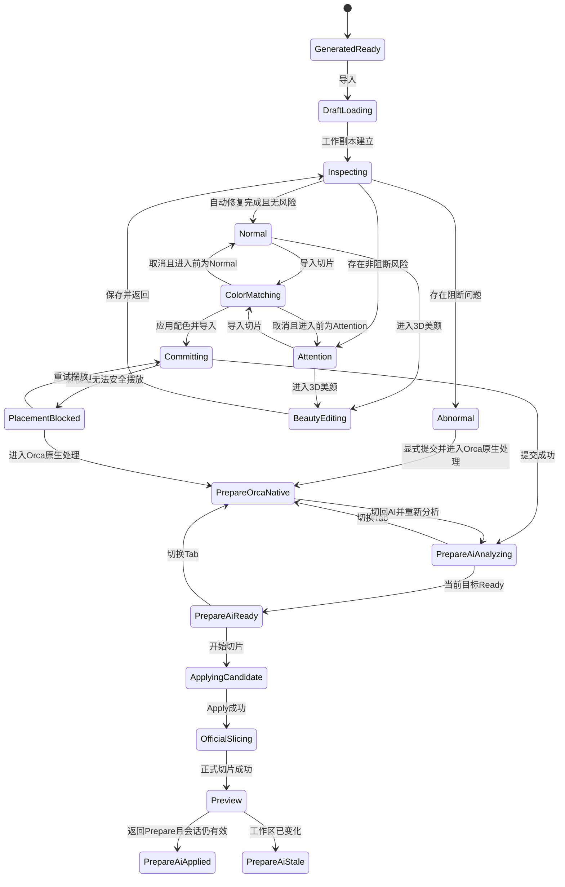

# OrcaSlicer 3D 模型新 UX 需求与交互方案基线

日期：2026-09-30  
状态：产品与 UX 方案已确认，可作为软件架构和详细设计输入  
适用范围：OrcaSlicer Windows 内部测试版，新 UX 中的 3D 模型工作台、颜色匹配、Prepare、AI 智能切片和 Preview 交接

## 1. 文档目的

本文固化 3D 模型生成完成后，从“导入”到 Preview 的新 UX 需求、业务边界和已确认方案。后续软件架构、详细设计、任务拆分和验收必须以本文为需求基线，不再从 Figma 静态画面反推未定义的业务语义。

本文明确区分：

- **已确认需求**：用户应能观察到的行为和产品规则。
- **已确认方案**：为保证简单、易用、高效和业务稳定而确定的交互或业务处理方式。
- **现有可复用能力**：当前代码中已经存在、后续应优先复用的业务能力。
- **当前实现缺口**：架构和详细设计必须解决，但不代表本文已经实现的内容。

Figma 仅是视觉与页面状态参考。设计稿中的静态画面不等于功能已经实现，也不能替代真实主窗口、切片结果或实物打印验收。

## 2. 依据与约束文档

后续设计和实施至少应同时读取：

- UI 重构总计划：`D:/OrcaSlicer/docs/plans/ui-redesign/README.md`
- 本需求基线：`D:/OrcaSlicer/docs/plans/ui-redesign/2026-09-30-3d-model-ux-requirements.md`
- AI 智能切片需求与方案：`D:/OrcaSlicer/docs/plans/2026-09-28-ai-smart-slicing-requirements-and-solution.md`
- AI 智能切片软件详细设计：`D:/OrcaSlicer/docs/plans/2026-09-28-ai-smart-slicing-software-detailed-design.md`
- AI 集成边界锁：`D:/OrcaSlicer/docs/architecture/ai-integration-lock.json`
- 当前开发说明：`D:/OrcaSlicer/Docs/coordination/current-development.md`
- 工程模块和验证入口：`D:/OrcaSlicer/Docs/AI_ENGINEERING.md`

若文档之间出现冲突：本文负责 3D 模型新 UX 的产品流程与交互语义；AI 算法、版本化 Apply、设备能力、性能和实物打印门槛继续以 AI 智能切片基线及更新后的架构约束为准。

## 3. 目标与非目标

### 3.1 目标

1. 将生成后的 3D 模型安全地带入一个独立工作台，而不是点击“导入”后立即修改正式工程。
2. 自动完成模型检查，并在可安全处理的范围内自动修复。
3. 允许用户按需进入 3D 美颜，编辑外观、局部颜色、区域和语义细节。
4. 在正式进入 Prepare 前完成模型颜色与当前打印机耗材颜色的显式匹配。
5. 以一次可撤销事务将模型、配色和新模型摆放提交到 Orca 正式工程。
6. 默认提供“综合最优 / 速度优先 / 质量优先”三个 AI 智能切片目标，并复用已经开发的三目标算法和隔离试切能力。
7. 保留 Orca 原生参数编辑能力，允许用户切换到 Orca 原生 Prepare 手动配置。
8. 正式切片成功后进入 Preview，并保留本次所用 AI 目标和结果摘要。

### 3.2 非目标

1. 不重新设计或重新发明三目标智能切片算法。
2. 不新增“模型用途”下拉框或分段控件；当前阶段内部固定使用 `UsagePurpose::General`。
3. 不在工作台阶段静默修改正式 Plater 工程。
4. 不在首版自动保存 `.3mf`；正式工程仍由 Orca 现有保存动作持久化。
5. 不在首版提供工作台草稿的多版本列表，只恢复最新草稿。
6. 不在当前阶段完成打印流程 UX；Preview 中的“去打印”暂时隐藏，待打印 UX 独立开发后接入。
7. 不以自动化测试、代码检查或 Figma 画面代替真实主窗口、真实切片、设备能力或实物打印验收。
8. 首版优先完成正常工作流。复杂的取消、失败重试和恢复体验后续优化，但关键失败必须 fail closed、不得污染工程或展示虚假成功。

### 3.3 UX 适配边界与已确认处理原则

本轮新 UX 的总体目标是适配现有 Orca 业务能力，不扩展 3D 模型编辑、颜色处理、自动摆放或 Preview 功能。现有业务组件和算法的行为是唯一来源；新 UX 负责页面容器、流程状态、工作副本边界、事务入口和结果展示。

1. 3D 视图的旋转、平移、缩放、视角、模型选择、问题高亮和已有预览交互，优先直接复用当前 Orca / `ModelPreview3D` 能力；本轮不新增剖切、X-Ray、复杂选择器或其他高级视图工具。
2. 模型工作台不新增旋转、缩放或手动摆放入口。新模型的自动摆放继续使用现有 Orca 业务；需要手动调整时，进入正式导入后的 Orca 原生 Prepare 处理。
3. 3D 美颜严格沿用现有 `BeautyWorkbenchControls` 的编辑范围，只处理当前已有的外观、颜色、区域和语义编辑，不新增几何雕刻、网格变形或独立材质编辑能力。
4. 模型检查、自动安全修复、单位、坐标、格式和多部件处理继续沿用现有检查器及导入适配器，不在新 UX 中重新定义算法或数据语义。
5. 颜色来源、颜色合并、耗材槽匹配和退化处理继续复用 `NativeMatch`、`AutoMap`、`ManualMatch`；不新增独立颜色合并编辑器或另一套匹配规则。
6. `Abnormal` 路径只绕过 AI 智能切片，不绕过 Orca 原有的模型导入、颜色槽、耗材能力和原生参数校验；进入 Orca 原生 Prepare 后由现有流程处理其余配置。
7. 风险区域只展示现有 AI/切片业务提供的风险数据，不新增用户自定义重点区域或新的风险识别规则。
8. Preview 只复用现有 G-code / 切片预览交互；新 UX 仅增加本次切片来源、AI 目标和结果摘要，不新增图层过滤、路径播放或风险编辑工具。
9. 当前生成结果导入仍按既有业务粒度处理；本轮不扩展为多模型工作副本、多草稿并行管理或新的恢复体系。
10. 现有能力未覆盖的交互明确标记为本轮范围外，不因 Figma 静态画面或实现便利性自行补造产品功能。

## 4. Figma 页面映射

以下 8 张设计图属于一个连续流程中的页面、弹层或状态，不是 8 个独立顶层页面。

| Figma 节点 | 设计语义 | 产品归属 | 页面或状态判定 |
|---|---|---|---|
| [`15:6343`](https://www.figma.com/design/TafDZMN6dVlTTT5DX1LwCF/3D-%E6%89%93%E5%8D%B0-0929%E6%9C%80%E6%96%B0?node-id=15-6343) | 生成完成，点击右下角“导入” | Model | 生成结果页到模型工作台的入口状态 |
| [`15:3287`](https://www.figma.com/design/TafDZMN6dVlTTT5DX1LwCF/3D-%E6%89%93%E5%8D%B0-0929%E6%9C%80%E6%96%B0?node-id=15-3287) | 3D 美颜工作台 | Model | 模型工作台的专属编辑子状态 |
| [`15:2629`](https://www.figma.com/design/TafDZMN6dVlTTT5DX1LwCF/3D-%E6%89%93%E5%8D%B0-0929%E6%9C%80%E6%96%B0?node-id=15-2629) | 检查、上色、美颜完成，待切片 | Model | 模型工作台的 Ready 状态 |
| [`15:914`](https://www.figma.com/design/TafDZMN6dVlTTT5DX1LwCF/3D-%E6%89%93%E5%8D%B0-0929%E6%9C%80%E6%96%B0?node-id=15-914) | 模型叠色窗口 | Model | “导入切片”触发的模态颜色匹配弹框 |
| [`15:1298`](https://www.figma.com/design/TafDZMN6dVlTTT5DX1LwCF/3D-%E6%89%93%E5%8D%B0-0929%E6%9C%80%E6%96%B0?node-id=15-1298) | AI 智能切片页 | Print / Prepare | Prepare 中默认 AI Tab 的分析状态 |
| [`15:1490`](https://www.figma.com/design/TafDZMN6dVlTTT5DX1LwCF/3D-%E6%89%93%E5%8D%B0-0929%E6%9C%80%E6%96%B0?node-id=15-1490) | 选择智能切片模式 | Print / Prepare | 同一 AI 页面中目标卡选择状态 |
| [`15:1685`](https://www.figma.com/design/TafDZMN6dVlTTT5DX1LwCF/3D-%E6%89%93%E5%8D%B0-0929%E6%9C%80%E6%96%B0?node-id=15-1685) | 开始切片 | Print / Prepare | 同一 AI 页面中应用候选并正式切片的运行状态 |
| [`15:2029`](https://www.figma.com/design/TafDZMN6dVlTTT5DX1LwCF/3D-%E6%89%93%E5%8D%B0-0929%E6%9C%80%E6%96%B0?node-id=15-2029) | Orca 原生切片设置 | Print / Prepare | Prepare 内的 Orca 原生 Tab，不是旧 UI 回退 |

同页状态归并关系：

- `15:1298`、`15:1490`、`15:1685` 是 Prepare 中“AI 智能切片”同一页面的分析、选择和正式切片状态。
- `15:2029` 与 AI 智能切片共享 Prepare 页面容器，是另一个 Tab 的内容状态。
- `15:2629` 是模型工作台 Ready 状态；`15:3287` 是从该工作台进入的美颜编辑子状态。
- `15:914` 是覆盖模型工作台的模态弹框，不是独立页面。
- `15:6343` 是生成结果页的完成状态，也是进入模型工作台的前置状态。

## 5. 页面层级和导航关系

新 Shell 顶层导航保持：

```text
Assets / Image / Model / Print
```

本需求涉及的层级为：

```text
Model
├─ 3D 生成结果
├─ 模型工作台
│  ├─ 自动模型检查与修复
│  ├─ 检查详情与 3D 风险高亮
│  ├─ 3D 美颜子工作台
│  └─ 叠色 / 打印机耗材颜色匹配弹框
└─ 正式导入交接

Print
├─ Prepare
│  ├─ AI 智能切片 Tab（默认）
│  │  ├─ 综合最优 balanced（默认选中）
│  │  ├─ 速度优先 speed
│  │  ├─ 质量优先 quality
│  │  └─ 方案详情 / 风险确认
│  └─ Orca 原生 Tab
└─ Preview
   └─ AI 目标与切片结果摘要
```

3D 美颜、检查详情和颜色匹配不是新的顶层导航项。Prepare 和 Preview 由新 UX 路由和页面容器承载，内部阶段性复用现有 Orca 稳定业务；不得通过旧 Notebook 实现“新 UI 回退旧 UI”。

## 6. 端到端正常工作流

```text
3D 模型生成完成
→ 点击“导入”
→ 创建模型工作副本，不修改 Plater
→ 自动检查与安全修复
→ 显示正常 / 需注意 / 异常
→ 用户可选进入 3D 美颜
→ 美颜保存并返回后重新检查
→ 点击“导入切片”
→ 打开叠色 / 耗材颜色匹配弹框
→ 点击“应用配色并导入”
→ 一次事务提交模型、颜色与新模型摆放到 Plater
→ 进入 Prepare，并选中包含新模型的当前打印板
→ 默认进入 AI 智能切片 Tab
→ 同时分析 balanced / speed / quality
→ 默认选中 balanced，用户可切换目标并查看详情
→ 必要时查看并确认重点区域风险
→ 点击“开始切片”
→ 应用当前候选并启动 Orca 正式切片
→ 切片成功后自动进入 Preview
```

用户也可在 Prepare 中切换到“Orca 原生”Tab，手动修改现有 Orca 参数后再切片。

## 7. 工作台共享组件

以下组件应作为共享工作台能力设计，不应分别在检查、美颜和切片页面重复实现：

| 组件 | 职责 |
|---|---|
| 新 UX Shell 与语义路由 | 维护 `Model / Print / Preview` 页面关系，接收旧业务通知但不重新打开旧 Notebook |
| 工作区标题与上下文栏 | 显示模型名、草稿保存状态、当前打印机/耗材摘要和返回路径 |
| 3D 视图宿主 | 展示工作副本或正式工程模型，支持选区、风险区域和问题区域高亮 |
| 流程状态条 | 展示模型检查、3D 美颜、颜色匹配、自动摆放、切片等步骤状态；未执行步骤必须显示等待而非完成 |
| 通用异步状态 | 统一展示加载中、分析中、处理中、空状态、失败和 stale，不伪造结果 |
| 详情侧栏 / 抽屉 | 展示问题、参数差异、风险解释、数据来源和可执行动作 |
| 底部主操作区 | 根据状态投影主按钮和次按钮，不在 View 中复制业务规则 |
| 消息与确认组件 | 承载风险确认、未保存草稿提示、恢复提示和阻断错误 |
| 草稿状态与恢复提示 | 展示自动保存状态，并在重启时允许恢复最新工作台草稿 |
| Undo/Redo 控件语义 | 按工作台草稿、颜色弹框和正式 Plater 三个边界调用不同历史机制 |

共享组件只消费只读 ViewModel / 状态投影，并通过稳定 Command 或 callback 发起动作；不得直接修改 Plater 或智能切片 Domain 状态。

## 8. 功能专属组件

| 功能 | 专属组件 |
|---|---|
| 模型检查 | 检查进度、问题分类、严重度、自动修复结果、问题列表、3D 定位与重新检查 |
| 3D 美颜 | 面/区域选择、笔刷/套索/相似区域、颜色与语义编辑、局部 Undo/Redo、Reset、保存并返回 |
| 颜色匹配 | AI 建议色、模型颜色区域、打印机耗材槽、自动匹配、手动匹配、退化原因、应用配色并导入 |
| 自动摆放 | 新模型位置求解、失败原因、重试摆放或进入 Orca 原生处理 |
| AI 智能切片 | 三目标卡、隔离试切状态、摘要指标、参数差异详情、风险区查看与确认、开始切片 |
| Orca 原生 | 现有打印机、耗材、工艺和切片参数编辑宿主，以及原生切片入口 |
| Preview | G-code / 切片预览、所用 AI 目标和结果摘要、返回 Prepare；打印入口当前隐藏 |

## 9. 业务状态模型

### 9.1 核心状态

| 状态 | 业务语义 | 允许的主要动作 |
|---|---|---|
| `GeneratedReady` | 生成结果可查看，尚未建立工作副本 | 导入、返回生成流程 |
| `DraftLoading` | 正在创建或加载工作副本 | 等待；不得提交 Plater |
| `Inspecting` | 自动检查与安全修复执行中 | 查看进度；后续动作禁用 |
| `Normal` | 未发现阻断问题，或可安全问题已修复 | 美颜、导入切片 |
| `Attention` | 存在非阻断风险 | 查看详情、美颜、继续导入切片 |
| `Abnormal` | 存在无法安全修复的阻断问题 | 查看详情、重新检查、导入并进入 Orca 原生处理、返回工作台 |
| `BeautyEditing` | 正在编辑工作副本外观/区域/颜色 | Undo、Redo、Reset、保存并返回 |
| `ColorMatching` | 颜色匹配弹框打开，尚未正式提交 | 自动/手动匹配、取消、应用配色并导入 |
| `Committing` | 正在提交模型、颜色和摆放事务 | 等待；禁止重复提交 |
| `PlacementBlocked` | 新模型无法在不移动旧模型的情况下安全摆放 | 重试摆放、进入 Orca 原生处理、返回工作台 |
| `PrepareAiAnalyzing` | Prepare 已进入，三目标正在隔离试切 | 切换目标/Tab、查看渐进状态 |
| `PrepareAiReady` | 当前目标有可应用候选 | 查看详情、必要时确认风险、开始切片 |
| `PrepareAiApplied` | 当前候选已应用，不允许重复 Apply | 查看已应用摘要、正式切片或返回编辑 |
| `PrepareAiStale` | 工程或打印板 revision 已改变，旧候选失效 | 重新分析、切换 Orca 原生 |
| `ApplyingCandidate` | 正在版本化应用当前候选 | 等待；禁止重复 Apply |
| `OfficialSlicing` | 候选已应用，Orca 正在正式切片 | 查看进度；失败时保持可诊断状态 |
| `PrepareOrcaNative` | 用户手动配置 Orca 原生参数 | 编辑参数、启动原生切片、切回 AI |
| `Preview` | 正式切片成功并可预览 | 查看结果、返回 Prepare |

### 9.2 页面状态转换



## 10. 模型检查与自动修复需求

### 10.1 已确认需求

1. 点击“导入”后首先自动执行普通模型检查，不自动进入 3D 美颜。
2. 检查至少覆盖非流形边、破面或拓扑问题、壁厚不足、悬垂过大以及现有检查器可识别的其他问题。
3. 可安全、无歧义修复的拓扑问题自动修复，目标是尽可能达到“正常”。
4. 壁厚不足主要通过切片策略、层高和墙数等后续方案处理，不得静默改变模型外形。
5. 悬垂问题主要通过摆放、支撑和切片策略处理，不得伪装成几何已修复。
6. 无法安全修复的问题显示“异常”；非阻断但需要知情的问题显示“需注意”。
7. 检查详情必须与 3D 模型问题区域高亮联动。
8. 美颜保存并返回后自动重新执行模型检查和颜色检查，但不自动再次打开美颜。

### 10.2 状态和动作规则

- `Normal`：允许进入美颜、颜色匹配和智能切片链路。
- `Attention`：允许继续，但必须明确显示风险和详情入口。
- `Abnormal`：禁止美颜、颜色匹配和 AI 智能切片；允许查看详情、重新检查、返回工作台，以及“导入并进入 Orca 原生处理”。
- “导入并进入 Orca 原生处理”是一个显式异常绕行操作，只有用户点击后才正式提交 Plater。

## 11. 工作副本、正式工程与持久化

### 11.1 工作副本边界

1. 生成结果页点击“导入”只建立独立工作副本。
2. 自动检查、自动安全修复、美颜编辑和未应用颜色映射只作用于工作副本。
3. 在“应用配色并导入”或异常路径的“导入并进入 Orca 原生处理”之前，Plater 不得增加模型，不得修改已有对象、预设或打印板。
4. 原始生成历史资产始终保留，工作副本不得覆盖原始文件。

### 11.2 正式提交边界

“应用配色并导入”必须作为一次原子业务事务处理：

```text
校验工作副本和颜色映射
→ 建立正式模型对象
→ 应用颜色/耗材槽映射
→ 只为新模型求解安全位置
→ 生成一个 Plater Undo 快照
→ 标记工程 dirty
→ 进入 Prepare
```

任何前置校验失败都不得生成半提交工程。事务中途失败时，详细设计必须给出可靠回滚或明确的 fail-closed 状态，不能用普通多步 UI 操作模拟原子提交。

### 11.3 保存和恢复

1. 美颜和颜色草稿自动保存，不要求用户频繁手动保存。
2. 美颜提供“保存并返回”，用于明确结束本轮编辑并触发重新检查。
3. 不静默保存 `.3mf`。正式工程变更只设置 dirty，由用户使用 Orca 现有“保存项目”动作保存。
4. 应用重启时，如果存在兼容的最新工作台草稿，提示用户恢复。
5. 当前阶段只恢复最新草稿，不提供多版本列表。
6. 不恢复未应用 AI 候选和隔离试切缓存；进入 Prepare 后按最新 revision 重新分析。

## 12. 3D 美颜需求

1. 3D 美颜由用户主动点击进入，不在导入后自动打开。
2. 只处理模型外观、局部颜色、区域和语义细节，不负责打印机耗材槽匹配。
3. 支持面/区域选择、局部调整、颜色修改、Undo、Redo、Reset 和保存并返回。
4. 美颜 Undo/Redo 只操作工作台草稿，不写入 Plater Undo 历史。
5. 草稿编辑自动保存；“保存并返回”后运行模型检查和颜色检查。
6. 打印机耗材颜色匹配统一在“导入切片”触发的叠色弹框中处理。

## 13. 颜色匹配和叠色弹框

### 13.1 两类颜色状态的边界

- **模型区域配色**：来自原始单色/全彩模型、AI 建议色和 3D 美颜编辑，描述模型各区域希望呈现的颜色。Figma 中“多色上色完成”指这一层完成。
- **打印机耗材映射**：将模型区域配色匹配到当前打印机真实可用的耗材颜色和槽位，只在“导入切片”触发的叠色弹框中完成。

两者必须分开保存和展示。模型区域配色完成不等于耗材映射已满足打印条件，也不能让工作台提前显示耗材匹配完成。

### 13.2 数据来源和算法复用

1. 默认加载原始模型或全彩模型得到的 AI 建议颜色。
2. 同时读取当前打印机可用耗材颜色和槽位能力。
3. 继续复用现有 `NativeMatch`、`AutoMap` 和 `ManualMatch` 业务，不另建一套颜色算法。
4. 自动匹配失败或发生退化时，必须向用户说明原因并允许手动匹配。

### 13.3 交互规则

1. 点击“导入切片”打开专门的模态叠色弹框。
2. 点击取消只关闭弹框，保留工作副本，正式工程不变。
3. 点击“应用配色并导入”才正式提交模型，并进入 Orca Prepare。
4. 颜色未完成匹配、可用耗材槽不足或映射已退化时，主按钮禁用并给出原因。
5. 模型颜色数量超过当前耗材槽位时，不允许静默合并颜色；用户必须显式手动合并，或返回配置耗材。
6. 没有可用耗材时禁用应用，并提供“返回配置耗材”；配置完成后重新读取耗材颜色。
7. 弹框内的 Undo 只作用于未提交颜色映射，不写入 Plater Undo 历史。

## 14. 自动摆放和当前打印板

1. 自动摆放延迟到“应用配色并导入”的正式提交阶段。
2. 已有工程模型和用户明确摆放的对象视为固定；只为新导入模型寻找位置。
3. 不得为了放入新模型而移动已有模型。
4. 正式提交前，流程状态条中的“自动摆放”显示等待，不得提前显示完成。
5. 摆放失败时不得产生重叠模型，不进入 AI 智能切片；提供重试摆放、进入 Orca 原生处理和返回工作台。
6. 进入 Prepare 后自动选中包含新模型的打印板。
7. AI 智能切片只分析当前打印板上的全部模型，不跨打印板复用候选。
8. 模型检查和导入前颜色匹配只针对当前新导入模型。
9. 用户切换打印板后，当前 AI 会话和候选变为 `Stale`，必须基于新打印板重新分析。

## 15. AI 智能切片需求

### 15.1 入口和默认值

1. 进入 Prepare 后默认停留在“AI 智能切片”Tab。
2. 默认选中“综合最优”。
3. 不显示“装饰 / 通用 / 功能”模型用途控件；内部固定 `UsagePurpose::General`。
4. 后端同时分析三个目标，先完成的目标可渐进展示，不要求等待全部目标结束。

| UX 文案 | 稳定 ID | 内部枚举 |
|---|---|---|
| 综合最优 | `balanced` | `RecommendationGoal::Balanced` |
| 速度优先 | `speed` | `RecommendationGoal::Speed` |
| 质量优先 | `quality` | `RecommendationGoal::Quality` |

UX 的三个目标必须直接对接现有三目标智能切片内核和算法，不允许在 UI 层用三个本地预设或文案替代真实推荐结果。

### 15.2 分析和数据真实性

1. 每个目标独立显示 `Analyzing`、`Ready`、`Unavailable`、`Failed`、`Stale` 或 `Applied`。
2. 时间、耗材、支撑、换色等结果必须来自 Orca 隔离试切或其可信业务证据。
3. 在没有试切证据前，不显示估算为 0 或虚构的成功数据；缺失指标显示“暂无数据”或“暂不可评估”。
4. 用户修改模型、颜色、耗材、打印机、参数或当前打印板后，相关 Preview/G-code 和未应用候选全部失效。
5. 只有当前选中目标为 `Ready` 且所有必要确认完成时，“开始切片”可用。

### 15.3 目标卡和详情

三目标使用“摘要卡 + 详情面板”的信息结构：

- 摘要卡：目标名称、状态、预计时间、耗材、主要收益和主要风险。
- 详情面板：参数新旧值、支撑、换色、风险、证据和推荐解释。
- 当前选择使用稳定 ID 持久于本次 Prepare 会话，默认 `balanced`。
- 不得因为某一目标失败而覆盖其他目标已完成的结果。

### 15.4 风险确认

如果候选无法避免脸部或用户重点区域的支撑、接缝等风险：

```text
目标卡显示风险
→ 用户点击查看风险
→ 3D 视图高亮风险区域
→ 用户显式确认当前候选的风险集合
→ 才允许开始切片
```

风险确认必须绑定候选身份、工作区 revision 和具体风险集合。候选或工程变化后旧确认失效，不允许复用泛化的“我知道了”状态。

### 15.5 “开始切片”的准确语义

```text
应用当前 AI 候选
→ 成功后启动 Orca 正式切片
```

1. 详情中必须明确说明该按钮会应用方案并开始正式切片。
2. 应用候选与正式切片是两个可区分阶段。
3. 应用失败时工程不得被修改。
4. 正式切片失败时应明确“候选已应用，但切片未完成”，不得重复 Apply 同一候选。
5. AI 应用必须使用既有 versioned Apply、候选身份、workspace revision 和 confirmation token 契约。

## 16. Orca 原生 Tab 与混合迁移方案

采用已确认的混合方案：

1. 新 UX 路由和页面容器承载 Prepare / Preview 流程。
2. Prepare / Preview 内部先复用现有 Orca 稳定业务和控件，再逐步完成 Figma 风格视觉迁移。
3. “Orca 原生”是新 Prepare 内的一个 Tab，不是返回旧 Notebook 或旧 UI。
4. 用户切换到 Orca 原生时，取消未完成的 AI 分析，不自动修改工程，不自动开始切片。
5. 用户从 Orca 原生切回 AI 时，基于最新 workspace revision 重新分析，不恢复旧的未应用候选。
6. 原生参数编辑、预设、普通切片和普通 Orca 行为必须保持兼容。

## 17. Preview 和打印边界

1. 正式切片成功后自动进入 Preview。
2. Preview 显示本次使用的 AI 目标和切片结果摘要；原生切片则显示相应来源。
3. 返回 Prepare 时，优先回到进入 Preview 前使用的 Tab。
4. 如果工程在 Preview 后发生变化，旧 G-code、Preview 和 AI 候选立即失效并返回 Prepare 的有效状态。
5. 当前阶段暂时隐藏“去打印”。打印流程及其独立 UX 后续开发，不在本文范围内。

## 18. Undo/Redo 边界

| 操作域 | 历史边界 | 要求 |
|---|---|---|
| 3D 美颜 | 工作台草稿历史 | Undo/Redo/Reset 不影响正式工程 |
| 颜色匹配弹框 | 未提交颜色映射历史 | 取消后正式工程不变 |
| 应用配色并导入 | 一个 Plater Undo 快照 | 包含模型提交、颜色映射和新模型摆放 |
| AI 候选 Apply | 独立 AI Apply Undo 快照 | 与导入快照分离，受身份和历史相邻关系保护 |
| AI Apply 后继续编辑 | Orca 原生 Undo 历史 | AI 专用 Undo 禁用，并提示使用 Orca 原生 Undo |

执行 Undo 后，受影响的 G-code 和 Preview 必须失效并返回 Prepare。不得以 UI 栈模拟正式工程 Undo。

## 19. 关键控件语义与可用性

| 控件 | 可用条件 | 触发效果 |
|---|---|---|
| 生成结果“导入” | 生成资产存在且可读 | 创建工作副本并开始自动检查，不修改 Plater |
| “进入 3D 美颜” | 检查为 `Normal/Attention` 且工作副本可编辑 | 进入美颜子工作台 |
| “保存并返回” | 美颜编辑状态有效 | 保存草稿，返回并重新检查 |
| “导入切片” | 检查为 `Normal/Attention` | 打开颜色匹配弹框 |
| “应用配色并导入” | 颜色映射完整、耗材能力满足、事务可提交 | 原子提交、摆放并进入 Prepare |
| “导入并进入 Orca 原生处理” | 检查为 `Abnormal` | 显式提交并绕过 AI，进入 Orca 原生处理 |
| 目标卡 | Prepare AI 会话存在 | 选择目标并显示其真实状态和详情 |
| “开始切片” | 当前目标 `Ready`，revision 匹配，风险已确认 | versioned Apply 后启动正式切片 |
| Orca 原生 Tab | Prepare 可用 | 取消未完成 AI 分析，显示原生参数界面 |
| 返回 Prepare | Preview 可返回 | 回到先前 Tab；若状态已变则标记 stale |

所有禁用控件都应提供可理解的禁用原因，不能只以灰色呈现。

## 20. 页面与业务状态对应

| 页面/设计状态 | 主要业务状态 | 正式工程是否已改变 |
|---|---|---|
| 生成结果 | `GeneratedReady` | 否 |
| 导入后的模型工作台 | `DraftLoading / Inspecting / Normal / Attention / Abnormal` | 否 |
| 3D 美颜工作台 | `BeautyEditing` | 否 |
| 待切片模型工作台 | `Normal / Attention` | 否 |
| 叠色弹框 | `ColorMatching` | 否 |
| 应用配色并导入处理中 | `Committing` | 事务完成后才是 |
| AI 智能切片 | `PrepareAiAnalyzing / Ready / Stale` | 模型已导入；AI 候选尚未应用 |
| 开始切片 | `ApplyingCandidate / OfficialSlicing` | Apply 成功后是 |
| Orca 原生 | `PrepareOrcaNative` | 模型已导入；参数是否变化取决于用户操作 |
| Preview | `Preview` | 是，且已有成功正式切片结果 |

## 21. 已解决的 Figma 不明确项

此前 Figma 静态稿未明确、现已形成产品结论的项目如下：

1. “导入”不等于导入 Plater，而是创建工作副本并自动检查。
2. 3D 美颜不自动进入，只能由用户主动打开。
3. 模型检查会自动执行；安全拓扑问题可自动修复，壁厚和悬垂不静默改形。
4. “导入切片”打开独立颜色匹配弹框；“应用配色并导入”才提交 Plater。
5. 自动摆放发生在正式提交阶段，只摆放新模型。
6. Prepare 默认 AI Tab 和 `balanced`，三个目标同时自动分析。
7. 不显示模型用途控件，内部固定 `General`。
8. 切片指标必须来自隔离试切；试切前不显示虚假数据。
9. “开始切片”包含 Apply 候选和正式切片两个阶段。
10. Orca 原生是新 Prepare 内的 Tab，不是回到旧 UI。
11. 切片成功进入 Preview；当前阶段隐藏打印入口。
12. 草稿自动保存并可恢复，正式 `.3mf` 不自动保存。
13. 工作台、颜色弹框、正式导入和 AI Apply 使用不同 Undo 边界。
14. AI 只分析当前打印板全部模型，切板后旧候选 stale。

截至本文冻结时，没有阻塞软件架构设计的产品/UX 未决项。设备能力、真实风险证据、主窗口表现和实物效果属于后续设计或验收待验证项，不应通过继续补造产品规则解决。

## 22. 现有业务逻辑可直接复用的部分

以下是当前代码中可复用的能力边界；“可复用”不代表已经接入本文新 UX：

| 能力 | 当前代码位置 | 复用要求 |
|---|---|---|
| 新 Shell、Model 预览和顶层导航 | `D:/OrcaSlicer/src/slic3r/GUI/Redesign/RedesignShell.hpp`、`.cpp` | 扩展新页面状态，不把业务写进绘制代码 |
| 新 UI 命令和粗粒度状态 | `D:/OrcaSlicer/src/slic3r/GUI/Redesign/OrcaBusinessAdapter.*`、`RedesignState.*` | 通过稳定命令和只读状态投影扩展 |
| 模型导入、网格检查、颜色槽、摆放和工作流适配 | `D:/OrcaSlicer/src/slic3r/GUI/AI/Orca/OrcaWorkspaceAdapter.*` | 拆分工作副本与正式提交，避免沿用“导入即写 Plater”语义 |
| 3D 预览与区域交互 | `D:/OrcaSlicer/src/slic3r/GUI/AI/ModelGeneration/ModelPreview3D.*` | 作为共享 3D 视图宿主复用 |
| 3D 美颜、局部编辑和草稿历史 | `D:/OrcaSlicer/src/slic3r/GUI/AI/ModelGeneration/BeautyWorkbenchControls.*` | 接入新工作台并保持本地 Undo 边界 |
| 颜色匹配 | `D:/OrcaSlicer/src/slic3r/GUI/AI/ColorMatching/`、`D:/OrcaSlicer/src/slic3r/GUI/AI/Orca/` | 复用 NativeMatch/AutoMap/ManualMatch 和现有颜色事务 |
| 三目标状态和展示模型 | `D:/OrcaSlicer/src/slic3r/GUI/AI/SmartSlicing/SmartSlicingViewModel.*`、`SmartSlicingPresenter.*` | 新 UX View 只渲染状态，不复制 Domain 决策 |
| 三目标算法、会话和隔离试切 | `D:/OrcaSlicer/src/slic3r/AI/SmartSlicing/`、`D:/OrcaSlicer/src/slic3r/GUI/AI/Orca/OrcaTrialSliceExecutor.*` | 使用稳定目标 ID 和真实试切证据 |
| 版本化 Apply 和正式切片 | `D:/OrcaSlicer/src/slic3r/AI/SmartSlicing/Application/VersionedApplyWorkflow.*`、`D:/OrcaSlicer/src/slic3r/GUI/AI/Orca/OrcaOfficialSliceGateway.hpp` | 保持版本、revision、token、单事务和 Undo 守卫 |

## 23. 需要新增或适配的 UI 状态

1. 工作副本的创建、加载、自动保存、恢复和兼容性状态。
2. 模型检查的 `Inspecting / Normal / Attention / Abnormal` 只读投影。
3. 自动修复结果、未修复问题与 3D 高亮的关联状态。
4. 美颜工作台进入、脏状态、保存中、保存完成和返回后重新检查状态。
5. 颜色匹配完整性、耗材槽不足、退化、无耗材和手动修复状态。
6. 正式提交与自动摆放的事务状态，以及 `PlacementBlocked`。
7. 当前打印板、打印板 revision 和候选 stale 状态。
8. 三目标并行分析和每目标独立状态。
9. 目标摘要、详情、风险高亮、风险确认及 confirmation token 状态。
10. Apply 失败与正式切片失败的分离状态。
11. Preview 来源、AI 目标摘要和返回 Prepare 的 Tab 记忆。
12. 三层 Undo 边界和动作可用性状态。

这些状态应由业务层或 Presenter/ViewModel 投影提供，不能由控件可见性反推业务真相。

## 24. 当前实现缺口与后续设计必须解决的问题

1. `OrcaWorkspaceAdapter::import_artifact()` 当前语义包含导入 Plater 和可能的摆放；必须拆分为工作副本阶段与正式提交阶段，或在其上建立不混淆语义的新接口。
2. `RedesignStateSnapshot` 当前以项目、选择、Undo/Redo 和粗粒度切片状态为主，需要新增工作台、检查、颜色匹配、导入事务、当前板和 AI 会话的只读投影。
3. `RedesignShell` 中 `ModelPreview3D` 需要接入选择、问题高亮、颜色状态和美颜工作台，而不是只作为生成结果预览。
4. `Print` host 需要承载 Prepare / Preview 新 UX 路由，并嵌入稳定 Orca 业务，不允许通过打开旧 Notebook 完成迁移。
5. Smart Slicing GUI Apply 链路必须端到端传递用户实际选择的目标、candidate ID、workspace revision 和 confirmation token；任何固定使用 `Balanced` 的过渡路径都必须移除或证明不可达。
6. 当前 Smart Slicing Panel 已存在用途选择能力；新 UX 不展示该控件，并必须确保传入内核的用途稳定为 `UsagePurpose::General`。
7. 需要设计“已有模型固定、只摆放新模型”的原子事务和失败回滚。
8. 需要定义工作副本文件、元数据 schema、兼容版本、生命周期、恢复提示和清理策略。
9. 需要把模型检查/颜色检查的后台任务、取消所有权和 GUI owner thread 回调写入详细设计。
10. 需要明确新 ViewModel 与现有 Smart Slicing ViewModel 的组合关系，避免出现两个业务状态源。
11. 需要在架构中明确模型检查、美颜、颜色、Plater、AI 会话和 Preview 各自的状态所有权及 revision 传播。

## 25. 非功能和稳定性要求

1. UI 线程不得执行长时间网格检查、修复或隔离试切；后台结果必须按 session/revision 校验后再发布。
2. 用户连续点击主操作不得重复提交、重复 Apply 或重复启动正式切片。
3. 所有后台回调必须能识别页面销毁、会话取消和 stale revision。
4. 新 UX 不直接持有或修改 Plater 内部对象；所有正式工程变更通过稳定适配器、Command 和事务边界。
5. AI 不可用、离线或单目标失败时，普通 Orca 原生行为必须可用。
6. 不记录凭据、模型私密内容或无关用户数据；日志记录稳定 ID、revision、状态、耗时和诊断码。
7. 继续保持 C++17、wxWidgets、现有项目格式和预设格式兼容。
8. 四喷头/六喷头能力、真实设备证据、冲刷矩阵、擦料塔、性能和实物质量继续受 AI 智能切片基线门控；不得因 UX 已接入而宣称生产启用。

## 26. 验收标准

### 26.1 自动化与代码验收

1. 工作副本建立前后 Plater 状态不变。
2. `Normal / Attention / Abnormal` 的按钮可用性与状态矩阵一致。
3. 取消颜色弹框不会改变正式工程。
4. 正式导入只产生一个包含模型、颜色和摆放的 Plater Undo 动作。
5. 已有模型在新模型自动摆放过程中位置不变。
6. 三目标稳定 ID、显示顺序、默认选中和 `General` 内部用途正确。
7. 三目标状态互不覆盖；未知指标不显示为 0。
8. revision 改变、切板或参数改变后旧候选 stale，旧 token 不可应用。
9. “开始切片”只对当前 Ready 候选执行一次 versioned Apply，然后启动正式切片。
10. Apply 失败零写入；正式切片失败不会重复 Apply。
11. Preview 只有在正式切片成功后可进入。
12. 三个 Undo 边界互不污染，受影响 G-code 正确失效。

### 26.2 真实主窗口验收

使用与当前源码匹配的 Windows 构建、独立测试配置和固定模型完成：

1. 生成结果导入后先进入检查，不直接出现在 Plater。
2. 检查问题列表、状态和 3D 高亮一致。
3. 美颜保存返回、草稿恢复和重新检查可观察。
4. 颜色匹配的自动/手动路径、禁用原因和取消语义正确。
5. 正式导入后已有模型不移动，新模型不重叠，进入正确打印板。
6. Prepare 默认 AI / balanced，三目标渐进显示并可切换详情。
7. 风险确认、高亮和确认失效规则可观察。
8. Orca 原生 Tab 可用，切换不会隐式修改或切片。
9. 正式切片成功进入 Preview，返回 Prepare 的 Tab 正确。
10. 普通 Orca 工作流、项目保存和重启恢复不回归。

每项记录运行 EXE/DLL/资源身份、源码或完整快照身份、测试模型、截图/日志和 `PASS / FAIL / NOT_RUN`。未实际操作的项目不得写为通过。

### 26.3 当前不属于验收通过的证据

- Figma 与页面静态截图相似。
- 代码中存在对应类或按钮。
- 单元测试通过但未启动真实主窗口。
- Orca 进程成功启动但未完成交互。
- G-code 预计值替代真实设备或实物打印结果。

## 27. 已确认决策汇总

1. 生成结果“导入”建立工作副本，不立即写 Plater。
2. 自动检查和安全修复先于美颜；美颜必须手动进入。
3. `Normal / Attention` 可继续，`Abnormal` 禁止 AI，但允许显式进入 Orca 原生处理。
4. 颜色匹配放在独立叠色弹框；应用后才正式导入。
5. 自动摆放只处理新模型，不移动旧模型。
6. 草稿自动保存并恢复最新版本；`.3mf` 由用户显式保存。
7. Prepare 默认 AI / balanced，后台同时分析三目标。
8. UI 不提供模型用途控件，内部固定 `General`。
9. 所有摘要数据来自隔离试切，缺失数据不伪造。
10. 风险必须绑定具体候选和 revision 并显式确认。
11. “开始切片”是 Apply 当前候选再正式切片。
12. Orca 原生是新 Prepare 内的 Tab，采用新容器复用旧稳定业务的混合迁移方案。
13. 正式切片成功进入 Preview；打印 UX 后续开发。
14. 工作台草稿、颜色弹框、导入事务和 AI Apply 使用明确分离的 Undo 边界。
15. 新 UX 只适配现有 3D、颜色、摆放和 Preview 业务，不新增模型变换、风险编辑、颜色算法或预览工具；异常路径只绕过 AI，Preview 只复用现有交互。

## 28. 后续文档生成提示词

下面的提示词可直接复制。执行时将尖括号中的路径替换为实际输出文件；若文件已经存在，应先读取并增量更新，不得覆盖用户无关改动。

### 28.1 软件架构设计提示词

```text
请为 OrcaSlicer 的“3D 模型新 UX 工作流”输出软件架构设计文档，只做架构设计和审查，不修改源码、不构建、不启动程序。

开始前完整读取并以以下文件为输入基线：
1. D:/OrcaSlicer/AGENTS.md
2. D:/OrcaSlicer/docs/plans/ui-redesign/README.md
3. D:/OrcaSlicer/docs/plans/ui-redesign/2026-09-30-3d-model-ux-requirements.md
4. D:/OrcaSlicer/docs/plans/2026-09-28-ai-smart-slicing-requirements-and-solution.md
5. D:/OrcaSlicer/docs/plans/2026-09-28-ai-smart-slicing-software-detailed-design.md
6. D:/OrcaSlicer/docs/architecture/ai-integration-lock.json
7. D:/OrcaSlicer/Docs/AI_ENGINEERING.md

同时核对当前相关源码，至少覆盖 GUI/Redesign、GUI/AI/ModelGeneration、GUI/AI/ColorMatching、GUI/AI/Orca、GUI/AI/SmartSlicing、AI/Contracts 和 AI/SmartSlicing。不要只依据旧文档猜测当前代码。

目标：设计从生成结果“导入”到 Preview 的新 UX 架构，严格保持工作副本与正式 Plater 工程的边界，复用已有三目标智能切片内核和 Orca 稳定业务。

范围约束：本次只做现有 Orca 业务的 UX 适配，不扩展 3D 编辑、颜色算法、自动摆放、风险识别或 Preview 工具。3D 视图、选择、高亮、模型检查、美颜、颜色匹配、单位/坐标、摆放和 Preview 行为必须优先复用当前实现；工作台不新增模型旋转/缩放/手动摆放入口，`Abnormal` 只绕过 AI 并继续走 Orca 原生校验，Preview 只增加来源和结果摘要。现有能力未覆盖的交互标记为范围外，不自行补造产品规则。

文档必须包含：
- 范围、非目标、架构原则和约束；
- 现状架构、可复用模块、实现缺口和目标架构；
- Mermaid 模块图、依赖方向图、页面/业务状态机和端到端数据流；
- 模型工作副本、正式导入事务、Plater、当前打印板、推荐会话、正式切片和 Preview 的状态所有权；
- 领域对象、稳定身份、workspace revision、candidate、confirmation token、草稿 schema 和持久化边界；
- UI、Presenter/ViewModel、Application、Adapter、Plater 和后台任务的接口边界；
- 模型检查/修复、美颜、颜色匹配、只摆放新模型、versioned Apply、正式切片、Preview 和 Undo 的事务关系；
- wxWidgets GUI owner thread、后台任务、取消、stale 回调和对象生命周期策略；
- AI/Orca Tab 混合迁移、旧 Notebook 退出路径和分阶段迁移方案；
- 兼容性、日志、错误码、安全、性能和恢复策略；
- 架构风险、待验证项、替代方案及取舍；
- 架构验收条件和后续详细设计需要回答的问题；
- 对 docs/architecture/review-map.json 和 ai-integration-lock.json 是否需要更新的判断，不能擅自弱化架构锁。

必须遵守：
- 不重新发明 balanced/speed/quality 算法；UI 只消费现有三目标结果。
- 不增加“模型用途”控件；内部固定 UsagePurpose::General。
- UI 不得直接修改 Plater，也不得创建第二个业务状态源。
- 点击生成结果“导入”不得写入 Plater；只有明确正式提交动作可以修改工程。
- Prepare/Preview 使用新 UX 容器复用稳定业务，不以返回旧 Notebook 作为实现。
- 所有切片摘要数据必须来自可信试切证据，未知值不写成 0。
- 不把现有类、自动化测试或 Figma 静态稿描述成功能已完成。
- 清楚标注 Current / Target / Gap / Deferred / Validation Required。
- 将上述 UX 适配边界作为架构硬约束，明确列出复用的现有组件和禁止新增的功能；不要把范围外的 3D 交互误写成 Target 或 Gap。

将文档写入：<D:/OrcaSlicer/docs/plans/ui-redesign/3d-model-ux-software-architecture.md>
最后输出一份简短结论：主要架构决策、最高风险、仍需产品确认的问题（若无则明确写“无”）和进入详细设计前的门槛。
```

### 28.2 软件详细设计提示词

```text
请基于已经批准的软件架构，为 OrcaSlicer 的“3D 模型新 UX 工作流”输出可实施的软件详细设计。只编写和审查详细设计文档，不修改源码、不构建、不启动程序。

开始前完整读取：
1. D:/OrcaSlicer/AGENTS.md
2. D:/OrcaSlicer/docs/plans/ui-redesign/2026-09-30-3d-model-ux-requirements.md
3. <已批准的软件架构文档绝对路径>
4. D:/OrcaSlicer/docs/plans/2026-09-28-ai-smart-slicing-requirements-and-solution.md
5. D:/OrcaSlicer/docs/plans/2026-09-28-ai-smart-slicing-software-detailed-design.md
6. D:/OrcaSlicer/docs/architecture/ai-integration-lock.json
7. D:/OrcaSlicer/Docs/AI_ENGINEERING.md

核对当前源码和测试，详细设计必须映射到真实存在的类、方法和目录；对于尚不存在的类型明确标记 New，不得把建议接口写成已实现。

范围约束：本次只做现有 Orca 业务的 UX 适配，不扩展 3D 编辑、颜色算法、自动摆放、风险识别或 Preview 工具。3D 视图、选择、高亮、模型检查、美颜、颜色匹配、单位/坐标、摆放和 Preview 行为必须优先复用当前实现；工作台不新增模型旋转/缩放/手动摆放入口，`Abnormal` 只绕过 AI 并继续走 Orca 原生校验，Preview 只增加来源和结果摘要。现有能力未覆盖的交互标记为范围外，不自行补造产品规则。

文档必须包含：
- 需求到模块、类、接口、状态和测试的可追踪矩阵；
- C++17/wxWidgets 层级、类职责、对象所有权、生命周期和依赖注入；
- DTO、enum、稳定 ID、schema version、Command、ViewModel、Presenter 和 Adapter 的字段级定义；
- 完整状态机、事件表、按钮 CanExecute 条件和页面导航规则；
- 工作副本创建、模型检查/安全修复、美颜草稿、颜色匹配、正式导入和只摆放新模型的时序图；
- AI 三目标并行分析、渐进结果、风险确认、versioned Apply、正式切片、失败区分和 Preview 的时序图；
- workspace revision、当前打印板、candidate identity、payload digest、confirmation token、stale 和幂等规则；
- Plater 原子提交、回滚、dirty、Undo/Redo 和 G-code 失效的具体调用边界；
- 草稿文件路径策略、JSON/schema、原子写入、恢复兼容、清理和错误处理；
- GUI owner thread、worker thread、事件投递、取消、页面销毁和晚到回调处理；
- 稳定错误码、用户文案映射、日志字段和敏感信息约束；
- 具体文件级修改清单：复用、修改、新增、禁止修改分别列出；
- 单元、契约、集成、回归和真实主窗口测试矩阵，包含固定样本、前置条件和通过判据；
- 分阶段实施顺序，每阶段都能独立构建和验收，并给出回退边界。

重点审查并给出明确方案：
- 如何拆开 OrcaWorkspaceAdapter 当前“导入即写 Plater”的语义；
- 如何扩展 RedesignState 而不建立第二个业务状态源；
- 如何把 ModelPreview3D 的问题/风险/颜色高亮接到共享视图；
- 如何在新 Print host 中承载 Prepare/Preview 和 Orca 原生 Tab；
- 如何确保 UI 实际选择的 balanced/speed/quality 贯穿 candidate、Apply 和 Preview，消除固定 Balanced 的过渡路径；
- 如何保证已有模型不移动、导入只产生一个 Undo 动作；
- 如何让 Apply 失败零写入、正式切片失败不重复 Apply。

必须遵守：
- 不绕过现有 Contracts、Adapter、versioned Apply 和 Plater Undo 机制。
- 不把 UI 控件状态当成业务状态源。
- 不增加模型用途控件，固定 General。
- 不修改 libslic3r、3MF/Profile 格式或 Provider 协议，除非批准的架构明确要求且给出迁移方案。
- 不把未验证的主窗口、设备、性能或实物能力写成完成。
- 不把范围外的 3D 交互写入详细设计；所有复用行为必须映射到当前真实组件或适配器，并明确禁止新增的功能边界。

将文档写入：<D:/OrcaSlicer/docs/plans/ui-redesign/3d-model-ux-software-detailed-design.md>
最后列出：设计阻塞项、仍需产品确认的问题（若无则明确写“无”）、可直接开始的第一个最小实施任务及其验收范围。
```

### 28.3 实施任务提示词

```text
请根据以下已批准文档，实现 OrcaSlicer“3D 模型新 UX 工作流”的一个最小、可独立验收任务：
- D:/OrcaSlicer/docs/plans/ui-redesign/2026-09-30-3d-model-ux-requirements.md
- <已批准的软件架构文档绝对路径>
- <已批准的软件详细设计文档绝对路径>

本次只实施：<填写一个明确任务，例如“建立不写入 Plater 的 ModelWorkbenchDraft 和自动检查状态投影”>。

开始前：
1. 读取 D:/OrcaSlicer/AGENTS.md 和受影响目录下的嵌套 AGENTS.md。
2. 检查 git status，保留用户已有修改，不清理、不重置、不覆盖无关文件。
3. 核对当前源码是否仍符合详细设计；若不符合，先报告差异并采用最小兼容调整。
4. 明确本任务可修改文件、禁止修改边界、可观察结果、固定测试样本和验证范围。

实施要求：
- 遵循现有 C++17、wxWidgets、Command、ViewModel、Adapter 和测试约定。
- 优先复用现有能力，不复制三目标算法、颜色匹配规则或 Plater 状态。
- 本次只做现有业务的 UX 适配，不新增 3D 变换、手动摆放、风险编辑、颜色算法或 Preview 工具；工作台不提供模型旋转/缩放/手动摆放，异常路径只绕过 AI，Preview 只复用现有交互并补充摘要。
- UI 不直接修改 Plater；正式工程写入必须经过批准的事务接口。
- 保持普通 Orca、项目保存、Undo/Redo 和 AI 不可用时的行为。
- 不增加“模型用途”控件；内部使用 General。
- 不顺手扩展到其他页面或全量 UI 重构。
- 对跨线程回调、revision/stale、对象生命周期和重复点击采取 fail-closed 处理。

验证要求：
- 先运行与改动对应的定向自动测试，再增量构建受影响目标。
- GUI 改动必须启动与当前源码匹配的真实 Orca 主窗口，操作受影响流程并记录实际结果；如果当前工具无法操作原生窗口，明确记为 NOT_RUN，不能用构建或进程启动代替。
- 涉及导入、持久化、Undo/Redo、切片或 Preview 时，执行相应回归检查。
- 复核 git diff，确认没有混入无关改动，并记录源码/补丁、构建产物和日志身份。
- 不运行与本任务无关的全量套件、远程 CI、发布、签名或付费服务。

完成后输出：
- 已实现的用户可观察行为；
- 修改文件和关键设计映射；
- 测试/构建/GUI 验收结果及日志路径；
- PASS、FAIL、NOT_RUN 明细；
- 已知限制和下一项最小任务。
```

## 29. 文档维护规则

1. 产品语义变化先更新本文，再更新架构和详细设计。
2. 代码实现进度不直接写进需求条款；在实施计划或当前开发记录中维护完成状态。
3. 新增需求必须说明对状态机、持久化、Undo、revision、普通 Orca 和验收的影响。
4. Figma 更新若只改变视觉，不自动改变本文业务语义；若改变交互或状态，必须形成明确需求变更。
5. 未完成的设备、主窗口、性能和实物验证始终保留 `NOT_RUN`、`PendingValidation` 或等价状态，不得用推断关闭。
