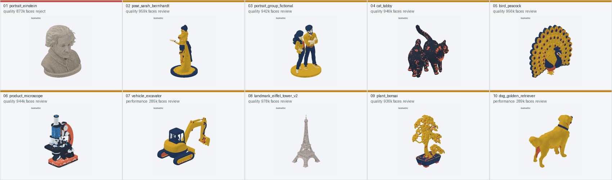

# Tripo 真实 10 例质量校准报告

日期：2026-08-29

范围：Image2 可打印参考图 → Tripo H3.1 图生 3D → OBJ 转换 → 顶点色量化 → 本地结构门禁 → 五视图人工复核

## 结论

- 严格创建了 **10 个 Tripo 生成任务**；10/10 远端生成成功、10/10 OBJ 转换成功，且没有自动重试或重复付费任务。
- 9/10 通过基础闭合拓扑门禁；爱因斯坦胸像存在 8 条开放边及绕序异常，必须修复或重新生成。
- 完整质量门禁结果为 1 个 reject、9 个 review、0 个无警告 pass。`review` 不等于不可用，而是不能把“远端生成成功”直接呈现为“可放心打印”。
- 7/10 为单一连通体；双猫、挖掘机、盆景分别有 2、2、9 个未焊接壳体。旧门禁因壳体接触主体或热床而漏报，本轮已修复。
- performance 两例平均 28.7 万面、12.88 MB；quality 八例平均 94.2 万面、48.26 MB。performance 文件约小 73%，但挖掘机细部连接有风险，不能仅凭体积把它设为所有类别的默认档。
- 适合继续给内部 Beta 使用，但 reject 必须阻断自动导入/切片；review 必须展示具体原因并要求用户旋转检查。

## 十例结果

| # | 案例 | 档位 | 面数 | 连通体 | 结果 | 五视图结论 |
|---:|---|---|---:|---:|---|---|
| 1 | 爱因斯坦胸像 | quality | 873,702 | 1 | reject | 身份、胸肩裁切和低底座清楚；后脑过度平滑。8 条开放边及绕序异常，不能直接进入切片。 |
| 2 | 莎拉·伯恩哈特全身像 | quality | 959,616 | 1 | review | 侧姿、长裙、手臂和低底座完整，接地很好；背面衣饰与色块噪声较多，有 53 个局部薄壁区域。 |
| 3 | 虚构双人像 | quality | 942,582 | 1 | review | 恰好两人、左右顺序和共享底座均保持，是本轮人像底座策略的最佳证明；侧面遮挡和背面推断仍需复核。 |
| 4 | 两只虎斑猫 | quality | 946,102 | 2 | review / 建议重生 | 两只猫和两条尾巴可辨，但身体接触区粘连，第二壳体约占 1.55%；仅两种目标色达到有效表面积。 |
| 5 | 开屏孔雀 | quality | 956,514 | 1 | review | 正面完整漂亮，尾屏是接近二维的薄板，背面色点噪声明显；接地面积比仅 0.003552，接近门槛。 |
| 6 | 显微镜 | quality | 944,844 | 1 | review | 镜筒、弧臂、物镜、载物台、反光镜、旋钮和原底座均保留，是硬表面语义最佳案例；小色斑仍多。 |
| 7 | 挖掘机 | performance | 285,542 | 2 | review / 建议重生 | 履带、驾驶舱、推铲、动臂和铲斗轮廓完整；第二壳体约占 3.24%，铲斗/附件连接可疑，细连接风险高。 |
| 8 | 埃菲尔铁塔 | quality | 978,408 | 1 | review | 四腿、大拱、平台、塔身和天线完整，四脚落地；格构细节过密，细杆、局部薄壁和微三角面较多。 |
| 9 | 盆景 | quality | 936,956 | 9 | review / 建议重生 | 盆、主干和树冠外观完整，但被拆成 9 个相接未焊接壳体，最大主体仅占 75.92%；结构上不够可靠。 |
| 10 | 金毛犬 | performance | 289,134 | 1 | review | 头身、四肢、尾巴和项圈完整，单一闭合连通体；常规动物在 performance 档仍保留了良好轮廓，是本档最佳案例。 |

## 重复出现的问题

| 问题 | 命中 | 影响 | 本轮处理 |
|---|---:|---|---|
| 局部悬垂 | 10/10 | 需要旋转模型或支撑，不能视为自动可打印 | 继续作为 review，不误阻断所有造型模型 |
| 微小耗材色区 | 10/10 | 表面斑点、碎片化换色 | 保留顶点色色块清理并继续暴露告警；仍是下一轮最高优先级之一 |
| 局部薄壁 | 8/10 | 细肢、枝叶、格构或附件易断 | 五视图与局部厚度证据共同呈现 |
| 未焊接主要壳体 | 3/10 | 接触但不连通，打印后可能分离 | 新增 `unwelded_structural_components` 结构告警和中文说明 |
| 密集微三角面 | 2/10 | 高质量档文件大、细节不一定可打印 | 保持 review；不再把 100 万面等同于质量必然更高 |
| 硬拓扑错误 | 1/10 | 开放边/绕序异常，不能安全切片 | reject 并阻断 |

## 已完成的质量优化

1. 二维输入门禁不再只按碎片面积判断。新增“最大脱离部件跨度”指标，能拦截面积很小但跨度很大的伞柄、车座、枝条、把手和支撑。
2. 多色提示词要求所有承力细杆从头到尾使用同一不透明结构色，禁止使用白色、金属高光、透明或背景色，降低色板映射把结构吞掉的概率。
3. 植物、盆景、珊瑚、鹿角和羽扇类提示词改为更少、更厚、相互重叠的实体簇，并要求每个簇通过粗壮枝干明确焊接到主体或底座。
4. 3D 门禁新增“多个非微小壳体未焊接”告警，双猫、挖掘机和盆景的真实漏检现已全部命中。
5. 客户端新增具体中文提示：检测到细长部件脱离时，直接告诉用户检查把手、枝条和支撑；检测到多壳体时，提示确认接触处不会分离。
6. 真实付费运行器冻结输入哈希、档位、面数和色板；在付费创建前写入意图，远端结果不明确时禁止静默重放。

上述提示词和新门禁是在十次真实结果分析后完成的。为遵守本轮“恰好十次 Tripo”约束，没有为了美化成功率继续抽卡或用新提示词追加第 11 次任务。

## 付费调用与可追溯性

- Tripo：恰好 10 次生成，10 个唯一任务 ID，0 次重试；生成与转换均成功。
- Image2：本轮共 12 次付费尝试。10 次首轮参考图、1 次埃菲尔铁塔替代图、1 次雨伞替代图；雨伞替代请求连接失败且结果不明确，没有重放。
- 被人工拒绝的参考图保留为证据：灯塔因源主体过小而被生成成泛化建筑；雨伞和既有自行车因浅色细杆在色板映射后断开。
- 逐例输入 SHA-256、任务 ID、档位、面数、色板、OBJ SHA-256 和告警见 `generated_models/tripo-real-10-wave1/quality-summary.json`。

## 建议内部测试清单

- 人像：胸像底座是否一体、全身像脚/裙摆是否确实焊接、多人是否保持数量与左右顺序。
- 动物：耳、四肢、尾巴数量；多只动物是否粘连或出现小型脱离壳体。
- 机械：把手、油缸、铲斗、镜片、旋钮和支杆是否连续；旋转背面检查单图推断。
- 建筑/植物：格构、枝叶、平台和叶簇是否足够粗；关注“接触但未焊接”的壳体。
- 多色：不要只看颜色数量，要看有效表面积和是否出现背面碎斑。
- 导入切片前：reject 不继续；review 至少检查五视图、接地、局部薄壁和未焊接壳体，再决定加支撑、修复或重新生成。

## 尚未关闭的风险

- 本轮没有真实打印成品数据，局部薄壁和悬垂结论仍是几何分析与五视图判断，不是物理打印闭环。
- 单图 3D 的背面纹理/形体推断仍不稳定；高质量档会增加几何密度，但不会自动解决背面语义和色点噪声。
- performance 只有两例，已证明常规动物可用、复杂机械仍有连接风险，暂不足以形成更细的自动档位分流规则。
