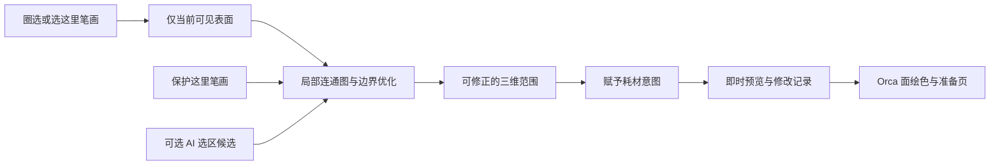

# 3D 美颜工作台的局部选择、去杂色与耗材编辑

## 结论与建议

建议把局部颜色编辑做成“圈定部位—修正范围—选择耗材—即时对比”的工作流。首版采用现有 Orca 绘色能力、表面连通关系与局部图优化；轻量 AI 只负责提出选区候选。修改范围、颜色意图和最终耗材分配必须可追踪，不能依靠反复修改 RGB 后再猜测用户意图。

美图秀秀提供低学习成本的交互参考，Photoshop 提供可修正蒙版与非破坏编辑的参考，Substance 3D Painter 提供三维表面编辑的参考。三者都不是可以直接嵌入 Orca 的开源引擎。真正值得复用的是现有选择、绘色、图算法和可选的分割模型。

优先顺序是：**先把边界和颜色保存正确，再把选择变得省力，最后验证 AI 能否进一步减少操作。** 不建议为了“一键识别领口”默认附带 PyTorch/CUDA、整套 Blender 或大型三维分割环境。

研究依据截至 2026-09-10：官方产品文档、原论文/作者仓库、当前工作树源码和已完成的领口模型实操记录。外部模型未在本机进行推理基准，文中的性能数值明确区分作者数据、算术估算和拟定验收目标。本报告是方案研究，不代表这些新能力已经实现。

## 1. 本模型真正需要解决什么

女性半身模型有 953,446 个顶点、1,906,896 个三角面。实操中，35% 的局部去杂色只处理了 23 个小区域、265 个顶点，对连成条带的黑绿色块改善有限；后来通过局部统一颜色，两轮保存才获得主要领口区域的蓝色效果。结果经过六色预览和准备页导入核对，但边界细线与底座杂色仍有残留。[本地实操记录](/D:/Workspace/11_3DDY_Continue/Docs/audits/2026-09-10-collar-cleanup.md)

这表明“杂色”至少包含不同的问题，不能全部交给一个强度滑块。

| 看到的现象 | 可能成因 | 应使用的处理方式 |
|---|---|---|
| 单一材质区内的小黑点、小色岛 | 原始色噪声、量化后形成孤岛 | 在已限定的部位内合并小区域 |
| 领口上连续的黑绿色条带 | 已烘焙进颜色的阴影、生成纹理、真实装饰等 | 由人确认该部位应统一，再赋予指定耗材 |
| 眼睛、嘴唇、纽扣等小色块 | 真实细节 | 保留或显式保护，不能按面积一律清除 |
| 衣服与皮肤交界漏色或细边 | 选区不准、共享顶点、纹理接缝/采样 | 修正选区与颜色表示，不能只增大去噪强度 |
| 转动光照后出现的明暗 | 渲染光照 | 不改模型颜色，用纯色视图区分 |

以上是诊断分类，不是对本模型每个黑点的成因认定。仅凭成品模型的 RGB 无法可靠判断它原来是阴影还是设计细节。用户“这里应当是一种布料”的意图比自动猜测更有用。

## 2. 从美图秀秀、PS 和三维工具借鉴什么

### 美图秀秀：围绕操作目的组织工具

美图秀秀官方消除笔说明采用点选或涂抹指定区域，并在涂抹后展示消除结果。这适合借鉴为简单动作与即时反馈；它公开的是使用方式，不能据此判断其内部使用哪一种算法。[1](https://www.meituxiuxiu.com/zh-Hans/academy/eraser-pen)

工作台应使用“清理小杂点”“统一这块颜色”“保护这里”等文案。默认参数由系统选择；界面先让人表达目标，不先要求理解颜色距离、法线夹角和图割权重。处理失败时显示具体候选范围，而不是让用户重复拖动强度。

但二维消除笔常常需要补出新的图像内容；领口换色通常只需要更改表面颜色。不能把“消除”直接实现为重新生成衣服、抹平褶皱或改变几何。

### Photoshop：选区、效果和原件分开

PS 官方推荐用选区建立调整层蒙版，通过黑白画笔修正范围；Select and Mask 提供边界、遮罩、原始选区和实时预览等观察方式。这些机制支持反复修改，而不必每次重新做选区。[2](https://helpx.adobe.com/photoshop/desktop/adjust-color/selective-color-adjustments/replace-object-colors-by-applying-a-hue-or-saturation-adjustment.html) [3](https://helpx.adobe.com/photoshop/desktop/make-selections/refine-modify-selections/refine-your-selection-and-mask.html)

建议借鉴为一个简化的“局部修改记录”：例如“领口 → 牛仔蓝”，可以显示/隐藏、改颜色、修范围、删除这次修改。不必复制 PS 的完整图层、混合模式和滤镜面板。

PS 保留亮度的换色方法适合照片，但六种实体耗材下，连续亮度渐变不能直接变成连续耗材色。工作台里的软边只能作为选择提示；最终分色使用明确标签。几何褶皱的明暗留给光照渲染与实物照明，不能再次烘焙成额外 RGB。

### Substance 3D Painter / Blender：选择表面，而非屏幕像素

Painter 的 Polygon Fill 可按三角面、连接子网格或 UV 岛填充蒙版；它的最终蒙版仍是像素数据。这证明三维工具可以把“选择范围”和“赋予材质”组合起来，但不能把 Painter 的纹理蒙版直接当成打印耗材标签。[4](https://experienceleague.adobe.com/en/docs/substance-3d-painter/using/painting/paint-tools/polygon-fill)

Blender 的面选择遮罩、拓扑与面组自动遮罩也提供了保护未选区域的交互参考。这里引用的是固定版本官方手册，不以开发版功能作为产品依赖。[5](https://docs.blender.org/manual/id/5.0/sculpt_paint/selection_visibility.html) [6](https://docs.blender.org/manual/id/4.0/sculpt_paint/sculpting/controls.html)

对 AI 生成模型，整个身体可能连成一个网格，UV 岛又可能只是展开碎片。连接块、UV 岛、几何部位和服装部位不是同一个概念，因此它们只能作为选区线索，不能直接显示成“领口已识别”。

## 3. 当前代码中的机会与限制

### 3.1 当前“同色选择”还不是部位选择

`smart_region()` 从种子面出发，比较相邻面的颜色与种子色，并限制相邻面的法线夹角。它容易在同一布料的深浅变化处停下，也可能越过与目标同色的相邻区域。累加选择修复了操作丢失问题，但不会自动理解哪一片是衣服。[源码](/D:/Workspace/11_3DDY_Continue/src/slic3r/GUI/AI/Model/VertexColorRegionEditor.cpp:402)

`local_patch()` 使用网格对角线比例决定空间半径，再沿邻接关系扩展。这个范围不是屏幕圆形笔刷，也不等于沿表面的距离。在褶皱、贴近的双层衣片上，空间距离很近并不代表应同时选择。[源码](/D:/Workspace/11_3DDY_Continue/src/slic3r/GUI/AI/Model/VertexColorRegionEditor.cpp:433)

当前去杂色已使用区域面积、邻接投票和保护标记，并非简单 RGB 均值滤波；它对小色岛保持保守是合理的。下一步应增加“统一部位”路径，而不是单纯放宽清理阈值。[源码](/D:/Workspace/11_3DDY_Continue/src/slic3r/GUI/AI/Model/ModelColorCleanup.hpp)

### 3.2 共享顶点是边界漏色的潜在来源

`apply_color()` 把选中面的三个顶点都标为需要改色，再修改顶点颜色。相邻未选面若共享同一顶点，也会使用修改后的颜色。这是源码推导出的结构风险，尚不能断言实操中的每一条黑边或漏色都由此造成。[源码](/D:/Workspace/11_3DDY_Continue/src/slic3r/GUI/AI/Model/VertexColorRegionEditor.cpp:628)

例如 A、B 两个面共用边上的两个顶点，单独选择 A 并改三个顶点，B 的两个角也会受影响。只验证“选中顶点以外不变”不能证明“未选面的外观不变”。

解决方向是把局部耗材覆盖记在面上，预览使用面或面角颜色，导入时传递到 Orca 的面绘色。独立 OBJ 导出若要表达硬边颜色，可生成带必要重复顶点的派生副本，或使用具备面材质的输出形式；不能同时承诺普通共享顶点 RGB、索引完全不变、任意硬边独立颜色三者全部成立。

### 3.3 已有能力可以复用

Orca 本地 `TriangleSelector` 已有笔刷选面、种子填充、桶填充和绘色子三角形支持；`GLGizmoMmuSegmentation` 已有智能填充界面。应先提取/适配这些选择与绘色能力，而不是再写一套独立的打印绘色格式。[选择器](/D:/Workspace/11_3DDY_Continue/src/libslic3r/TriangleSelector.hpp:323)

项目已依赖 Boost 1.84 和 OpenCV 4.6.0；OpenCV 当前构建包含 `core`、`imgproc`、`imgcodecs`，但没有默认构建 `dnn`。因此可以评估复用图算法与 GrabCut，不能假设现有 OpenCV 已能直接运行所有 SAM 网络。[Boost 配置](/D:/Workspace/11_3DDY_Continue/deps/Boost/Boost.cmake) [OpenCV 配置](/D:/Workspace/11_3DDY_Continue/deps/OpenCV/OpenCV.cmake)

## 4. 业界与学术方法筛选

| 方法 | 擅长的问题 | 对本模型的判断 | 工程决定 |
|---|---|---|---|
| 连通区域、表面距离、边界屏障 | 明确范围内的选取与补选 | 便宜、可控，仍需要粗略提示 | 首版基础 |
| 前景/背景种子 + 图割 | 把粗略圈选修成较合理边界 | 可同时用颜色、几何与保护笔画 | 首版重点验证 |
| 受约束随机游走 | 正负笔画、软边界和强制边界点 | 适合模糊边界的多次修正 | 图割的对照方案 |
| CGAL SDF 分割 | 按形状厚度与几何结构分部件 | 对同一身体表面的服装颜色分界未必有效 | 不作为领口主算法 |
| MobileSAM | 单张图像上的点选/框选候选 | 可用于当前视角，再映射到可见表面 | 轻量 AI 优先候选 |
| SAM 2.1 | 更强的图像/视频交互分割 | 可作质量对照，不能直接输出三维耗材区 | 可选增强候选 |
| SAMesh | 多视图分割提升到网格部件 | 三维一致性路线值得参考 | 研究设计，先不默认集成 |
| PartField | 三维特征、层级部件与交互选择 | 对“选一个部位”很有启发 | 许可限制，不能直接默认集成 |
| EdgeSAM | 端侧分割和完整编码/解码导出 | 部署工程有参考价值 | 非商业许可，先不集成 |
| SAM 3 / 3.1 | 文本概念与视觉提示、视频跟踪 | “选领口”的交互有吸引力，未证实适配本模型 | 重型候选，暂不默认使用 |

这不是泛化榜单。最终排名应由本项目的领口、皮肤、衣物边界及用户操作数据决定。

### 4.1 推荐的经典方法：用户指定范围，算法辅助找边界

GrabCut 将前景/背景颜色模型与边界优化结合，允许矩形初始化和后续笔画修正。OpenCV 已提供实现；但它处理二维像素，不是把 OBJ 交给 `grabCut()` 就能得到三维领口。[7](https://www.microsoft.com/en-us/research/publication/grabcut-interactive-foreground-extraction-using-iterated-graph-cuts/) [8](https://docs.opencv.org/4.6.0/d8/d83/tutorial_py_grabcut.html)

三维方案可以在局部面邻接图上做二元分割。Boost 已提供 Boykov–Kolmogorov 最大流实现；可复用求解器，项目只构建自己的局部图、代价和提示约束。[9](https://www.boost.org/doc/libs/1_84_0/libs/graph/doc/boykov_kolmogorov_max_flow.html)

受约束随机游走论文支持前景/背景笔画、边界附近的软约束和必须经过的点，并讨论了仅增加种子仍可能难以处理弱边界。这支持保留用户修正边界的能力，而不是承诺一次点击总能成功。[10](https://jianfei-cai.github.io/TVCG11-CRW-Zhang.pdf)

推荐先做局部二元图割基线；若弱边界案例明显受益，再比较随机游走。没有必要首版同时维护两个默认求解器。

### 4.2 几何分割不等于服装分割

CGAL 的表面分割采用 Shape Diameter Function 并结合图割。它适合利用厚度和形状差异，但领口颜色界线可能位于连续、平滑的表面上。形状分割可帮助区分底座、肢体等候选部件，不能代替颜色与用户意图。[11](https://doc.cgal.org/latest/Surface_mesh_segmentation/group__PkgSurfaceMeshSegmentationRef.html)

### 4.3 轻量 SAM 的合理角色

MobileSAM 官方报告约 9.66M 参数，提供点/框提示，示例保留图像编码结果供后续提示使用。官方 CPU 示例约 3 秒是特定机器上的作者结果，不是本产品时延保证。[12](https://github.com/ChaoningZhang/MobileSAM)

适合的接法是：当前视角渲染图 → 提示分割 → 可见面候选 → 三维边界约束 → 用户确认。它只提出选区，不重新生成模型，不改源图片，不直接决定打印耗材。

一个部署细节不能省略：MobileSAM 主仓库的 ONNX 导出脚本以已有 `image_embeddings` 为输入，导出提示编码器与掩码解码器，并没有证明整个图像编码链已经可脱离 PyTorch 部署。完整轻量部署还需验证图像编码器、预后处理和算子支持。[13](https://github.com/ChaoningZhang/MobileSAM/blob/master/scripts/export_onnx_model.py)

SAM 2.1 tiny 为 38.9M 参数，官方原生安装依赖 PyTorch，Windows 推荐 WSL；官方速度在 A100 上测量。可以用于质量对照，不能把该 FPS 当成普通 Windows 台式机里的一键完成时间。[14](https://github.com/facebookresearch/sam2)

### 4.4 真三维方案：参考多视图一致性，避免盲目带入环境

SAMesh 将多模态、多视图渲染的二维掩码提升为三维网格分割；这与“旋转后选区仍应一致”的需求相关。但作者配置包含 Python 3.12、PyTorch、渲染及网格处理依赖，公开项目树/元数据中未核实到明确顶层许可。不能仅根据名称相近的第三方封装宣称其为 MIT。[15](https://github.com/gtangg12/samesh) [16](https://arxiv.org/abs/2408.13679)

PartField 提供三维特征与层级部件选择，同时明确指出连接混乱的网格仍可能难处理。它的官方 NVIDIA License 第 3.3 条限制非商业研究和教育用途。可以借鉴论文思路，但不能直接作为当前商用产品依赖。[17](https://github.com/nv-tlabs/PartField) [18](https://github.com/nv-tlabs/PartField/blob/main/LICENSE)

SAM 3 当前仓库已提到 3.1，多对象视频跟踪改进不是本任务最迫切的能力。SAM 3 仍是图像/视频提示分割，文本输入“领口”不保证得到网格上正确的衣片边界。其 848M 参数与 CUDA 环境要求也使它更适合作为可选研究对照；许可为自定义 SAM License，不能套用 SAM 2 的 Apache 许可。[19](https://github.com/facebookresearch/sam3) [20](https://github.com/facebookresearch/sam3/blob/main/LICENSE)

EdgeSAM 提供编码器、解码器的 ONNX/CoreML 导出，并提醒其 IoU 预测分数可能不可靠；适合参考部署与候选置信处理。其 S-Lab License 也限定非商业用途，商业使用需另行取得相应许可。[21](https://github.com/chongzhou96/EdgeSAM) [22](https://github.com/chongzhou96/EdgeSAM/blob/master/LICENSE)

## 5. 建议的用户旅程

### 默认流程

1. 进入“3D 美颜 → 颜色”，选择“统一这块颜色”。
2. 在领口粗略圈一下，或用“选这里”笔刷划一笔；屏幕显示清晰轮廓与轻遮罩。
3. 选多了，使用“保护这里”；选少了，继续“选这里”。原图仍可对照。
4. 点击六个耗材中的蓝色，立即看到颜色预览；按住“对比”看修改前。
5. 点击“保留修改”，生成“领口 → 牛仔蓝”的修改记录。随后继续编辑或导入准备页。

“一圈一色”是理想常见流程，允许增加少量保护笔画；对复杂遮挡不承诺固定两次点击。

### 工作台应保持简单

左侧保留已有几何美颜入口，颜色部分只有“统一颜色”和“清理杂点”两个主要目的。中间固定模型画布，右侧显示本次范围与耗材；撤销、对比、清除范围始终可见。专家参数按需展开，不出现“图割”“阈值图”等术语。

鼠标左键在编辑模式下用于笔画，旋转使用明确的导航手势或可见“转动模型”按钮。避免现有“短按选择、拖动旋转”在升级连续笔刷后互相冲突；不强迫只有触控板的用户依赖中键。快捷键沿用已有 F 放大选区、Ctrl+Z 撤销，并在实际平台验证后确定其余键位。

### 观察模式

保留“六色分区”和“光照效果”两种视图，不重新增加棋盘格选项。前者用来确认实际颜色区域，后者用来理解几何起伏。选区遮罩是编辑辅助层，不写入图片、纹理或导出模型。

纯色视图的边缘抗锯齿也可能让截图出现额外像素色；六色成立与否应按模型的材质标签检查，不能统计屏幕截图 RGB。

## 6. 建议的技术流程

### 6.1 可见性与表面范围

圈选不是把二维轮廓无限穿透到模型背面。优先通过面 ID 与深度缓冲得到可见面；ID 缓冲不启用混色/普通抗锯齿，像素缩放与相机矩阵需与画布一致。遮挡判断使用深度，不能只靠“面朝向相机”。

首次操作默认只作用于当前可见表面。换视角后，已选面保持不变，可以累加新看见的部分；延伸到背面应是明确动作，而不是隐含效果。衣片、手臂、身体距离很近时，不用欧氏最近点无条件连接。

已有源码会为重复边界顶点补充选择邻接，这能跨某些导入接缝；新图需要记录这类虚拟邻接的依据，并结合边端点、法线和组件约束，防止把真正分离的衣片缝合到一起。构建分析邻接不应修改原网格。

### 6.2 局部图优化

面作为节点，共享边构成邻接；在粗选范围及其边界带内计算。正笔画为前景约束，保护笔画为背景约束，范围外冻结。未画笔的节点综合考虑原始颜色特征、表面距离及可选 AI 候选。

边代价结合共享边长度、颜色差异、法线变化和边界提示。颜色使用不带显示光照的原始表面数据，避免旋转灯光改变选区。同一衣片的褶皱也可能有较大法线变化，因此几何边缘默认作为软线索；用户明确划出的保护边界具有更高优先级。

一个可试验的目标是最小化 `E(L)=Σ面积×区域归属代价 + λΣ共享边权重×标签不同惩罚`。这只是建议的工程模型，不是复制某篇论文的完整公式，也没有证明适配本模型。二元非负边代价可交给成熟最小割求解器；用户约束权重必须按局部总代价构造，不能凭一个固定“大常数”声称永不违背。

先以原始局部面图得到可验证基线。局部范围很大时，再做保留原面映射的区域聚合或分析代理；聚合后的结果要回到原网格边界带精化，避免低分辨率代理抹掉领口细节。代理只用于分析，导出仍使用原模型。

### 6.3 去杂点与统一色的不同后处理

“统一色”将明确选中的面赋予目标耗材，不保留该范围内原来的噪声标签。“清理杂点”在所选部位内部检查材质连通分量，结合实际面积、周长、宽度、周围标签和保护笔画决定候选。

面积阈值必须使用模型实际打印尺寸，不能用三角面个数代表可打印大小，也不能只用整模型面积比例。100 mm 和 200 mm 高的同一模型需要重新评估细节尺寸。窄长条不是小圆点：它可能是领口缝线，单凭面积小不能自动吞并。

所有决定对同一份输入计算，避免先清一块后触发连锁吞并。改变范围与残留候选可显示，但不增加必须完成的检查步骤，也不拦截正常下一步。

## 7. 用面材质意图连接美颜和准备页

颜色处理应区分三个层次：原始外观、局部编辑意图、当前工程耗材。领口和头发即使原来恰好是同一个 RGB，也必须能独立修改。

建议在模型生成模块中维护稀疏的面覆盖记录：源模型标识与几何/拓扑指纹、面 ID 集合、目标耗材或色卡角色、操作顺序、启用状态。默认只形成顺序修改记录，暂不实现任意图层混合；后写的明确局部修改覆盖同一面的先前修改。

耗材包角色与物理槽号需要分开。记录色卡 ID、角色/耗材定义及其版本，再解析到当前工程槽位；不要把“第 5 槽”当成永远代表蓝色。换包后展示对应变化，用户明确固定的局部颜色优先保留；目标耗材不存在时展示替代候选。

当前六色匹配的 RGB 精确保留规则解决了已发现的重复匹配问题，但它只是兼容保护：无法表达“同样是黑色，头发保持黑色，领口改蓝色”的空间意图。面覆盖记录才是长期解决方案。

导入适配层先完成普通外观分色，再应用已确认的局部覆盖，最终使用 Orca 的绘色/材质结构保存 3MF。导入不重复量化已锁定区域，不自动切片，不静默修改打印工艺。

已有 `ColorIntent.hpp` 区分实体通道、目标色和混色配方。新增面覆盖如果跨模块传递，需要增量扩展契约及迁移，不能偷偷向旧 v1 schema 塞入其他消费者不识别的数据。旧模型没有覆盖时继续走现有逻辑。[契约](/D:/Workspace/11_3DDY_Continue/src/slic3r/AI/Contracts/ColorIntent.hpp)

纯色路径与 CMYK 视觉叠色路径共用部位范围，但不共用随意推导的颜色公式。叠色由 Orca 的既有配方/切片路径处理；双色渐变笔刷不能直接声称等于标定后的叠色打印。

对于局部平滑等不改变面索引的几何修改，可以保留面覆盖并验证位置变化；重网格或简化会破坏原面 ID，必须失效或显式重投影并比较。不能只检查面数相同就认定语义相同。

## 8. 性能、体积与实现成本

| 层级 | 安装影响 | 运行影响 | 建议 |
|---|---|---|---|
| 现有 Orca + Boost/OpenCV 局部算法 | 不需要模型权重；新增编译代码体积需实测 | 局部图和缓存使用 CPU/内存 | 默认能力 |
| MobileSAM + 裁剪运行时 | 按 9.66M 参数算，FP32 权重理论约 38.6 MB；不是最终安装包 | 图像编码、掩码解码、缓存与映射 | 按需安装并测完整链路 |
| SAM 2.1 tiny | 按 38.9M 参数算，FP32 理论约 155.6 MB；运行时另计 | 不能照搬 A100 吞吐 | 可选质量对照 |
| SAM 3 | 按 848M 参数算，仅 FP16 理论约 1.70 GB；实际分发另计 | GPU、框架与中间激活开销较大 | 不默认装入桌面包 |
| SAMesh/PartField 完整研究环境 | 多个网格、渲染、深度学习依赖，不能仅看权重 | 预处理、多视图或特征计算 | 不作为当前默认部署 |

权重数字为参数量乘字节数的十进制估算，不是下载包测量，不能推导峰值内存。使用 ONNX Runtime 的按模型算子裁剪可以减小运行时，但需验证完整编码器、解码器和目标平台；不可把 Python 原型大小直接写成产品增量。[23](https://onnxruntime.ai/docs/build/custom.html)

对 1,906,896 个面，一个 `uint8` 标签数组约 1.91 MB，一个 `uint32` 索引数组约 7.63 MB。80,000 个面的一次颜色撤销，若每面保存 4 字节索引和各 1 字节的新旧标签，原始差量约 0.48 MB，远小于每一笔保存整份百 MB OBJ。这些只是数据布局估算，未包含容器、索引和渲染开销。

建议在鼠标拖动时只更新笔画与轻量遮罩，松开后异步计算局部候选；颜色变化仅更新颜色/标签缓冲，几何没变时复用 BVH。保存使用后台原子写入与操作差量，落盘失败时保留内存修改并允许重试。

AI 编码缓存应由模型版本、相机、视图裁剪、渲染方式和输入分辨率共同标识。旋转相机后不能复用旧画面特征。每个请求带版本序号，过期结果不得覆盖新的选区。推理和图优化均可取消，失败回到圈选/笔刷，不拖住普通 Orca 功能。

## 9. 分阶段落地与停止条件

### 第一阶段：先保证结果正确

引入局部面覆盖及差量撤销；打通预览、版本恢复和 Orca 导入；解决共享顶点边界、同色不同部位独立编辑和耗材包换槽的问题。先用当前选择工具驱动，不等待 AI。

验收以两个共享边三角面、同色的头发/领口、跨 UV 接缝等可解释样例为基础。若未选面的材质受影响，或重新导入覆盖已锁定颜色，不进入下一阶段。

### 第二阶段：让普通人选得准

加入可见表面圈选、“选这里/保护这里”笔画、局部图优化和即时对比。去杂点与统一色共用选区，但使用不同处理规则。优先验证这次女性模型，随后扩展到白领白衣、黑发黑衣、交叉手臂和低面数衣片。

先比较现有累加同色、圈选直接填色、圈选加图优化三个基线。如果简单圈选已经达到目标，不为所有操作强制增加图优化等待；只有边界修正能明显减少操作时才自动启用。

### 第三阶段：验证可选 AI 是否真正省事

以 MobileSAM 为轻量候选、SAM 2.1 为质量对照，评估当前视角掩码到三维面的链路。锁定模型版本与输入图，分别测冷启动、热提示、面映射和边界精化。AI 候选不合格时保留经典方法，不新增强制登录或云端等待。

只有在修正笔画显著减少、误染率不提高且资源预算可接受时，才形成可下载增强包。PartField、EdgeSAM 的当前许可不作为默认集成依据；SAMesh 在许可与复现条件明确前只作设计参考。

## 10. 验收目标与实验设计

以下是拟定目标，不是已达成指标。性能需在明确 CPU、GPU、内存、驱动及模型尺寸的机器上报告，至少覆盖一台无独显的 Windows 基线机和一台主流独显机。

| 维度 | 建议验收目标 | 如何测 |
|---|---|---|
| 常见领口操作 | 1 次粗选 + 选色；边界修正不超过 2 笔作为起始目标 | 记录操作数与完成时间，允许困难样例失败 |
| 笔画反馈 | 95% 在 100 ms 内显示笔迹/范围反馈 | 区分反馈与完整求解时间 |
| 缓存后的局部选区 | 不超过 150k 面的 ROI，95% 在 500 ms 内返回候选作为目标 | 统计 p50/p95；更大 ROI 单列 |
| 首次准备 | 对约 190 万面模型，目标 3 秒内准备可选取状态 | 单独记录加载、索引与分割，不混为一个数 |
| 误染保护 | 明确保护区、选区外面材质标签零变化 | 数据级比较；不只看截图 |
| 六色一致性 | 预览、保存、重载、3MF 的目标标签一致且实体槽不超过 6 | 读取材质映射与绘色数据 |
| 几何保护 | 颜色操作不改变原始表面几何 | 位置、面连接及派生输出规则核对 |
| 恢复 | 撤销/重做、切工具、切页、重启均不丢已接受修改 | 按原生主窗口流程验证 |
| 失败恢复 | 取消或算法失败后仍可转动、补选、重试 | 故障注入与过期结果测试 |

建立约 20 个局部任务的固定评测集，至少包含当前模型、细节保护和接缝失败样例，并留一部分不参与调参。人工标注需要分别标记“允许修改”“必须保护”“边界可讨论带”；不同人对领口边界可能有分歧，不能用一个未经复核的掩码作为绝对真值。

推荐记录面积加权 IoU、未授权改色面积、以毫米计的边界偏差、修正笔画数、完成时间和失败率。当前人工清理结果可以作候选参考，但仍含残留，不能直接当完美真值。Princeton 网格分割基准强调人类分解的不唯一性，可用于理解评测；其整体功能部件指标不能替代本项目衣片颜色区的任务评测。[24](https://segeval.cs.princeton.edu/)

必测案例包括：黑发与黑衣同色但只改衣服、皮肤紧贴领口、手臂遮住衣服、正面圈选不得穿透背面、衣物 UV 岛断裂、共享顶点硬边、单个大三角面跨材质边界、六色包重新应用、物理槽顺序调整、几何简化后旧选区失效、保存磁盘失败、取消后旧推理结果返回。

最后用同一六色耗材实际打印少量对照样件，判断残留小岛、层纹、换色数量和废料变化。区域数量减少不必然意味着换色或废料减少，必须经真实切片比较；本研究没有执行切片或打印。

## 11. 来源与核实范围

下列来源均在 2026-09-10 检索。日期明确者列出发布或更新日期；仓库内容会变化，实施时应固定提交与权重哈希。许可条目是官方文本筛选结果，不构成对整条依赖链的分发结论。

1. 美图秀秀，《照片中有想擦除的区域，试试消除笔吧》，官方功能说明。[链接](https://www.meituxiuxiu.com/zh-Hans/academy/eraser-pen)
2. Adobe，Replace Object Colors by Applying a Hue or Saturation Adjustment，更新于 2026-02-23。[链接](https://helpx.adobe.com/photoshop/desktop/adjust-color/selective-color-adjustments/replace-object-colors-by-applying-a-hue-or-saturation-adjustment.html)
3. Adobe，Refine your selection and mask，更新于 2026-02-23。[链接](https://helpx.adobe.com/photoshop/desktop/make-selections/refine-modify-selections/refine-your-selection-and-mask.html)
4. Adobe Substance 3D Painter，Polygon fill，更新于 2026-07-03。[链接](https://experienceleague.adobe.com/en/docs/substance-3d-painter/using/painting/paint-tools/polygon-fill)
5. Blender 5.0 Manual，Selection & Visibility，官方固定版本索引内容。[链接](https://docs.blender.org/manual/id/5.0/sculpt_paint/selection_visibility.html)
6. Blender 4.0 Manual，Controls / Auto-Masking，官方固定版本索引内容；英文正文抓取失败，未据此作算法实现断言。[链接](https://docs.blender.org/manual/id/4.0/sculpt_paint/sculpting/controls.html)
7. Rother、Kolmogorov、Blake，GrabCut，SIGGRAPH 2004，Microsoft Research。[论文入口](https://www.microsoft.com/en-us/research/publication/grabcut-interactive-foreground-extraction-using-iterated-graph-cuts/)
8. OpenCV 4.6.0，Interactive Foreground Extraction using GrabCut Algorithm。[文档](https://docs.opencv.org/4.6.0/d8/d83/tutorial_py_grabcut.html)；该版本 [Apache 2.0 许可](https://github.com/opencv/opencv/blob/4.6.0/LICENSE)。
9. Boost 1.84，Boykov–Kolmogorov Maximum Flow。[文档](https://www.boost.org/doc/libs/1_84_0/libs/graph/doc/boykov_kolmogorov_max_flow.html)；[Boost Software License 1.0](https://github.com/boostorg/boost/blob/boost-1.84.0/LICENSE_1_0.txt)。
10. Zhang、Zheng、Cai，Interactive Mesh Cutting Using Constrained Random Walks，作者公开论文稿。[全文](https://jianfei-cai.github.io/TVCG11-CRW-Zhang.pdf)
11. CGAL，Triangulated Surface Mesh Segmentation，当前参考手册；页面列出该包 GPL 许可。[链接](https://doc.cgal.org/latest/Surface_mesh_segmentation/group__PkgSurfaceMeshSegmentationRef.html)
12. MobileSAM，作者官方仓库，2023 年研究。[README](https://github.com/ChaoningZhang/MobileSAM)；[Apache 2.0 许可](https://github.com/ChaoningZhang/MobileSAM/blob/master/LICENSE)。
13. MobileSAM，官方 ONNX 导出脚本。[源码](https://github.com/ChaoningZhang/MobileSAM/blob/master/scripts/export_onnx_model.py)
14. Meta，SAM 2 / 2.1，2024 年发布，当前 README 含依赖、参数、测试硬件及 Apache 2.0 说明。[链接](https://github.com/facebookresearch/sam2)
15. Tang 等，SAMesh，官方代码、依赖与安装说明；顶层 LICENSE URL 返回 404，不能据此排除其他文件中的授权信息。[仓库](https://github.com/gtangg12/samesh)；[依赖](https://github.com/gtangg12/samesh/blob/main/pyproject.toml)。
16. Tang 等，Segment Any Mesh，arXiv:2408.13679，2024 年首发。[论文](https://arxiv.org/abs/2408.13679)
17. Liu 等，PartField: Learning 3D Feature Fields for Part Segmentation and Beyond，ICCV 2025，官方仓库。[链接](https://github.com/nv-tlabs/PartField)
18. NVIDIA，PartField LICENSE，尤其第 3.3 条。[许可](https://github.com/nv-tlabs/PartField/blob/main/LICENSE)
19. Meta，SAM 3 官方 README，含 2026-03-27 的 SAM 3.1 更新、848M 参数及 CUDA 安装要求。[链接](https://github.com/facebookresearch/sam3)
20. Meta，SAM License，更新于 2025-11-19。[许可](https://github.com/facebookresearch/sam3/blob/main/LICENSE)
21. Zhou 等，EdgeSAM: Prompt-In-the-Loop Distillation for On-Device Deployment of SAM，2023，作者仓库，含 ONNX/CoreML 与分数限制说明。[链接](https://github.com/chongzhou96/EdgeSAM)
22. S-Lab，EdgeSAM License 1.0。[许可](https://github.com/chongzhou96/EdgeSAM/blob/master/LICENSE)
23. Microsoft，ONNX Runtime Custom build，按模型算子裁剪运行时。[链接](https://onnxruntime.ai/docs/build/custom.html)
24. Chen、Golovinskiy、Funkhouser，A Benchmark for 3D Mesh Segmentation，Princeton 官方项目页。[链接](https://segeval.cs.princeton.edu/)

本地实现与实测依据：`VertexColorRegionEditor.*`、`ModelColorCleanup.hpp`、`TriangleSelector.*`、`ColorIntent.hpp`、`deps/Boost/Boost.cmake`、`deps/OpenCV/OpenCV.cmake` 以及[领口实操记录](/D:/Workspace/11_3DDY_Continue/Docs/audits/2026-09-10-collar-cleanup.md)。工作树包含并行开发内容；本研究只读取代码并新增本报告，不将未验证的新功能记作已完成。
