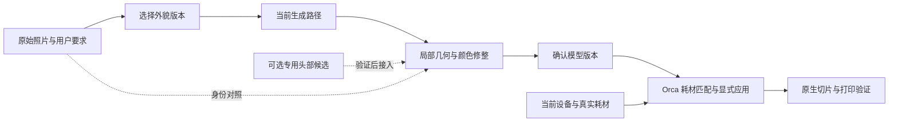

# 3DDY 写实人像打印：结合现有工程的落地筛选

日期：2026-09-10。依据：[写实人像打印研究](2026-09-10-realistic-portrait-printing-research.md)及当前 `codex/team/model-generation` 工作树。审阅基线为 `6c992edc39e1b2500d0e313fd9eaebf9658d5c6d` 加未提交修改；未提交能力不等于集成基线已交付。

本文是开发与验证范围的建议，没有实施下列新功能，没有调用付费生成，也没有新增程序或实物验收。这里的“小、中、大”表示相对工程投入，不是排期承诺。

## 1. 建议选择什么

建议近期推进 **可选的 2D 自然美化、受保护的局部 3D 修整、人像关键区域配色**，补上灰模与多光照比较。同时开展一项优先级很高的验证：**专用头部重建究竟能否比当前 Tripo 明显更像本人**。

这两部分解决不同问题：近期改进提高观感、可修正性与少色打印表现；专用头部重建验证负责检验相似度能否有实质提升。不能把前者的完成当作后者已经解决。

| 措施 | 建议安排 | 主要收益 | 工程投入与边界 |
| --- | --- | --- | --- |
| 保留原贴图的几何编辑，以及现有编辑/导入流程验收 | 前置基础 | 避免美颜过程中丢掉眼唇细节，保证修改能送到打印准备页 | 中；当前 GLB 修整有颜色表示转换，实际主窗口验收有缺口 |
| 2D“保留原貌 / 自然美化”可选模式 | 首批产品改进 | 改善输入观感，让用户先决定接受哪种外貌 | 小到中；复用现有图像服务，实际收益需要成对生成验证 |
| 局部柔化、保护细节，再扩展局部推拉 | 首批分两步做 | 用户能修掉局部不满意之处，减少整模重生成 | 现有柔化收尾较小；新增形变中等，自动五官滑杆另算 |
| 人像区域标记与关键色保护 | 首批，与原生配色工作协同 | 皮肤、眼唇、头发和服装不因全局减色互相污染 | 中；先人工指定区域，自动识别后续验证 |
| 灰模、多灯位、多视角比较 | 首批配套 | 看清真实形状，并筛掉只在某一盏灯下好看的改动 | 小到中；属于观察与比较能力，不是实物仿真 |
| 专用头部重建的半自动质量对照 | 同一轮开展关键验证 | 判断提升“像本人”的路线是否值得投入 | 中等验证工作；正式集成、自动化及接颈另评估 |
| 根据打印尺寸做局部几何强化 | 第二阶段小范围试验 | 让眼睑、唇线等特征在实体上仍然可辨 | 中；依赖形变、区域和真实打印证据 |
| 品牌影像风格、复杂去光、任意曲面 CMYK 反推 | 后置 | 展示风格或进一步的材质表现 | 前两者不能直接证明身份提升；完整打印反推研发量大 |

对四个原始想法的取舍是：**2D 美化保留；影像风格先落到照明观察和材料配色；凹凸光影先落到局部实体特征；3D 美颜作为可持续扩展的主要交互能力。** 专用头部重建是研究补充出来的相似度验证方向。

## 2. 现有工程能复用到什么程度

| 已核实的代码事实 | 对落地的影响 | 依据 |
| --- | --- | --- |
| 新创作保留自然颜色；耗材约束放在生成之后，单色写实仍可选 | 不应再把 2D 设计图和 Tripo 输入提前压成六色 | [当前产品说明](../../CONTINUATION.md)、[Sidecar](../../tools/ai/orca_ai_sidecar.py) 的 `_use_unrestricted_creation` |
| 写实图片提示词明确约束眼、鼻、嘴、脸型，并禁止泛化成另一张漂亮脸 | 新增自然美化时需要明确的策略分支，追加一句“更漂亮”会造成提示词冲突 | [图像预处理](../../tools/ai/openai_preprocessor.py) 的 `_style_preview_prompt`、`_unrestricted_creation_prompt` |
| 新任务把用户确认的 AI 设计图交给生成；原图没有作为第二份身份条件自动进入 Tripo | 保存原图是对照基础，不能把它称为已实现双参考身份约束 | [Sidecar](../../tools/ai/orca_ai_sidecar.py) 的 `_geometry_generation_reference` |
| GUI 当前选择单张参考图；底层有四个命名视角的请求能力 | 真实多照片产品入口、来源记录、相机/姿态检查仍需开发；不能把底层接口当作已完成多照片重建 | [生成面板](../../src/slic3r/GUI/ModelGenerationPanel.cpp)、[客户端](../../src/slic3r/GUI/AIModelGenerationClient.hpp)、[Provider Gateway](../../tools/ai/model_provider_gateway.py) |
| 现有美颜包括平滑、网格修复、选区、去杂色和局部改色 | 可以增量做可控修整；还没有人脸关键点、自动五官区域或脸型参数模型 | [修整选项](../../src/slic3r/GUI/AI/Model/ModelFinishing.hpp)、[局部编辑记录](../audits/2026-09-10-general-local-editing.md) |
| GLB 经通用编辑入口转换成网格和采样顶点色，再保存派生版本；原 GLB 保留 | 高频纹理可能在编辑版本中损失。眼唇细节明显的模型，必须先验证表示转换的影响 | [产物接口](../../src/slic3r/GUI/AI/Model/ModelArtifact.hpp)、[修整实现](../../src/slic3r/GUI/AI/Model/ModelFinishing.cpp) 的 `finish_model_artifact` |
| 可见面圈选、补选、保护、局部图割、状态保存已在工作树中实现 | 这些是人像编辑可复用的底座；最新主窗口流程尚未验收，不能写成现成稳定产品 | [SurfaceSelection](../../src/slic3r/GUI/AI/Model/SurfaceSelection.hpp)、[状态保存](../../src/slic3r/GUI/AI/Model/SurfaceSelectionState.hpp)、[验证记录](../audits/2026-09-10-general-local-editing.md) |
| 人像配色卡依据颜色特征匹配角色，不识别人脸或衣服 | 需要真实的区域意图；肤色接近的衣服不能靠调色卡可靠区分 | [PortraitColorPackMapping](../../src/slic3r/GUI/AI/ModelGeneration/PortraitColorPackMapping.hpp) |
| 已有灰模、灯光开关、最多六色试色，以及当前工程耗材颜色读取 | 可以扩展统一观察条件，但当前灯光不是经过材料标定的打印仿真 | [着色器](../../src/slic3r/GUI/AI/ModelGeneration/ModelColorPreviewShader.hpp)、[美颜界面](../../src/slic3r/GUI/AI/ModelGeneration/ModelGenerationFinishingView.cpp) |
| 工作树导入请求已有试色映射、面颜色覆盖和几何身份字段 | 先复用、验证现有交接，新增人像语义时再判断是否需扩展契约 | [IModelArtifactConsumer](../../src/slic3r/AI/Contracts/IModelArtifactConsumer.hpp) |
| 仓库已包含 libigl 的 ARAP 源码及依赖入口 | 局部形变有可利用的几何库；算法接入、性能和异常网格处理仍是新增工作 | [libigl 构建入口](../../deps_src/libigl/CMakeLists.txt)、[ARAP](../../deps_src/libigl/igl/arap.h) |

最新局部编辑记录还显示：约 190.7 万面的现有模型，单次离线编辑器准备约 15.6 秒、圈选约 3.4 秒。它们是已有记录中的一次测量，不是本次测速，也不是交互延迟承诺。因此，新形变优先在局部区域计算，必要时增加可追溯的低分辨率控制网格；不能默认每拖一次滑杆都处理整个高面数模型。

## 3. 首批措施的具体边界

### 3.1 2D 自然美化：让用户选择输入外貌

在现有写实风格下增加外貌选项，不改变“单色写实、多色写实、风格化”的一级结构。

- **保留原貌**：沿用身份优先约束，主要处理背景、构图和输入质量。
- **自然美化**：允许用户选择的皮肤瑕疵整理、柔和明暗和轻微外貌修饰；默认保护眼距、鼻口位置、发际线及用户希望保留的特征。
- **特征加强**：作为后续实验项，只对明确指定的特征进行低强度调整；先证明有收益，再考虑作为常用功能。

首版应复用现有图像编辑服务、参考图比较和任务记录，不引入新的身份生成模型。保存原图、所选外貌策略、强度及确认的设计图；原图始终是身份对照。可以先用用户提供的美化照片作候选，不必为每种模式自动生成一轮收费结果。

**需要改动**：图像提示构造、生成面板选项、客户端与 Sidecar 的策略传递和任务元数据。新策略要同时参与请求身份与历史恢复，不能因切页或重试改变已确认外貌。策略逻辑留在 `tools/ai` 的专用模块，避免继续把全部规则塞入已有大文件。

**判断是否保留**：同一人物、同一构图、相同可控生成参数下，把“像本人”和“更喜欢哪一个”分别评分。2D 更受喜欢但 3D 不受喜欢时，这只能作为输入美化能力；不据此宣称提高了三维相似度。生成服务存在随机性时记录限制，少量重复应纳入单独确定的预算。

### 3.2 3D 美颜：先做可指定区域的修整，再做五官滑杆

第一步整理现有能力：用户圈出脸颊等区域，保护眼睑、鼻翼、唇线及个人特征，再轻柔平滑或处理局部杂色。接受后保存新版本，前后对比与撤销沿用现有作品记录。

第二步增加真正改变形状的工具：**局部凸起、局部压低、受约束拖动**。先由用户指定范围和保护区，用平滑衰减权重控制效果；需要保持周围形状时，可评估现有 libigl 的 ARAP。ARAP 是形变算法，不会自行知道怎样更漂亮。[官方说明](https://libigl.github.io/tutorial/#as-rigid-as-possible)

“鼻尖高度、脸颊饱满、下颌轮廓”等语义滑杆放在下一步。它们需要额外的头部方向、关键点、左右对应及区域绑定。普通 Tripo 网格没有统一顶点编号，不能直接套用另一张人脸的 blendshape；自动定位不可靠时应允许用户校正。

**第一项工程前提是保留外观数据**：仅改变几何、拓扑不变时，应保留原始 UV、材质和纹理采样关系，并同步更新必要的法线/切线与节点变换。现有仅输出网格和顶点色的接口不满足这一点，需要有界扩展产物编辑路径。显示、最终导出和导入也要分别核对，不能只验证磁盘上保留了贴图文件。

**形变边界**：位移限制要同时考虑局部尺寸、选区边界和最终打印尺度；新增自相交、翻折与明显薄化检查，异常则保留原版本并返回可理解的结果。现有法线翻转保护不等同于完整自相交检测。网格修复若改变拓扑，旧选区和颜色覆盖必须重新建立。

**判断是否保留**：用户能完成一次具体修正，保护区和未选区域不变，近看没有颜色漂移；取消、比较、接受、重开、撤销/重做、导入准备页都能保留正确版本。功能通过后还需比较实体，不能只以网格成功写出作为人像质量结论。

### 3.3 人像关键色：先指定“这是什么区域”，再匹配耗材

六色下首先要保住有辨识价值的区域。建议首版允许给选区标记“皮肤、嘴唇、眼眉、头发、服装”等用途，配合用户指定目标外观；模型并不需要每个角色都独占一种耗材。实际分配按可用材料、区域面积、辨识重要性和打印代价决定。

这能处理当前纯颜色聚类无法可靠解决的问题，例如肤色衣服与脸、深色领口与头发，或嘴唇只占很小面积而被全局减色吞掉。已有圈选、保护和面颜色覆盖可以复用；新增的重点是区域用途、优先级以及准备页消费这些意图的方式。首版人工指定，后续再接自动区域建议。

**配色原则**：尊重用户原本肤色及明确选择的外观，目标材料不足时显示可比较的替代方案；不能用固定浅肤色卡覆盖所有人物。保留原始自然色，打印方案对应当前模型版本、设备和耗材。变更任一项后重新评估。

**工程分工**：生成/修整侧负责区域与外观意图；正式耗材匹配、空间或层次叠色、试切和 G-code 由现有 Orca 原生适配及智能切片工作承担。当前源码主入口是 `TextureImportDialog` 及 `TexturePainting` / `TextureToColor`，不是把 `ColorDecomposeDialog` 单独当作完整导入流程。跨模块数据继续放在 `AI/Contracts`。

先使用实际耗材打印小色块与少量肤色过渡样，固定材料批次、厚度及观察条件，记录色彩、表面光泽和透光影响。配置中的十六进制颜色只是描述值。换色次数、材料浪费和时间来自实际试切；“屏幕好看”和“打印可接受”分开记录。

**判断是否保留**：选定部位不串色，手工纠正能保存到准备页，嘴唇和眼眉不会仅因面积小而消失；真实耗材下的用户偏好提升，且打印代价可接受。

### 3.4 光影：先成为观察和小范围造型的依据

首版增加统一的正面、侧面、斜侧观察，以及均匀光、侧光和可转动灯位。已有灰模与双方向光着色器可以作为入口；需要明确头部朝向，不能默认任意模型的世界坐标轴就是人的正面。

每次几何修改同时比较原色、灰模和打印配色。观察用的灯光预设保存为展示状态，不能直接烘焙成皮肤上的黑块。该能力用于揭示鼻、眼、嘴的真实体积，也为下一阶段选择适合加强的特征提供依据。

随后只挑少数局部特征做打印对照，例如适度清晰的上眼睑边缘、唇线、鼻翼转折或头发分束。保持相同材料，比较原模型和微调版，先打印保留邻近表面的局部面片，再检查完整头部。部位不能孤立成脱离脸部上下文的一条凹槽。

“尺寸小了就统一加深多少毫米”不适合作为默认规则。最终尺寸、喷嘴、线宽、层高、朝向、支撑、材料和观看距离共同决定细节能否成立。此阶段不尝试从一张带阴影照片自动推算唯一三维形状。

影像审美可以借鉴柔和光比、自然肤色关系和暖冷平衡；展示页的创意灯光可后续加入。“阿莱/徕卡”命名及合作范围需另行确认，预览风格本身不能作为打印相似度指标。

## 4. 必须尽早验证的支线：专用头部重建

如果希望明显提高“像本人”，建议本轮就安排一个小型质量对照。先比较脸部质量，再决定是否做完整产品集成。

### 4.1 用可操作的行业工具建立质量基准

优先候选是 **FaceBuilder for Blender 的人工辅助拟合**：用真实照片拖动参考点调整头部，并导出模型，与当前 Tripo 结果按统一条件比较。官方提供照片拟合、纹理生成及输出能力，说明订阅可用于商业创作、产物归创作者所有；它仍依赖收费 Core，企业使用应选择相应授权。这些说明不构成可把 Core 直接嵌入本产品的 SDK 授权。[产品及 FAQ](https://keentools.io/products/facebuilder-for-blender)

首轮可用头部或胸像作为测量对象，避免衣服与身体的差异掩盖脸部结果；这只是试验范围，不是产品固定形态。记录人工修正分钟数，不能把专家制作结果当成一键生成效果。先以导出的 OBJ 等现有产物进行离线对照，确认优势后再设计主窗口里的正式候选入口。

还要分开比较两件事：在相同照片条件下，方法是否更好；增加真实侧面照片后，额外拍摄是否值得。不能让专用工具用了多张照片、Tripo 只用一张，再把全部差异归因于算法。

### 4.2 如果质量优势成立，再选择产品化路径

| 路径 | 适合的下一步 | 尚需解决 |
| --- | --- | --- |
| 商业头部工具的正式合作或服务化接口 | 想较快形成高质量可选模式时评估 | 嵌入/服务权限、自动化接口、成本、失败恢复及部署方式 |
| FLAME 2023 Open 加自行组织的拟合流程 | 需要长期可控的脸部参数与局部编辑时评估 | 图像关键点与相机拟合、细节与头发、纹理、鲁棒性及全部依赖许可 |
| 真实多视角/视频重建 | 对拍摄要求较高的可选质量模式 | 输入指导、遮挡与表情变化、相机信息、运行设备及处理时间 |

FLAME 的商业可用说明仅适用于 **FLAME 2023 Open**，其他旧版本与周边权重不能据此自动获得相同许可；它是可参数化的人脸模型，不是已经完成照片重建的即用系统。[官方模型许可](https://flame.is.tue.mpg.de/modellicense.html)

不建议在第一步就实现“专用脸 + Tripo 全身”的自动接合。接颈、头身比例、发际线、边界颜色和可打印封闭性是另一组工程问题。先用独立头部证明相似度优势，再决定是否承担这些成本。

## 5. 产品流程和模块边界

建议继续使用同一个作品和 Orca 主窗口：

| 工作项 | 建议位置及责任 | 需要共同检查的边界 |
| --- | --- | --- |
| 2D 外貌策略与可选头部提供商 | `tools/ai` 的专用逻辑；GUI 只传递选项并呈现状态 | 客户端/Sidecar 契约、历史任务兼容与收费任务去重 |
| 区域、受保护形变、纹理保留 | `GUI/AI/Model` 和 `GUI/AI/ModelGeneration` | 导出格式、原始资产、选区对应、内存、取消及版本比较 |
| 区域用途与外观意图 | 生成侧产生，必要的共享数据归 `AI/Contracts` | 当前未提交的颜色交接先核对，避免重复设计一套接口 |
| 耗材分配、试切和打印应用 | Orca 适配与智能切片负责人 | 真实设备、原生撤销、材料成本、普通 Orca 行为 |

按现有分工，模型生成部分由 `arsenaltj` 负责，原生配色/智能切片协同 `tony20160206`，共享契约和集成协调由 `tangjiajie15191661723-web` 参与。本文没有发送团队通知或把工作分派给其他任务。

## 6. 开发顺序与验收出口

| 顺序 | 一个可审查的工作范围 | 进入下一步所需证据 |
| --- | --- | --- |
| 0 | 明确可测试源码基线，补齐当前选区/颜色交接实际验收；单独完成保留贴图的几何编辑 | 确定运行文件对应版本；原贴图细节、选区、比较、恢复和准备页交接有证据 |
| 1A | 2D 外貌策略与候选对照 | 提示词不冲突，原图保留，策略/任务恢复正确；真实生成收益另做对照 |
| 1B | 已有局部工具形成稳定流程，加统一灰模/灯位比较 | 用户可完成一次具体修正，取消/接受/撤销/重开不丢状态 |
| 验证线 | 同一轮用专用头部工具做小样对照 | 相似度、偏好、人工时间和输入负担可比较；优势不足则暂停集成 |
| 2A | 新增受保护的局部推拉，暂不自动识别全部五官 | 几何合法、颜色保留、区域边界平顺，真实人像修改有价值 |
| 2B | 区域用途接到原生耗材方案 | 改色意图到达准备页，实际材料与试切成本可复核 |
| 3 | 尺度相关的局部特征加强与头部路线集成决策 | 局部试片和完整实体均有收益，再扩到更多部位与人物 |

1A 不依赖新的网格编辑表示，可以先进行工程准备；2A 必须依赖第 0 步的外观数据保护，2B 必须与当前原生交接工作对齐。一个提交只承载一个可审查变化。选出多项措施不意味着把它们合并为一次大改造。

现有局部编辑审计明确记录新版主窗口验收尚未完成，且先前启动被平台策略拒绝，原始信息为 `blocked by policy`。本文只使用现有源码与记录，未重试该操作；它影响运行验收结论，不妨碍完成此次方案筛选。实际验收应在该阻塞解除后沿真实主窗口完成，不能用离线结果替代。

### 小规模试验建议

先取约 5 位已有适当授权的代表性人物做流程探索，覆盖不同头形、肤色、发型及至少一类易失败情况。若显示收益，再扩大到研究报告建议的 10–20 人。这些数量用于探索，不能支撑广泛人群准确率承诺。

每一轮只回答一个主要问题，避免同时改输入、模型提供商、颜色和打印配置：

| 问题 | 对照方法 | 应记录的结果 |
| --- | --- | --- |
| 美化输入是否值得 | 原貌输入与自然美化输入，保持同一生成路径和可控参数 | 2D 喜好、3D 喜好、本人/熟人相似度、失败与重试 |
| 3D 局部编辑是否有用 | 同一网格的原版与局部修改版 | 灰模和原色的偏好、修改时间、非选区变化与恢复情况 |
| 专用头部重建是否更像 | 同人物、可比照片条件、统一尺寸与观察条件 | 身份辨识、审美、人工干预、耗时、失败案例；多照片增益另列 |
| 关键色保护是否有用 | 同一几何、同一组真实耗材，普通映射与区域保护映射 | 眼唇与皮肤可辨识性、本人偏好、换色和材料代价 |
| 几何强化是否适合实体 | 同一几何基础、同一材料和打印参数，小范围增减形状 | 多方向光照与多角度下的局部及完整实体结果 |

比较时保持相机、模型尺寸和展示条件一致，并在多灯位中保留最差表现。允许平局、不喜欢两者和失败结果，按人物汇总，不把多个视图算成多个独立样本。优先使用本人及熟人的相似度判断；自动图像分数只作辅助，不能掩盖侧面或实体失真。

软件验证按受影响模块使用项目现有测试与集成检查，GUI 改动必须走实际主窗口。性能改善、付费生成表现和实物质量分别取证。付费图像/模型服务、软件购买和实际试印需要对应的资源与明确范围，不因本文提出对照就自动执行。

## 7. 本轮不进入主线的技术

| 技术/思路 | 本轮取舍依据 | 重新考虑的条件 |
| --- | --- | --- |
| 直接接完整 OpenDelight / WildCap / STFR 流程 | 与当前轻量 Sidecar 差距较大，公开流程含多项依赖、人工处理或外部服务；研究能力不等于完整产品能力 | 有明确的优质拍摄模式，验证确实能提高几何/肤色质量，并逐项确认模型与依赖的可用范围 |
| 把 MICA、DECA、Pixel3DMM 的公开仓库直接打包商用 | 研究报告已核实非商业或混合依赖限制；FLAME Open 不会自动重新许可旧权重 | 取得适用授权或换成全链路适用的实现与资产 |
| 默认扩大所有人的五官或统一瘦脸 | 可能改变身份，研究未证明普遍更像；难形成可靠默认值 | 对明确特征和人群取得成对偏好证据，仍保持可选及低强度 |
| 把高分辨率贴图或增加面数作为相似度方案 | 当前瓶颈包含脸部结构；增加存储精度不能直接纠正结构 | 固定结构对照证明确有可见细节损失，且打印尺度能表达 |
| 直接用渲染阴影给脸划分黑色耗材区域 | 阴影会随灯位变化，固化后可能在另一方向产生错误特征 | 仅对真实稳定的材料色区着色，并完成多光照实体对照 |
| 自动优化任意曲面的完整 CMYK 视觉叠色 | 需要实际设备、材料透光、表面坡度、层/线结构与原生切片协同，超出局部美颜范围 | 实际色片、局部曲面和切片机制先建立可复核模型 |

这些是暂缓集成的理由，不是对论文价值的否定。完整文献、代码及许可核实见[研究报告](2026-09-10-realistic-portrait-printing-research.md)。

## 8. 待讨论的决策记录

以下均为建议，尚未作为新的架构决定采纳；确认方向后只为实际改变边界的事项补充正式 ADR。

| 决策 | 建议 | 取舍 |
| --- | --- | --- |
| 近期如何改善产品 | 基于现有流程扩展可选外貌、受保护修整和区域配色 | 能较快形成用户可感知结果，但不承诺解决所有相似度问题 |
| 如何判断是否换脸部生成路线 | 先建立半自动头部质量对照，再决定正式接口 | 需要少量人工评估，但可避免在质量收益未知时投入完整接合与自动化 |
| 如何控制技术依赖 | 优先已有服务、现有选区和 libigl；复杂神经重建作为可选候选 | 控制桌面安装与运行负担，自动化程度逐步增加 |
| 如何保护产品边界 | 几何/颜色意图留在生成与共享契约，打印执行仍由 Orca 管理 | 需要跨模块协同，但保留手动编辑、撤销及现有工程兼容性 |
