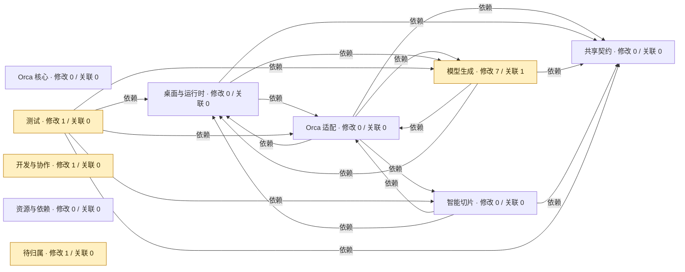

<!-- orca-architecture-impact -->
### 架构影响图

版本：`005d1ce9794b` → `668a031c9ea4`；模式：PR 提交。

直接修改 **10** 个文件，潜在关联 **1** 个文件；其中 **4** 个改动文件未做代码关系解析。

黄色＝直接修改，蓝色＝潜在关联；箭头由使用方指向依赖方。

- 试点仅解析 AI、sidecar 与相关测试；其他文件只标记模块，不推断其代码影响。
- 潜在影响最多沿静态依赖反向追踪两跳，同时保留基线中的删除关系。
- C++ include 按相对路径或唯一后缀推测；重复头文件不强行连接。未解析端点含外部库。
- wxWidgets 事件、动态调用及 HTTP 跨进程关系可能遗漏；图不代替代码审查或测试。
- 红色表示关系移除，不表示失败；绿色表示新增关系，不表示验证通过。

下载本次 Actions 的 `architecture-impact` 制品，解压后打开 `index.html`：L0 产品全貌 → L1 模块职责 → L2 业务状态 → L3 源码改动。`details.html` 保留完整静态关系，`report.json` 供 AI 阅读。Archify 总览展示选定主干；业务语义为维护的说明，状态名称从源码提取。这里没有实时运行或业务验收状态，布局校验不等于代码验证。
