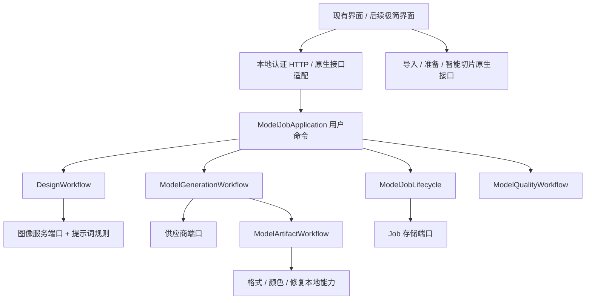

# 原子能力与界面组合

这次以 PR24 的集成版本为基线，将模型生成后端实现从 `orca_ai_sidecar.py` 拆到独立文件。既有 HTTP 接口实际调用新应用层；旧函数名保留兼容转发。这里的“独立”指模块可通过显式输入和端口调用、测试，不依赖 HTTP Handler 或旧面板，不代表每个能力都需要独立进程。

## 实际边界

| 能力 | 实现入口 | 输入 → 输出 | 当前状态 |
|---|---|---|---|
| 类型、结构与打印规则 | `image_preprocessing_policy.py` | 描述/风格/打印参数 → 策略 | 独立函数 |
| 人像及各类别提示词 | `image_preprocessing_prompts.py`、`openai_preprocessor.py::build_geometry_reference_prompt_layers` | 策略 → 精确规则层 | 独立调优；详见 [前处理说明](README_image_preprocessing.md) |
| 图像/文字设计生成 | `design_workflow.py::DesignWorkflow` | Job/输入 → 等待确认的设计 | 独立应用能力；图像服务通过端口注入 |
| 3D 生成/保留几何贴图 | `model_generation_workflow.py::ModelGenerationWorkflow` | 确认的 Job/授权 → 3D Job | 独立应用能力；供应商/下载/执行通过端口注入 |
| 请求与选项校验 | `model_request.py` | 字段/图片 → 合法值或 RequestError | 无 HTTP、队列或生成调用 |
| 已有模型/参考质量 | `model_quality_workflow.py::ModelQualityWorkflow`、`nonportrait_reference.py` | 已注册模型/参考 → 报告 | 独立检查；可选付费视觉复核单独注入 |
| 下载/转换/产物准备 | `model_artifact_workflow.py::ModelArtifactWorkflow` | 任务/文件 → 归一化产物 | 独立编排；供应商和历史记录通过端口注入 |
| 模型安全读写与格式校验 | `model_obj_io.py`、`glb_artifact.py` | 显式文件 → 模型/校验结果 | 独立本地能力 |
| 色彩距离/贴图烘焙/区域整理 | `model_color_space.py`、`model_texture_baking.py`、`model_color_regions.py` | 文件/色板 → 顶点色/整理报告 | 算法与文件处理独立；写入只针对调用方给定文件 |
| 局部网格修复 | `model_mesh_repair.py` | OBJ/报告路径 → 修复结果 | 独立；不自动创建 3D 或修复历史模型 |
| 旧人像几何、材质与多视图 | `portrait_geometry_reference.py`、`portrait_model_materials.py`、`portrait_multiview_workflow.py` | 显式参考/文件/Job → 参考/产物 | 从主入口移出；旧历史和显式开关保留 |
| 任务 DTO、创建、恢复、取消与状态 | `model_contracts.py`、`model_job_lifecycle.py` | 请求/目录/任务 → Job/状态 | 独立；默认恢复不创建新付费任务 |
| 历史落盘与相对路径 | `model_job_repository.py` | Job ↔ 有界 job.json | 独立；存储回调可替换 |
| 用户命令与确认 | `model_job_application.py::ModelJobApplication` | 命令/字段/Job ID → ApplicationResult | HTTP 和新界面共用的应用入口 |
| 配置建议 | `config_proposal.py` | 允许项/建议 JSON → 受约束提案 | 提示词与白名单验证独立；调用服务仍由 host 组装 |
| 原生模型导入 | `AI/Contracts/IModelArtifactConsumer.hpp`、`GUI/AI/Orca/OrcaWorkspaceAdapter.*` | ModelImportRequest → ModelImportResult | 既有中立接口；实际应用仍需原生工作区/线程/撤销事务 |
| 尺寸与底座 | `GUI/AI/Orca/OrcaModelPreparation.*` | source/options → proposal；source/proposal → apply | 既有计算与应用两步；提案不改变原件，应用需原生快照 |
| 智能切片 | `AI/SmartSlicing/Application`、`Domain`、`Ports` | 工作区快照 → 风险/候选/比较/应用 | 既有独立 CMake 核心；GUI 通过工作区和试切片接口连接 |
| 美颜工作台 | `GUI/AI/Model`、`GUI/AI/ModelGeneration` | 原模型/色板/操作 → 配色和编辑状态 | 底层算法已分文件；交互、部分事务/状态仍绑定 ModelGenerationPanel |
| 资源图库与重设计外壳 | `GUI/Redesign`、ModelGenerationFeatureHost | 用户动作/状态 → 视图 | 视图和部分会话仍有面板依赖；没有宣布全 GUI 已原子化 |

## 依赖方向



应用能力通过各自 `*Ports` 数据类声明依赖。`orca_ai_sidecar.py` 负责组装存储、任务注册表、锁、提供商和执行器，并负责认证、进程寿命和 HTTP。原子模块不导入它，不复制 host 的全局命名空间。工作流之间通过端口组合，本地算法使用显式参数，算法的阈值和旧历史兼容行为保持。

## 极简界面如何组合

`capability_catalog.py` 给出稳定能力 ID、源码入口、输入/输出、作用范围及确认点。离线查看：

```text
python tools/ai/capability_catalog.py --json
```

运行服务提供 `GET /v1/orcaslicer/capabilities`。它沿用会话证明及原生客户端认证，只发现能力，不执行清单中的入口。供应商可用性取本地配置；原生工作区可用性为 `null`，必须由原生 host 确认。目录中的文件和类名用于开发，不应直接成为产品交互文案。

现有 HTTP 创建设计、生成、停止、复用、选项、检查等接口继续有效。Job 命令统一交给 `ModelJobApplication.execute_job(command, job_id, request)`，只接受明确的命令白名单。新界面可通过既有 AISidecarClient/AIModelGenerationClient 复用认证和协议，也可在同进程注入自己的端口直接使用应用类。

```python
# application 已由当前宿主组装；这里不依赖 Handler 或 wxWindow。
draft = application.create_text_job({"request_id": request_id, "prompt": text, "style": "realistic"})
job_id = draft.payload["job"]["id"]
# 等待该 Job 进入 awaiting_confirmation，展示设计并取得用户确认后：
result = application.execute_job("generate", job_id, {"prepared_prompt": reviewed_prompt})
```

这段分阶段组合不会跳过 Job 校验、付费授权、重复提交保护、已有任务恢复和取消逻辑。恢复有供应商任务 ID 的任务使用原有 `resume_existing`，不能拿新任务代替恢复。界面改成一个输入框/少量按钮时，仍应保留设计确认和原生候选应用的必要决策。

目录已提供三种组合清单：图片到模型、文字到模型、已有模型到切片候选。清单不是自动执行器：客户端按阶段状态组织交互，通过原生接口完成导入/准备/切片；Sidecar 不越权宣称原生能力可以经 HTTP 执行。配色工作台完全摆脱旧面板的会话/事务依赖仍是下一阶段任务。

独立组合用例见 `test_atomic_capabilities.py`：无 HTTP/旧面板导入，真实本地设计文件生成，等待确认，确认后仅排队一个模型任务，授权未消费，再次提交被拒。提供商被隔离，不代表新的真实 3D 或 GUI 验收。

## 分工与守卫

| 现有开发线 | 可独立修改的文件范围 | 需要协商的边界 |
|---|---|---|
| 模型生成 | 前处理规则、design/model 工作流、Provider Gateway、本地模型/颜色/修复能力、Job 生命周期/仓储 | 公共 DTO、API 字段、安装组件清单 |
| 智能切片 | SmartSlicing Domain/Application/Ports 与自己的 GUI 适配器 | 工作区快照、导入结果、原生应用/撤销接口 |
| 维护与集成 | Sidecar/桌面组合、GUI 外壳、运行时、CMake、集成/架构检查 | 三方共享契约和图谱 |

同模块可继续按表中的文件分给不同开发者：调提示词的人无需修改 HTTP，修网格的人无需修改 Job/界面，写新交互的人通过应用/API 和原生端口组装。该表是文件边界说明，不代替团队负责人协调，也没有自动给同事派任务。

`model_runtime_files.cmake` 明确列出新的生产模块，主 CMake 和快捷刷新均使用该组件。集成校验检查入口存在、打包成员一致、循环依赖、host/UI 反向依赖及动态命名空间注入；单个能力文件上限 1500 行，Sidecar 上限由 9450 降为 2000 行。现有 upstream/shared/native 门禁保留。架构映射支持从多个文件提取同一 Job 状态，移动文件不再误报状态删除。

相关检查：`scripts/verify_ai_integration.py --json`、`test_atomic_capabilities.py`、`test_packaged_sidecar.py`、`scripts/test_atomic_capabilities_architecture.py`、`scripts/test_architecture_review.py` 及相应 Sidecar/模型回归。原生代码未在本次改写；既有 GUI 旅程不能自动升级为本次架构验收，完整部署和集成 CI 状态另行记录于主计划和短状态。
